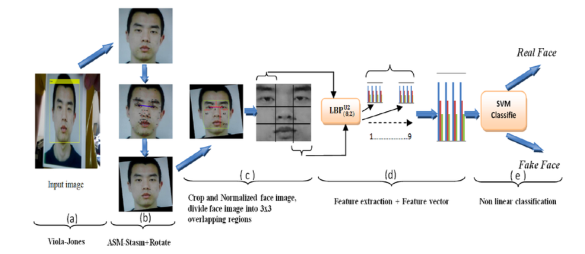
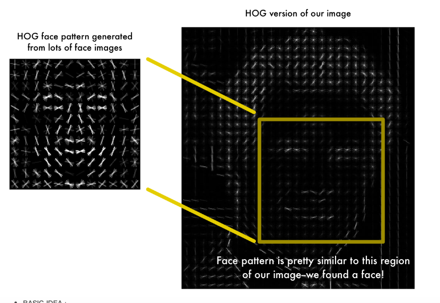
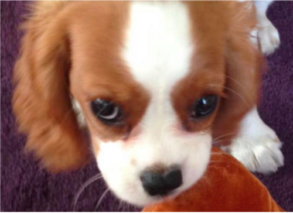
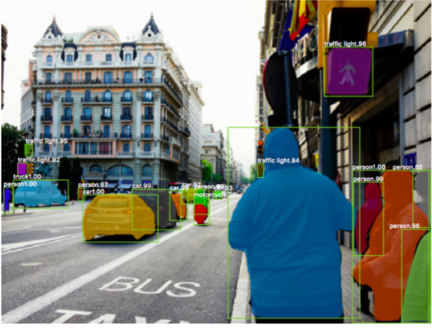
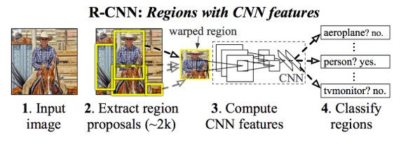

# Object Detection Techniques
Object Detection Techniques | Kaggle 重點節錄
* [Kaggle NoteBook](https://www.kaggle.com/infernop/object-detection-techniques)
* [講者 - AdamyaTripathi Vote : 33](https://www.kaggle.com/rtatman/kernels?sortBy=dateCreated&group=everyone&pageSize=20&userId=1162990)
[關於影像辨識，所有你應該知道的深度學習模型](https://medium.com/cubo-ai/%E7%89%A9%E9%AB%94%E5%81%B5%E6%B8%AC-object-detection-740096ec4540)
* 作者 : Steven Shen

# Hsitory (2001 - 2017)
## 1. The first efficient Face Detector (Viola-Jones Algorithm, 2001)
    * 可以即時辨識(real time)
    * 被實作在openCV中，稱作Viola and Jones algorithm.
    * 概念
      1. 拿一堆face data
      2. 硬幹一些臉部特徵(feature of a face)
      3. SVM
      4. 模型上線 
</img>
* 缺點 : 臉一但轉一下角度，往轉，下轉，或是wearing a mask, 就掛了

## 2. Much more efficient detection technique (Histograms of Oriented Gradients, 2005)
   * 同樣hardcode臉部特徵 
   * 對於每個pixel, 看他周圍的pixel, 去辨識該pixel周圍的pixel有多黑?
   * 往最黑的方向取一個gradient，當作此pixel的gradient
   * 對每個pixel都做這件事
   * 這樣的gradient可以展示出整張圖片亮暗之間的Flow
   * 這種特徵萃取方式稱作HOG(Histograms of Oriented Gradients)
</img>
* 缺點 : 或多或少減緩了Viola-Jones Algorithm, 2001的問題，但扔然是一種hardcode的方式，一但noise變大，或是背景東西一多，就分不好了

##  Deep Learning Era begins(2012)

## 1. CNN
  * 自從 Kriszhevsky 使用CNN搭建的ImageNet開始，CNN就開始變成標配
  </img>
  </img>
  * 而不論在單體辨識上，或是多物體辨識上，CNN都能夠有很好的表現
  * 透過CNN來做物件辨識的流程 : 
  1. 拿一張照片$I$然後切分成$n$個小個正方形$i$，我們就得到 $I : (i_{1}, i_{2}, ... i_{n})$
  2. 拿一個看過很多物體的pre-train CNN模型對每一個$i_{k}$進行預測，CNN預測的每個物體標籤為$l$
  3. $i_{k}$將會被預測為某個物體，probability score為$\alpha$，該CNN model最好也能預測所謂**沒有東西**
  4. $i_{k}$就會有$l$組probability, 用label及probalility表示張Image $I$，則為$(l_{1}, \alpha_{1}), (l_{2}, \alpha_{2}）... (l_{n}, \alpha_{n})$
  5. 對於每個$i_{k}$都留下最高的$(l, \alpha)$，我們就可以從一張圖片辨識多個物體
  * 這樣的方法是透過CNN來做物件辨識最早被實作的方法，由於不知道物件到底要多大的框框，所以我們就從小框框(邊長可能是3 pixel)，一直加大到100 pixel，這種暴力的方式，做Sliding Window，然後用CNN硬算，就幹出一個見偵測的結果
  * 想當然爾，這樣的做法有很大的改進空間，非常非常耗時 

## 2. R-CNN(Regions with CNN)
   * 上述的Sliding window approach，顯然有很多改進的地方，因此出現了Region with CNN (R-CNN)
   * R-CNN透過一套演算法，先篩選出2000個可能的區域，再將這2000個區域丟進pre-trained CNN做分類
   * CNN模型例如AlexNet拿來擷取特徵
   * 接著再用SVM分類器來區分是否是物體還是背景
   * 再透過一個線性迴歸模型來校正bounding box的位置
   * 同樣想要做物件辨識，YOLO採用了另一個完全不同的approach，他不訓練分類器!
   </img>
### Selective Search
將Sement的結果各自畫出bounding box, 然後以一個迴圈，每次合併相似度最高的兩個box, 直到整張圖合併為單一個box為止，這個過程中的所有box便是selective search出來的region proposals
   * R-CNN一開始需要先產生約2000個區域，每個區域都要丟進CNN中擷取特徵，所以一張圖最少要跑2000次CNN prediction
   * R-CNN model分開成3個部分，分別是用來取出特徵的CNN, 分類的SVM, 優化bounding box的線性迴歸。所以R-CNN不容易訓練
   * 一些優化方法，例如Fast R-CNN, Faster R-CNN基本上就是針對R-CNN做效能優化，可以在[關於影像辨識，所有你應該知道的深度學習模型](https://medium.com/cubo-ai/%E7%89%A9%E9%AB%94%E5%81%B5%E6%B8%AC-object-detection-740096ec4540)找到
   * 從一張圖片中標示出位置來，稱為Object Localization
## YOLO (You Only Liik Once)
  YOLO採取了完全不同的策略，只需要對圖片做一次CNN便能夠判斷裡面物體的類別和位置，大大提升辨識速度。
  R-CNN的概念事先提出幾個可能包含物體的 Region proposal，在針對每個region使用CNN做分類，最後再以regression修正bounding的位置，速度慢且不好訓練。
  YOLO的好處是單一網路設計，判斷結果會包含bounding box的位置，以及每個bounding box所屬的類別及概率。整個網路設計是end-to-end，容易訓練，速度快。
   
