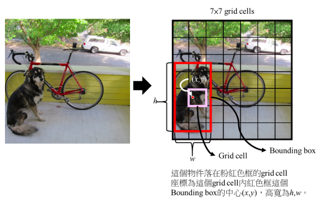
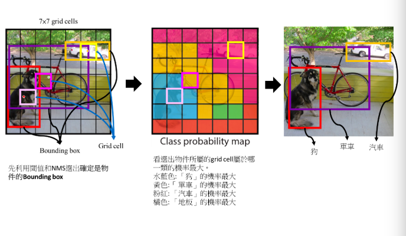
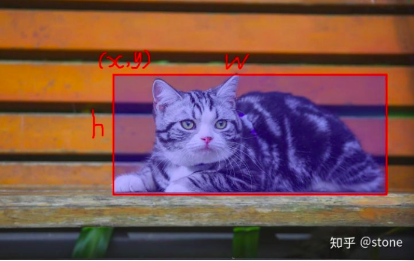
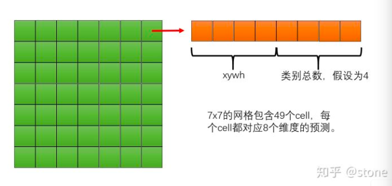

# Object Detection Techniques
* 集合文章閱讀，目的在於對於物件偵測深度學習的算法有個Introduction level的認識
* Object Detection Techniques | Kaggle 重點節錄
  * [Kaggle NoteBook](https://www.kaggle.com/infernop/object-detection-techniques)
  * [講者 - AdamyaTripathi Vote : 33](https://www.kaggle.com/rtatman/kernels?sortBy=dateCreated&group=everyone&pageSize=20&userId=1162990)
* [關於影像辨識，所有你應該知道的深度學習模型](https://medium.com/cubo-ai/%E7%89%A9%E9%AB%94%E5%81%B5%E6%B8%AC-object-detection-740096ec4540)
  * 作者 : Steven Shen
* [深度學習-物件偵測:You Only Look Once (YOLO)](https://medium.com/@chih.sheng.huang821/%E6%B7%B1%E5%BA%A6%E5%AD%B8%E7%BF%92-%E7%89%A9%E4%BB%B6%E5%81%B5%E6%B8%AC-you-only-look-once-yolo-4fb9cf49453c)
  * 作者 : Tommy Huang
* [你真的读懂yolo了吗？](https://zhuanlan.zhihu.com/p/37850811)
  *  作者 : stone

# Hsitory (2001 - 2017)
## 1. The first efficient Face Detector (Viola-Jones Algorithm, 2001)
  * 可以即時辨識(real time)
  * 被實作在openCV中，稱作Viola and Jones algorithm.
  * 概念
     1. 拿一堆face data
     2. 硬幹一些臉部特徵(feature of a face)
     3. SVM
     4. 模型上線 
</img>
* 缺點 : 臉一但轉一下角度，往轉，下轉，或是wearing a mask, 就掛了

## 2. Much more efficient detection technique (Histograms of Oriented Gradients, 2005)

   * 同樣hardcode臉部特徵 
   * 對於每個pixel, 看他周圍的pixel, 去辨識該pixel周圍的pixel有多黑?
   * 往最黑的方向取一個gradient，當作此pixel的gradient
   * 對每個pixel都做這件事
   * 這樣的gradient可以展示出整張圖片亮暗之間的Flow
   * 這種特徵萃取方式稱作HOG(Histograms of Oriented Gradients)
</img>
* 缺點 : 或多或少減緩了Viola-Jones Algorithm, 2001的問題，但扔然是一種hardcode的方式，一但noise變大，或是背景東西一多，就分不好了

##  Deep Learning Era begins(2012)

## 1. CNN
  * 自從 Kriszhevsky 使用CNN搭建的ImageNet開始，CNN就開始變成標配
  </img>
  </img>
  * 而不論在單體辨識上，或是多物體辨識上，CNN都能夠有很好的表現
  * 透過CNN來做物件辨識的流程 : 
    1. 拿一張照片$I$然後切分成$n$個小個正方形$i$，我們就得到 $I : (i_{1}, i_{2}, ... i_{n})$
    2. 拿一個看過很多物體的pre-train CNN模型對每一個$i_{k}$進行預測，CNN預測的每個物體標籤為$l$
    3. $i_{k}$將會被預測為某個物體，probability score為$\alpha$，該CNN model最好也能預測所謂**沒有東西**
    4. $i_{k}$就會有$l$組probability, 用label及probalility表示張Image $I$，則為$(l_{1}, \alpha_{1}), (l_{2}, \alpha_{2}）... (l_{n}, \alpha_{n})$
    5. 對於每個$i_{k}$都留下最高的$(l, \alpha)$，我們就可以從一張圖片辨識多個物體
  * 這樣的方法是透過CNN來做物件辨識最早被實作的方法，由於不知道物件到底要多大的框框，所以我們就從小框框(邊長可能是3 pixel)，一直加大到100 pixel，這種暴力的方式，做Sliding Window，然後用CNN硬算，就幹出一個見偵測的結果
  * 想當然爾，這樣的做法有很大的改進空間，非常非常耗時 

## 2. R-CNN(Regions with CNN)
   * 上述的Sliding window approach，顯然有很多改進的地方，因此出現了Region with CNN (R-CNN)
   * R-CNN透過一套演算法，先篩選出2000個可能的區域，再將這2000個區域丟進pre-trained CNN做分類
   * CNN模型例如AlexNet拿來擷取特徵
   * 接著再用SVM分類器來區分是否是物體還是背景
   * 再透過一個線性迴歸模型來校正bounding box的位置
   </img>
### Selective Search
將Sement的結果各自畫出bounding box, 然後以一個迴圈，每次合併相似度最高的兩個box, 直到整張圖合併為單一個box為止，這個過程中的所有box便是selective search出來的region proposals
   * R-CNN一開始需要先產生約2000個區域，每個區域都要丟進CNN中擷取特徵，所以一張圖最少要跑2000次CNN prediction
   * R-CNN model分開成3個部分，分別是用來取出特徵的CNN, 分類的SVM, 優化bounding box的線性迴歸。所以R-CNN不容易訓練
   * 一些優化方法，例如Fast R-CNN, Faster R-CNN基本上就是針對R-CNN做效能優化，可以在[關於影像辨識，所有你應該知道的深度學習模型](https://medium.com/cubo-ai/%E7%89%A9%E9%AB%94%E5%81%B5%E6%B8%AC-object-detection-740096ec4540)找到
   * 從一張圖片中標示出位置來，稱為Object Localization
## YOLO (You Only Liik Once)
  YOLO採取了完全不同的策略，只需要對圖片做一次CNN便能夠判斷裡面物體的類別和位置，大大提升辨識速度。
  R-CNN的概念事先提出幾個可能包含物體的 Region proposal，在針對每個region使用CNN做分類，最後再以regression修正bounding的位置，速度慢且不好訓練。
  YOLO的好處是單一網路設計，判斷結果會包含bounding box的位置，以及每個bounding box所屬的類別及概率。整個網路設計是end-to-end，容易訓練，速度快。
  目前(2019, 11, 03) 已經進展到YOLO v3, realtime的即時辨識是完全沒有問題
  * 先將圖平均的分成$S$ x $S$格，每一格則會稱為一個grid cell
  > 整體概念 : 如果**被偵測的物件中心**落在哪一個grid cell，那個grid cell就要負責偵測這個物件
  * 每個grid cell必須要負責預測$B$個bounding box, 屬於每個類別的機率, 每個bounding box 會帶有5個預設值$(x, y, w, h, confidence)$
  * bounding box在YOLO的算法中是從資料學出來的，並不是先用任何的算法進行segmentation
  </img>
  雖然上圖框出來是狗的位置，但實際上YOLO輸出的bounding box在每個grid cell都會存在$B$個，所以bounding box有可能框出的是背景，每個bounding box都會帶有一個confidence score，這個confidence score可以用來決定這個BOunding box是否真的是一個物件(這也是大部份物件偵測算法的做法)
  * 假設一個案例 $S=7~,B=2$，則會有98個bounding box, 這個網路最多只能偵測98個物件，然後把全部候選的bounding box的(中心最標, 長寬, confidence)根據閥值以及NMS篩選選出這張圖所有的物件
    * 先透過閥值來幹掉一些確定不是物件的bounding box
    * NMS可以把重疊的bounding box按照計算取出一個，消除其他的，接著我們就會有乾淨的bounding box
  * 接下來就可以根據剩餘bounding box來訓練有什麼物件了
  </img>
### How to learn a bounding box?

</img>

首先假設深度學習還沒用於目標檢測, 我們還不知道那麼多目標檢測算法
* 目標檢測就是要找出圖片物體中的bounding box(邊界框架)，並且判定框架內的物體類別。例如途中有一隻貓，那我們要將這隻貓用一個bounding box框出來, 則我們需要有4樣參數，在這裡我們使用坐上角座標$(x,y)$和舉行的寬高$(w, h)$來表示

對於這種任務我們怎麼做? 很自然的想法是，我們把圖片為給深度學習模型，讓網路吐出bounding box的$x,y,w,h$總共4個值，以及圖片的類別，這麼做貌似是可以的

但考慮這麼一種情況，如果圖片上除了有一隻貓，還有一隻狗，甚至更多的物體，我們都想把他們框出來，這時候我們就會發現，網路不僅僅要輸出貓的預測，還要輸出其他物品的預測，所以說，模型的輸出維度變得沒辦法固定了，因為圖片中存在的物體越多，模型輸出的維度就越大，所以上述思維是一個好的開始，但需要一些思考上的改良

### YOLO的思想
* 既然模型輸出需要固定維度，我們能不能設計一個固定維度大小的輸出，並且輸出的維度足夠大，大到足以囊誇圖像中所有的物體? 可以，YOLO就這麼做
* 怎麼做呢? 先把模型的輸出切分成網格狀，每個網格中的cell都可以輸出物體的類別以及bounding box的座標
</img>
* 怎麼解讀 `物體落在那個cell, 哪個cell就負責預測這個物體` ? 
1. 訓練階段, 在訓練階段中, 如果物體中心落在這個cell, 那麼就給這個cell打上物品的label，label包含5個dimension $(x, y, w, h, class~of~object)$。也就是說我們是通過這種方式來設置label, 換言之, 我們在訓練階段, 就教會cell要預測圖像中的哪個物體
2. 測試階段 因為你在訓練階段已經教會了cell去預測中心落在該cell中的物體, 那麼cell自然也會這麼做
  

