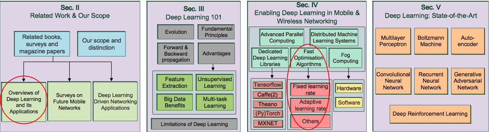
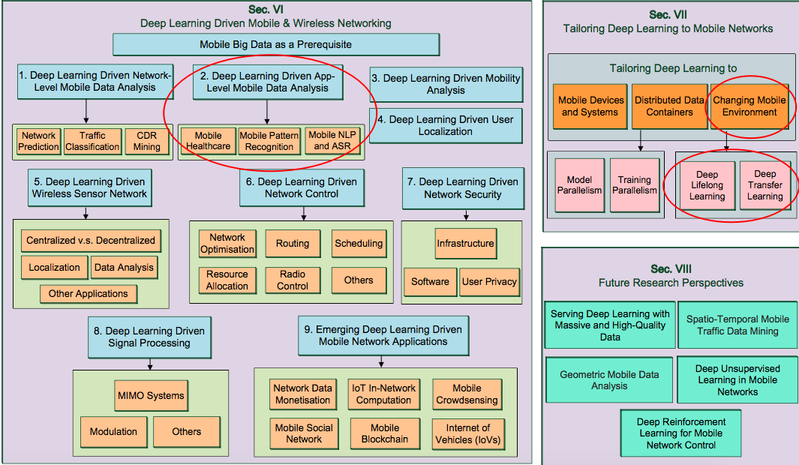
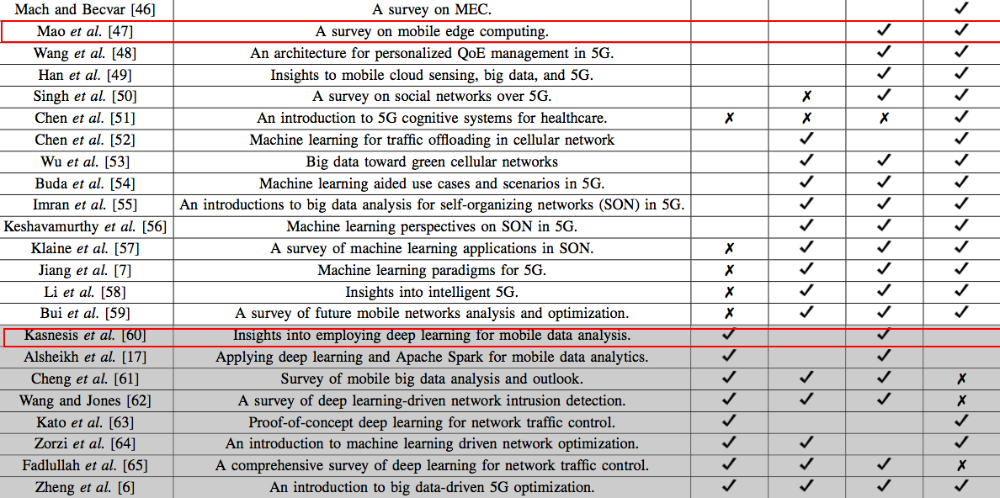
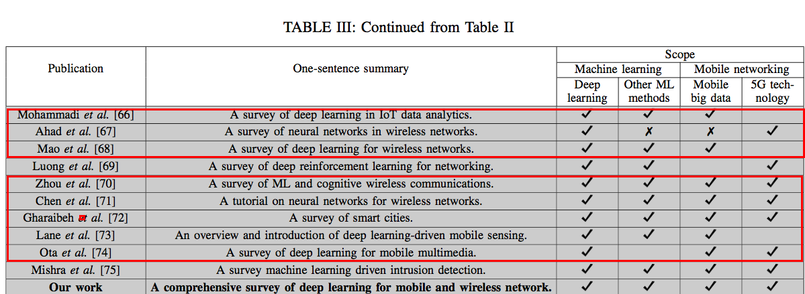
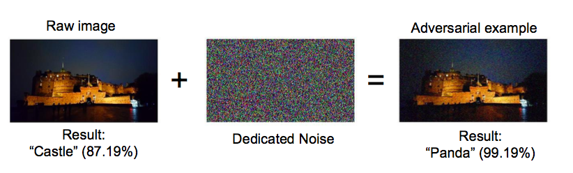

# [Paper]Deep_Learning_in_Mobile_and_Wireless_Networking_A_Survey
* 2019
* citation : 219+
* IEEE
# 摘要
行動裝置以及移動應用程式的迅速普及為移動以及無線網路帶來的前所未有的需求，未來的5G系統將會支撐目前已經飛速發展的
行動流量，realtime資料分析以及網路資源的管理，這些任務都極具挑戰性，而且行動裝置的環境正在日益變得複雜，其中一種有潛力的解法是採取
進階的機器學習技術，來幫助管理數據量和算法驅動的應用程式增長，近期深度學習的成功提供了一個堅固且有力量的工具讓我們來解決這些問題

本篇文章中我們會補足深度學習以及無線網路研究之間的gap，透過一個對這兩個領域進行一個全面的調查。
第一我們會介紹一些當前最好的深度學習演算法，以及他們在無線網路圈應用的潛力
接著我們會討論幾種技巧以及平台讓深度學習演算法可以較好的部署在行動裝置上，接下來呢，我們提供了一份近乎百科全書的review，裡面都是深度學習被應用在行動裝置以及無線網路的研究，並且把他們分門別類

# 作者
Chaoyun Zhang
Paul Patras
Hamed Haddadi

# 關鍵字

Deep Learning, Machine Learning, Mobile Net- working, Wireless Networking, Mobile Big Data, 5G Systems, Network Management.

關鍵字1 - 可以透過human activity關鍵字搜尋內文，太長了，很難掌握其內容
關鍵字2 - A summary of works on app-level mobile data analysis

# 精讀
## P0 ~ P5
### Intro
### The scope of this survey
* Overviews of Deep Learning adn its Applications
* Surveys on Future Mobile Networks
* Deep Learning Driven Networking Applications
* Our Scope

Intro : high level overview - 有Table來顯示目前Deep Learning以及無線網路(Wireless network)的技術專有名詞，除了DL專有名詞之外，也有網路技術專有名詞可以關注，提供之後如果查詢網路技術的關鍵字

也用圖解的方式來說明本篇文章會有什麼內容，在Fig 1中，下面我圈出幾個我們應該要注意到的Section

</img>

1. 當然就是Deep Learning的相關應用，讓我們增廣見聞

</img>

2. Section 6有提到行動端的資料分析，裡面包含了我們有在做的項目可以關注，其中ASR是Automantic Speech Recognition，跟我們比較沒關係

3. 第三則是對於變動的行動端環境，有一些Transfer Learning的研究即變型(Lifelong Learning)是我們可以關注的，其實目前我們人臉辨識以及物件辨識都希望follow tranfer learning的思想，讓維護網路的成本(有新資料就要重train)降低

The survey collection

這份論文也把Related Work交代得蠻清楚的並且在整理一次，我們可以從這個survey collection table中再挑出我們所需要的，以下紅框是我認為和我們可能比較有關的
</img>

</img>

# 這篇論文想要回答的問題
1. 為什麼Deep learning被認為可以解決未來的行動網路問題
2. Edge端的深度學習模型和行動裝置以及無線網路的關係
3. 在行動端網路領域最成功的深度學習應用有哪些
4. 研究者們怎麼把深度學習fit到行動網路問題
5. 爾後最重要以及最有價值的研究在哪個方向

## p5 ~ p10
p5~p8主要介紹Deep Learning的optimizer原理，直得注意的是p8提到在行動裝置以及無線網路中深度學習方法的限制
1. 容易被攻擊
2. 黑箱系統，不容易解釋行為
3. 非常依賴資料，資料甚至比模型重要，在資料較難取得的場景中實現難度增加
4. 算很久，要達成realtime需要蠻多effort(在我們的case，我們使用edge端運算資源，目前已經有初步結果可以達到realtime)
5. DL很多參數要調，專業人員的需求度仍然高

</img>

* 面臨以上困擾時我們可以回來翻論文所提供的reference，來參考是否有其他團隊面臨過同樣的問題，以及他們怎麼解決的

p9~p10則是介紹分散式系統，深度學習套件以及雲端計算，霧端計算(fog computing)，並指出趨勢，在5G網路時代的來臨，將會使得網路延遲降低，這為雲端計算以及霧端計算提供大大的好處，但就現況而言，樹莓派+Google運算棒的Edge端solution仍然是最好的，5G技術要成熟勢必還需要一段時間，其次則是霧端計算(fog computing)，跟雲端計算有什麼不同?
簡言之可以想成把雲端計算切成兩塊，雲端Server可能距離當地較遠，這會造成較大的延遲，因此設置一個中繼站，距離當地非常近(甚至就在當地)，讓網路延遲降低，並管理一部分計算資源，細節的話這裡有[一篇繁中簡介](https://medium.com/it-digital-%E4%BA%92%E8%81%AF%E7%B6%B2/%E9%9B%B2%E8%A8%88%E7%AE%97%E4%B9%8B%E4%B8%8A%E9%82%84%E6%9C%89%E9%9C%A7%E8%A8%88%E7%AE%97-%E9%9C%A7%E8%A8%88%E7%AE%97%E7%9A%84%E5%85%A5%E9%96%80-fog-computing-3eab52996c71)

## p10 ~ p18
p10~p12主要介紹了當前的幾個深度學習框架(包含tensorflow, theano, caffe, pytorch, mxnet)，包含了他們的優點及缺點，以及有提供的接口，可供爾後需要進行開發時的參考標的
p13則是介紹了當前的優化器(optimizer)，並把核心理念以及優缺點列出，其中也列出的Adam之後的Nadam、Learn to optimize以激Quantized training相關優化技巧也有列出reference，若有需要可以查詢
p13話題則繼續回到霧端計算，持續說明霧端計算帶來的好處

* 行動裝置(手機，sensor，穿戴式裝置等)就算只有弱弱的算力，仍然可以透過網路和霧端Server溝通
* 霧端Server能夠紀錄sensor當前狀態，接收sensor資訊，在霧端Server所提供的計算資源下，做第一階段的資料分析，並且即時回傳
* 較繁重的分析工作，或是即時性要求較低的工作則可以經由霧端在pass給雲端
* 就架構而言，就會形成sensor-fog-cloud的雙層式架構

p14則說到除了霧端計算，各大廠對於深度學習算法如何在行動裝置上進行特化也有一些發展，以下是硬體層面的處理器發展
* Gokhale開發了一種神經網路移動處理器 - neXt，可加速行動裝飾設備中的深度神經網路執行，並提供相關reference
* Bang也提供了一套，並提供相關reference
* IBM - TrueNorth
* 高通 - Snapdragon 820 - 開始在晶片上加入AI功能(2015)，由於高通是非常知名的手機幾片商，我特別google了一下該新聞，可以在[這裡](https://technews.tw/2018/09/06/qualcomm-snapdragon-855-aie/)看到
* 華為 - (Kiron 970)麒麟970
以上提供了我們許多關鍵字資訊，讓我們了解目前行動裝置在晶片支援AI運算上的現況
p15則提到在軟體層面上，除了上面提到的tensorflow，caffe等相關平台，IOS也出了自己的ML framework稱為Core ML。
p15~p18則講述了深度學習當前最好的幾種模型種類，包含了MLP, RBM, AE, CNN, RNN. GAAN, DRL

## Ref
[雲計算之上還有霧計算!? 霧計算(fog computing)的入門和用例](https://medium.com/it-digital-%E4%BA%92%E8%81%AF%E7%B6%B2/%E9%9B%B2%E8%A8%88%E7%AE%97%E4%B9%8B%E4%B8%8A%E9%82%84%E6%9C%89%E9%9C%A7%E8%A8%88%E7%AE%97-%E9%9C%A7%E8%A8%88%E7%AE%97%E7%9A%84%E5%85%A5%E9%96%80-fog-computing-3eab52996c71)
[高通積極深化 AI 於手機應用](https://technews.tw/2018/09/06/qualcomm-snapdragon-855-aie/)