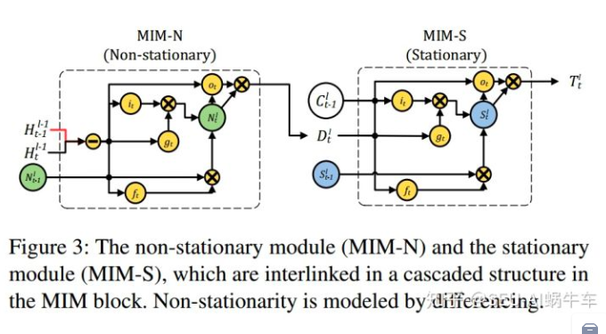
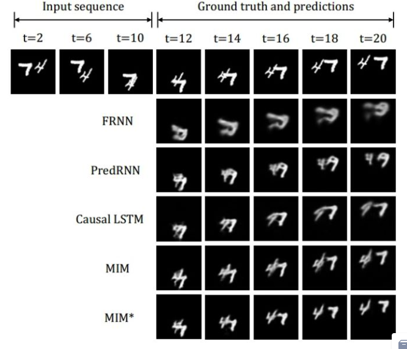
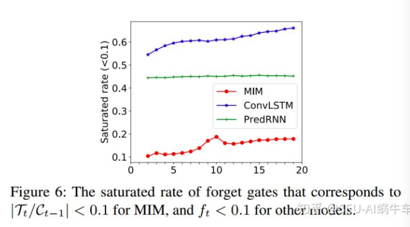

# Infors
citazion : 2019
year : 2019, Apr

[文章](https://arxiv.org/abs/1811.07490v2)
# Authors

Yunbo Wang
Jianjin Zhang
Hongyu Zhu
ingsheng Long
Jianmin Wang
Philip S Yu

# 摘要

# 導讀
[【时空序列预测第五篇】时空序列预测模型之Memory In Memory（学习高阶非平稳特征信息）](https://zhuanlan.zhihu.com/p/107261477?fbclid=IwAR1ItgM8yUw7rivfxYmWZOa-dMIaH0N1Q1H_gaaOqBDVNQI2j14JvaG2Th0)

* 平穩與非平穩 - 主要的難點在於非平穩的預測，因為非平穩績奔上是沒有規律的，而平穩存在一定的週期或是規律變化不大
* 非平穩過程
  * 低階非平穩性 : 區域像素點的空間與時間關係，小塊區域的時空變換
  * 高階變化 : 氣象中的雷達回波圖對應的數據堆積，變形，耗散
* 非平穩向拆解  : 確定項 + 時間變量多項式 + 零均值隨機項
* 非平穩向的處理方法 - 差分(diff)，就像ARIMA
* forget gate - 作者分析，在他們選定的情況下，forget gate有80％都處於飽和狀態，也就是forget gate在工作的時候總是記住平穩地變換訊息，可以近似維對整個預測就是類似於線性的推理
* 一種新的RNN耶夠，MIM blocks - 讓模型能夠更好的學到更多高階非平穩特徵，因為差分的輸入為左下方的hidden state，這種結構不能存在於第一層，所以第一層還是利用ST-LSTM
</img>

* experiments : Moving MNIST
</img>

</img>

* 關於forget gate的飽合率 : 如果forget gate大多數都是0的話，說明該cell一直在刷新，意即短期訊息其實沒有獲得，而加入MIM之後，飽合率下降，**說明更多短期非平穩訊息可以被傳播**，而且MIM-N主要處理的是短期的訊息(無規律的突發事件)，而MIM-S主要處理的是長期的變化(有規律的平穩訊息)

* Conclusions
  * 經典理論出發 - 分為平穩項以及非平穩項，並透過經典算法應用引入差分
  * 提出MIM機制，實驗證實可以有效提出非平穩訊息，而且是通用的，可以利用到其他與時空相關的LSTM
  * forget gate的飽和率研究

# 註解
