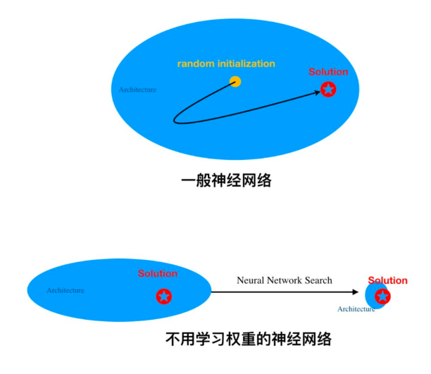

# Proving the Lottery Ticket Hypothesis : Pruning is all you need
citazion : 0+
2020, Feb

# Authors

Eran Malach

Gilad Yehudai

Shai Shalev-Shwartz

Ohad Shamir

# 摘要
pass

# 導讀
[剪枝与学习权重同等重要，Lottery Ticket Hypothesis第一次被理论证明](https://mp.weixin.qq.com/s/yQY9HF2yWtmSRmu8GsR4rQ?fbclid=IwAR0Eqh24WAIkINZUkQ96cyjwVsqb347q1ZRaLgw-0TpUi3LZUy3eolXnbFM)

</img>

[google去年所發表的一項研究 Weight Agnostic Neural Networks 2019, Sep, citation 25+](https://arxiv.org/abs/1906.04358)        

[Introduction check here](https://mp.weixin.qq.com/s?__biz=MzA3MzI4MjgzMw==&mid=2650763851&idx=1&sn=aef940b5de86deff578e1b356c5645e4&scene=21#wechat_redirect)

該文指出，透過變更網路結構來學習而非更新weight參數，也能夠成為一種神經網路的架構，而本篇文章證明這樣的思考在數學上也能夠成立![註1]

# 註解
註1 : 這顯然對於Deep Learning落地是一項福音，預測能力等效的子網路意味著大量壓縮模型大小以及大量提升推論效率，具有極高的潛力，但感覺目前還在壹些數學定理的研究階段，該領域有待觀察