# SORT & Deep SORT
* SORT citation 437
* SORT year 2016
* Deep SORT citation 377
* Deep SORT 2017

* [SORT](https://arxiv.org/pdf/1602.00763.pdf)
* [Deep SORT](https://arxiv.org/pdf/1703.07402.pdf)

# Key equation of Kalman filter
[ref](https://zhuanlan.zhihu.com/p/39912633)
[original](https://www.bzarg.com/p/how-a-kalman-filter-works-in-pictures/)

robot with position info and velocity info(state vector)

$$\vec{x_{k}} = (\vec{p}, \vec{v})$$

could be $(\vec{a}, \vec{\dot{a}})$ form

* position uncertainty - 10m
* velocity uncertainty - unknown

## describe predction
* Suppose variable of each component in state vector is stocastic variable, fit gaussian distribution with $\mu, \sigma^{2}$
* then they are covariance. in our case we have two variable

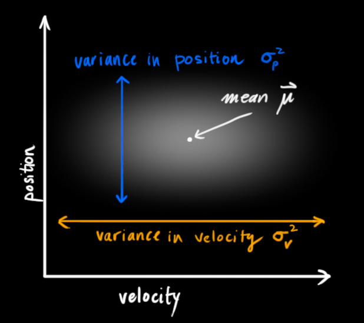</img>

* but case above shows two variable is not correlated, which is not true. 
* variable and first order differentiate variable should be correlated

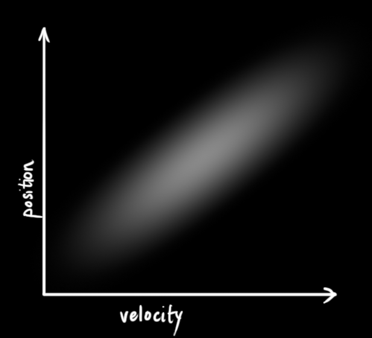</img>

* we could use the covariance to squeeze more infomation to accurate our estimation

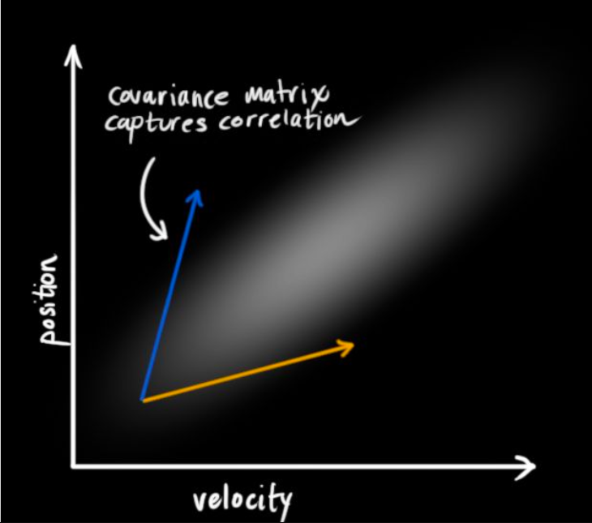</img>

then we need two matrix at time $k$

* state vector(matrix)

$$\hat{x_{k}} = \begin{pmatrix}
p \\
v
\end{pmatrix}$$

$$P_k = \begin{pmatrix}
\sum_{pp}~~~\sum_{pv}\\
\sum_{vp}~~~\sum_{vv}
\end{pmatrix}$$

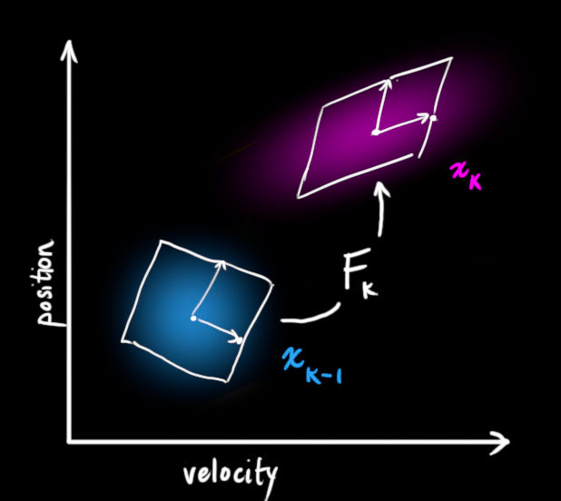</img>

we use matrix operation $F_{k}$ to describe state matrix $\hat{x}_{k-1}$ to $\hat{x}_{k}$

$$
\hat{x}_{k} = F_{k}\hat{x}_{k-1}
$$

more detail

$$
\begin{aligned}
 & p_{k} = p_{k-1} + \Delta t v_{k-1} \\
 & v_{k} = v_{k-1}
\end{aligned}
$$

then in matrix form

$$\hat{x}_{k} = \begin{pmatrix}
1~~~\Delta t\\
0~~~1
\end{pmatrix}\hat{x}_{k-1}$$

how about covariance matrix update?

recall formula of covariance matrix

$$
\begin{aligned}
 & Cov(x) = \sum \\
 & Cov(Ax) = A\sum A^{T}
\end{aligned}
$$

then we can write down update for state and covariance

$$
\begin{aligned}
 & \hat{x}_{k} = F_{k}\hat{x}_{k-1}\\
 & P_{k} = F_{k}P_{k-1}F_{k}^{T}
\end{aligned}
$$

if you have second order differentiate, we could add in it. in this case, is accelation

$$
\begin{aligned}
 & p_{k} = p_{k-1} + \Delta t v_{k-1} +  \frac{1}{2} a \Delta t^{2}\\
 & v_{k} = v_{k-1} + a\Delta t
\end{aligned}
$$

in matrix form

$$
\begin{aligned}
 & \hat{x}_{k} = F_{k}\hat{x}_{k-1} + \begin{pmatrix}
\frac{\Delta t ^{2}}{2} \\
\Delta t
\end{pmatrix} a \\
 & = F_{k}\hat{x}_{k-1} + B_{k}\vec{u}_{k}
\end{aligned}
$$
where $B_{k}$ is controlling matrix, $\hat{u}_{k}$ is controlling vector

* add new uncertainty every predction step to mimic we can't know all noise all the time.

</img>

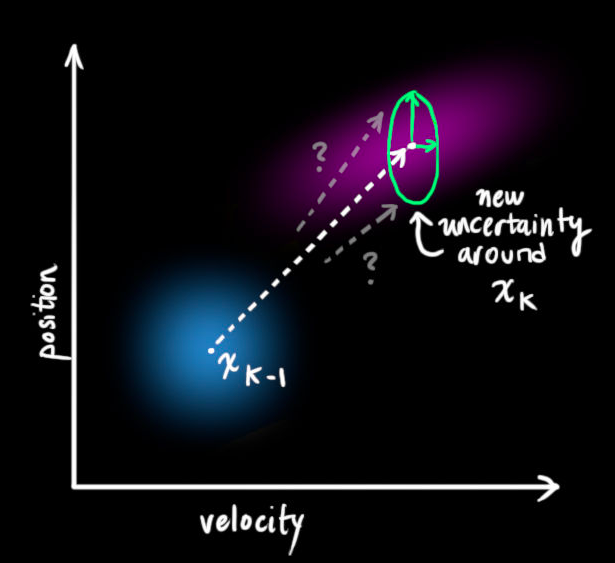</img>

* the uncertaity represent with a gaussian distribution, with the same mean $\mu$ but different covariance, we say $Q_{k}$

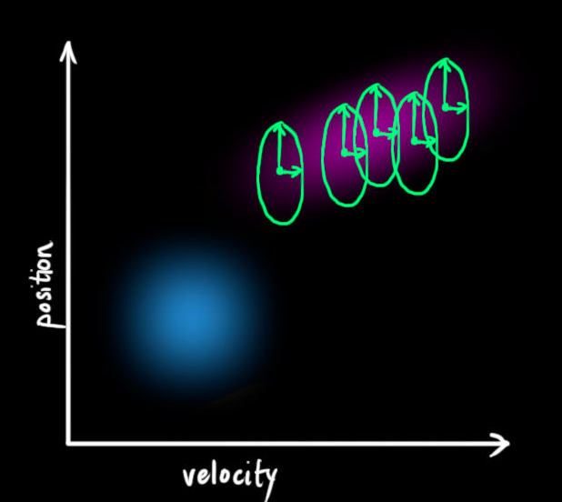</img>

* then our update formula will add on covatiance $Q_{k}$

$$
\begin{aligned}
 & \hat{x}^{k} = F_{k}\hat{x}_{k-1} + B_{k}\vec{u}_{k}\\
 & P_{k} = F_{k}P_{k-1}F_{k}^{T} + Q_{k}
\end{aligned}
$$

* the physical meaning in chinese
* 新的最佳估計$x_{k}$ 基於 原最佳估計($x_{k-1}$) + 以之外部影響校正$B_{k}\vec{u}_{k}$ 得到
* 新的不確定性($P_{k}$) 基於 原不確定性($F_{k}P_{k-1}F_{k}^{T}$)和外部環境的不確定性($Q_k$) 得到

## describe measurement

we describe predction phase above, but we still can measure, the describe measurement and combine both of them

real position / velocity <-> measurement 

we have measure matrix $H_{k}$ here

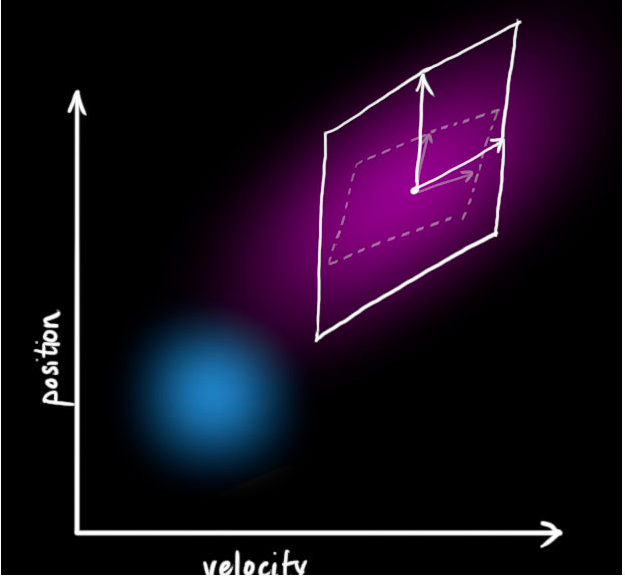</img>
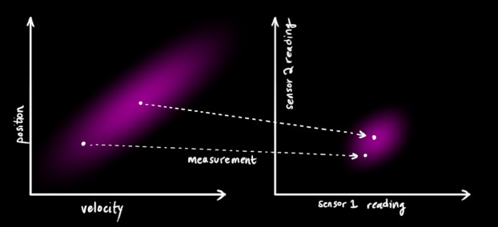</img>

again, it is a matrix operation, but we measure at time $k$ not time $k-1$

$$
\begin{aligned}
 & \vec{\mu}_{expected} = H_{k}\hat{x}_{k}\\
 & \sum_{expetected} = H_{k}P_{k}F_{k}^{T}
\end{aligned}
$$

</img>

it is still a guaasian distribution
we set uncertainty of measurement with mean $z_{k}$ covariance $R_{k}$

## Our idea, combine two infomation

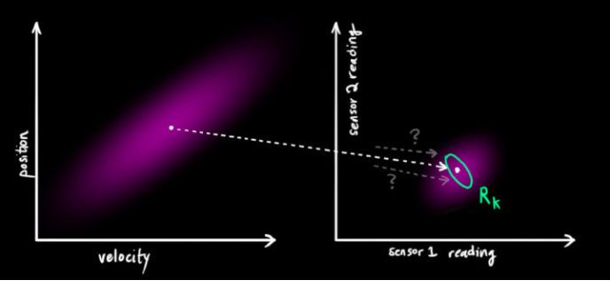</img>

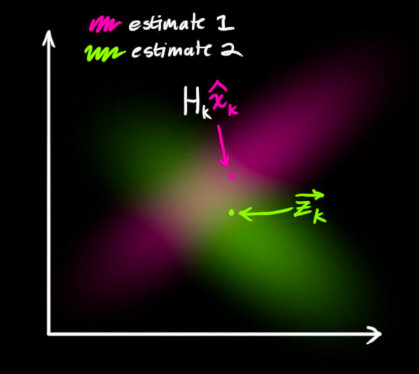</img>

* multiple by two gaussian, our new estimation

### some gaussian distribution detail

$$
N(x, \mu, \sigma) = \frac{1}{\sigma\sqrt{2\pi}}e^{-\frac{(x-\mu)^{2}}{2\sigma^{2}}}
$$

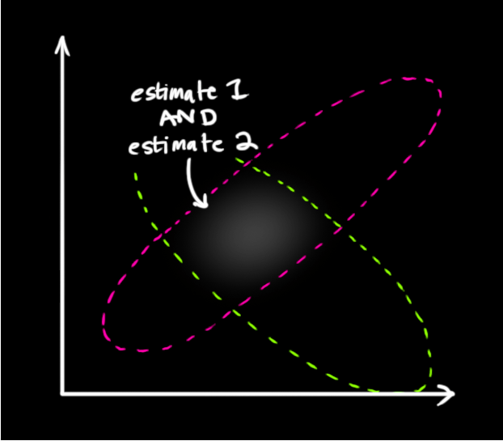</img>

$N_1 \times N_2$ just add on the exponetional
we get

$$
\begin{aligned}
 & \mu' = \mu_{0} + \frac{\sigma(\mu_1 - \mu_0)}{\sigma_{0}^{2} + \sigma_{1}^{2}}\\
 & \sigma' = \sigma_{0}^{2} - \frac{\sigma_{0}^{4}}{\sigma_{0}^{2} + \sigma_{1}^{2}}
\end{aligned}
$$

let 
$$k = \frac{\sigma_{0}^{2}}{\sigma_{0}^{2} + \sigma_{0}^{1}}$$

we have

$$
\begin{aligned}
 & \mu' = \mu_{0} + k(\mu_1 - \mu_{0})\\
 & \sigma' = \sigma_{0}^{2} - k \sigma_{0}^{2}
\end{aligned}
$$

we could see if $k \in R, k \geq 0$ uncertainty $\sigma$' is decreasing, $k$ also be called as kalmain gain

in matrix form, we get

$$
\begin{aligned}
 & K = \sum_{0}(\sum_{0} + \sum_{1})^{-1} \\
 & \vec{\mu}' = \vec{\mu}_{0}' + K(\vec{\mu}_{1}' - \vec{\mu}_{0}')\\
 & \sum' = \sum_{0} - K\sum_{0}
\end{aligned}
$$

### replace them with our info

$$
\begin{aligned}
 & (\mu_{0}, \sum_{0}) = (H_{k}\vec{x}_{k}, H_{k}P_{k}H_{k}^{T}) \\
 & (\mu_{1}, \sum_{1}) = (\hat{z_{k}}, R_{k})
\end{aligned}
$$

then 

$$
\begin{aligned}
 & K = H_{k}P_{k}H_{k}^{T}(H_{k}P_{k}H_{k}^{T} + R_{k})^{-1}\\
 & H_{k}\hat{x}'_{k} = H_{k}\vec{x}_{k} + K(\hat{z}_{k} - H_{k}\hat{x}_{k})\\
 & H_{k}P_{k}'H_{k}^{T} = H_{k}P_{k}H_{k}^{T} - KH_{k}P_{k}H_{k}^{T}
\end{aligned}
$$

simplify

$$
\begin{aligned}
 & K' = P_{k}H_{k}^{T}(H_{k}P_{k}H_{k}^{T} + R_{k})^{-1}\\
 & \hat{x}'_{k} = \vec{x}_{k} + K'(\hat{z}_{k} - H_{k}\hat{x}_{k})\\
 & P_{k} = P_{k} - K'H_{k}P_{k}
\end{aligned}
$$

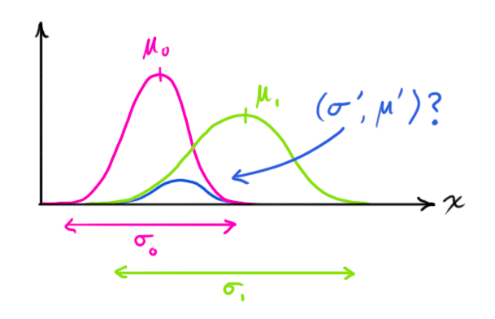</img>

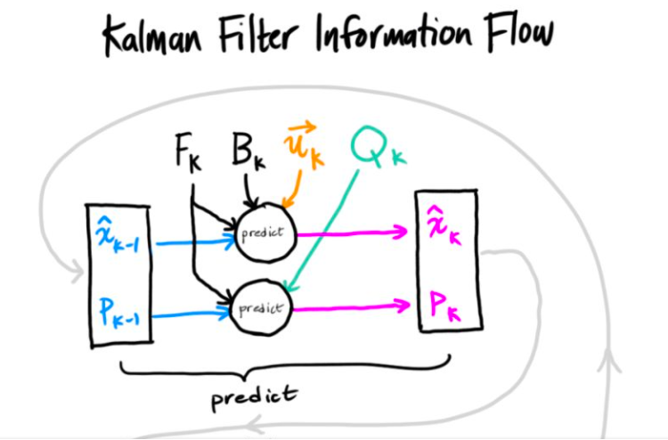</img>
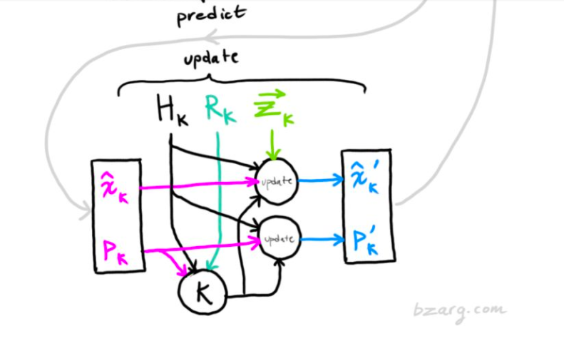</img>

* 匈牙利算法 - matrix steps
* Deep sort combine appreance matrix

