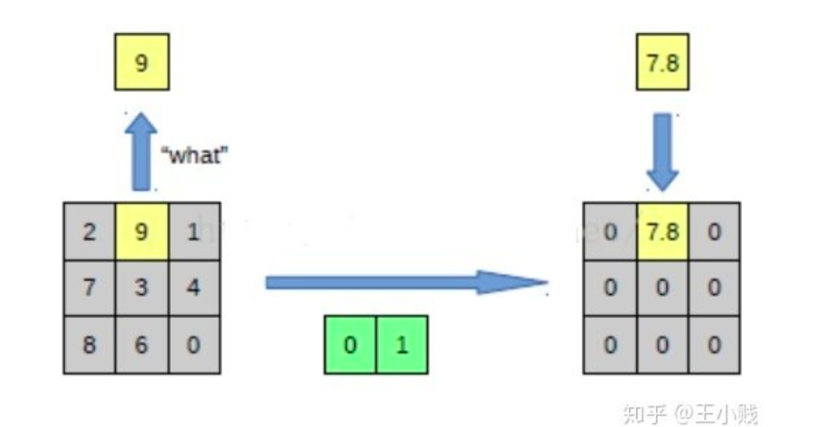
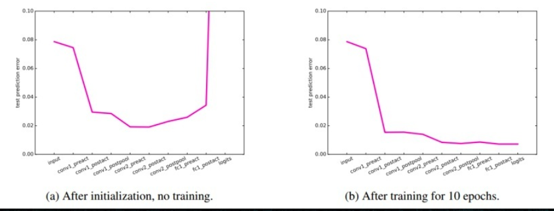

# Visualizing and Unstandering Convolutional Networks
[深度學習的可解釋性研究——不如打開箱子看一看](https://read01.com/zh-mo/dEdJ6ON.html#.Xlk_XRMzZE4)
[Visualizing and Understanding Convolutional Networks](https://link.springer.com/content/pdf/10.1007%2F978-3-319-10590-1_53.pdf)
* year 2014
* citation 8500+
* Author
  * Matthew D. Zeiler
  * Rob Fergus

# 摘要
大型的CNN網路目前都有非好的表現，但是仍然不太清楚他們為啥表現得那麼好，或是他們應該要怎麼被改進，本文中我們將會探討這兩個議題
我們將會介紹一個創新的視覺化方法幫助我們了解中間這些layer究竟學到了什麼，在我們的診斷條件下，我們還能夠找到一個更好的網路結構來打破當前ImageNet上的最佳成績，並且我們也用了一個方法來發現各layer對目標的貢獻，同時也展示出ImageNet model如何generalize到其他資料集上，當舞們把後面的softmax分類氣重新訓練後，我們打敗了了當前最好的結果在Caltech-101 and Caltech-256 datasets上。

# 作者
pass
## Key point
* from [深度學習的可解釋性研究——不如打開箱子看一看](https://read01.com/zh-mo/dEdJ6ON.html#.Xlk_XRMzZE4)
* pooling -> unpooling
</img>
* 激活 - 反激活 Relu -> inverse Relu
* 卷積 - 反卷積
  * 反捲積這個過程非常有意思，其實反捲斯這個名詞多多少少有些誤解，和真正的捲機沒有多大關係，真正的含義應該是**轉至卷積**(Transposed Convolution)，CNN模型的卷積過程事實上是可以轉變成一個**矩陣乘法操作**的(只不過對CNN模型來說是一個參數重複度很高的稀疏矩陣)...

## 一些實驗結果
### 每一層學習的趨勢?
第一第二層對應著一些邊角或是色彩
第三層對應著紋理
第四層對應著一些狗臉，車輪
第五層則對整體有比較強的識別能力
### 收斂速度
前面幾層較容易收斂
後面幾層則不，基本上一開始沒啥變化，但是到後期之後則變化很大
### 圖像變換
一些仿射變化(平移，縮放，旋轉)對於網路的前一兩層影響很大，但是到了後面幾層，這些提取到的特徵就比較沒什麼變化
而2017年又有一篇論文特別來了解CNN的提取特徵
《Network Dissection: Quantifying Interpretability of Deep Visual Representations》CVPR 2017
## 同個時間內
Bengio在同一年發表了一篇《How transferable are features in deep neural networks》，就是通過研究特徵的可遷移性來對這個從泛化到特化的過程進行評估

## 到底需要幾層?
Bengio團隊在2016年又做了一項工作
《Understanding intermediate layers using linear classifier probes》
這篇文章的思路非常簡單，在每個隱藏層中添加一個線性探爭來測試隱藏層的表徵性能，怎麼做呢？以每個隱藏層為輸入，直接接到最後的label，這樣就是一個Logistic Regression，如此一來我們可以馬上評估模型的準確率如何上升的。
</img>
上圖是基於MINIST的訓練集

## 其他價值
儘管這篇說明了CNN到底怎麼學的方法非常的重要，學習**反卷積網路**也是另一個大重點，大部分的CNN結構中，如果網路的輸出需要是一張圖片的話，那麼就經常需要屎放反卷積網路，比如圖片語意分割，圖片去模糊，圖片可視化，圖片深度估計等，基本上都可以利用反卷積網路，而且學術圈取得了非常不錯的成果!