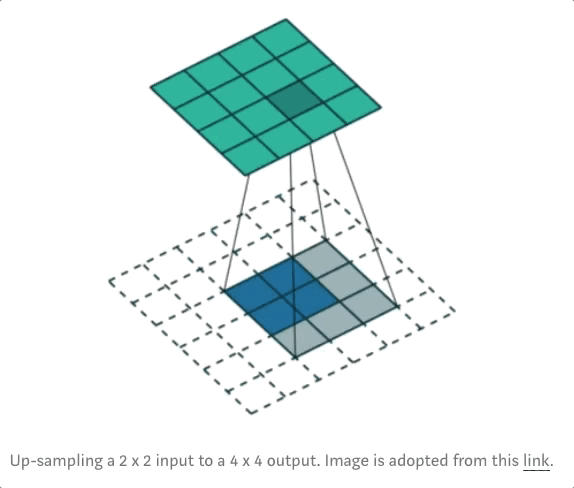

# Resource

* [原文 A Comprehensive Introduction to Different Types of Convolutions in Deep Learning](https://towardsdatascience.com/a-comprehensive-introduction-to-different-types-of-convolutions-in-deep-learning-669281e58215)
* [翻譯 一文读懂深度学习中的各种卷积](https://zhuanlan.zhihu.com/p/257145620?fbclid=IwAR3ookGhoWLdCcupRMMvRoy67UtZmg0LcM2BrLvIDZqHnXpkO4xkRPzGnIA)
* [convolution visulization, 9.4k+ stars](https://github.com/vdumoulin/conv_arithmetic)

* [一文带你了解深度学习中的各种卷积（上）](https://www.jiqizhixin.com/articles/2019-02-22-22)

# single channel convolution vs multi channels convolution

## single channel 

* stride : 1, padding : 0
* input : 5x5
* kernel : 3x3
* output : 3x3

</img> 

## multi channels

### layer, channels, feature map, filters, kernels

* 一些術語介紹 layer, channels, feature map, filters, kernels
* 一層(layer)可以有多個channel，或者說一層可以有多個特徵圖
* 舉例 - 輸入一個RGB影像，就有3個通道，或稱為三個特徵圖(R, G, B)
* fitler和kernel
  + 如果是描述2D - filter和kernel指同個東西，就是那個權重矩陣
  + 如果描述3D以上，kernel : 2D的權重矩陣，filter - 多個kernel堆疊的3D結構

### dive in

* input RGB image with 5x5x3 (3 channels)
* filter is a 3x3x3 matrix
* filter裡面有3個kernel，會對input的3個channels分別進行convolution，總共3次，然後在個別3個channels中得到3個feature map

</img>

* 接下來呢? 全部相加，實質上就是在channel level做aggregation

</img>

* 所以基本上input image(feature map)的channel數量最後會被aggregation掉，所以這樣的convolution感覺起來還是2D的，儘管我們是使用3D filter來處理3D input

</img>

# 1 x 1 Convolution

# Transposed Convolution (Deconvolution)

* 用於up-sampling
* 事實上內插法也可以視為一種up sampling，1D內插法就是1D的up sampling，2D的內插法就是2D的 upsamping
* 透過convolution來進行 up sampling則是希望從資料學習到一個最適合的內差函數$F$
* 事實上透過一個卷積運算我們是可以做到up-sampling的，如下所示

## Example 1

</img>

* 3x3 kernel
* 2x2 input padding with 2x2 borders of zeros
  + padding指的示input旁邊那些虛線的格子，因為本來就不存在，所以用0來代替
  + stride指的是convolution的step，unit step指的就是每次移動一格
* 我們可以output一個4x4的feature map，也就是說我們做了一個up-samping

  

## Example 2

* 我們可以來玩弄這個trick，我們讓input擴張一個格子(with 1 zero inserted between inputs)

</img>

* 同樣的setting如下
* 2x2 border of zeros padding
* 3x3 kernels

* 我們得到了5x5的 feature map

## 所以為什麼叫做transposed convolution?

* 先定義一下我們使用到的各個物件，$C$ : kernel，$Large$ : input image, $Small$ : output image
* 在一個down sampling的情境中，我們可以說kernel對input做convolution變成了output，這裡我們定義convolution操作符號為 $*$

$$
C * Large = Small
$$

* 事實上convolution操作是可以寫成dot product的，如下所示

</img>

* 接著我們把Sparse matrix$C$轉置，拿來對(output)$Y$做inner product，我們竟然可以得到(input)$X$

</img>

這也就是為什麼這樣的操作被稱作transposed convolution的原因！

# Dilated Convolution(Atrous Convolution)

* 中文翻譯又稱膨脹卷積 (擴張捲機)
* 直覺的概念，我們的kernel可以不用緊緊相鄰，中間可以有間隔，這樣就可以用同樣的參數量對更大的input image進行掃描，這是什麼意思? 我們用同樣的參數可以看更大的圖 =)

## 擴張係數 $l=1$

</img>

## 擴張係數 $l=0$(原本的convolution)

</img>

# Separable Convolutions
