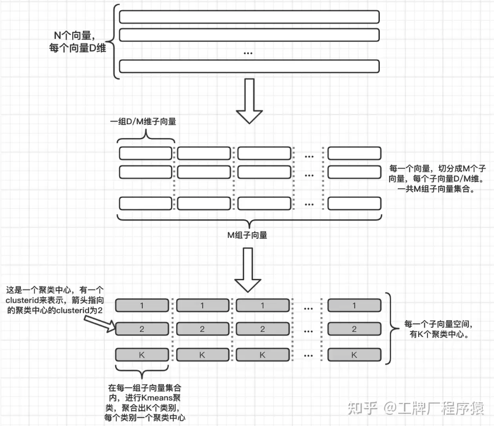
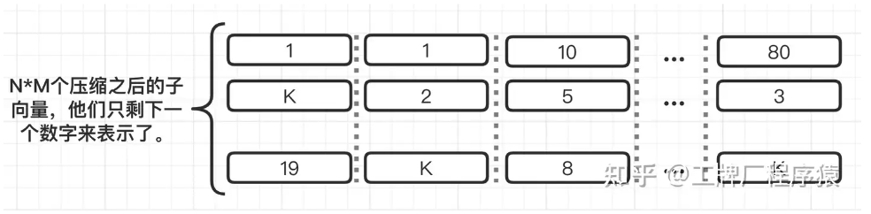
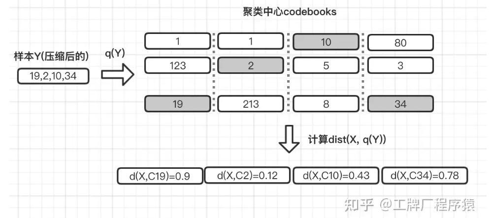
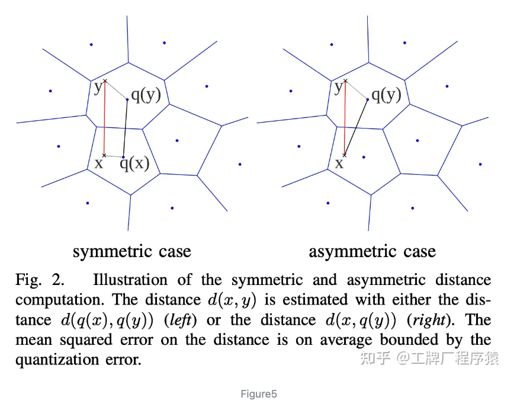
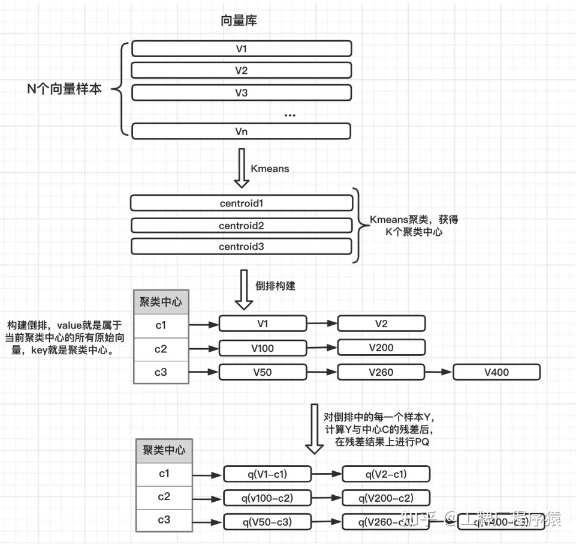
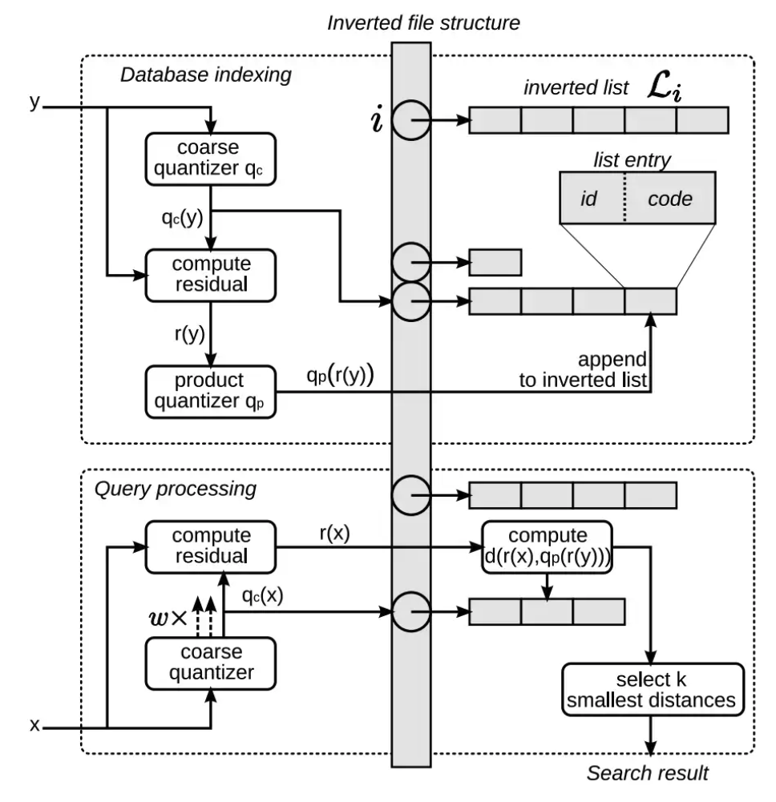
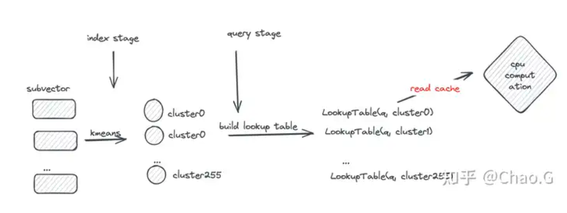
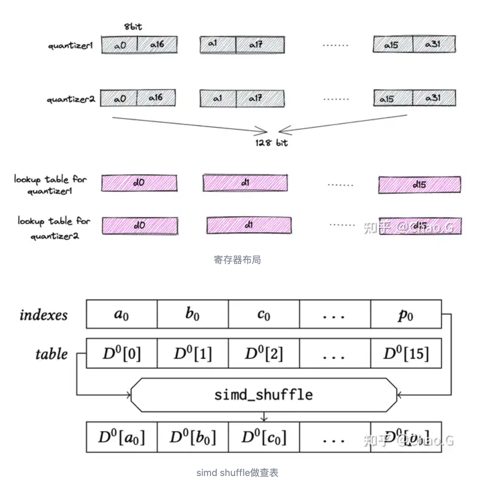

# ANN (Approximate Nearest Neighbor)

input : text / embedding vectors
output : approx most similar text / embedding vectors

problem : 

soppose N items need to find most K similar items

tc : $O(N^2)$
sc : $O(1)$

# LSH (Locality Sensitive Hashing)

* [my note](https://github.com/YLTsai0609/cs246_mining_massive_datasets/blob/main/implementation/lsh/jaccard_and_cosine.ipynb)

Building Hashes, in probability theorem, we could find hash function so that **we could hash the similar items to the same bucket with high probability**

building hash tables : 

tc : O(N)
sc : O(N)

finding similar (suppose maximum hashes buckets get N/B)

return random K in buckets : 
tc : O(1)

re-compute similarity 

tc : O(N/B), ~ O(N), suppose B 固定

## LSH Hashing Functions

similarity : L2, Cosine, Hamming, L1,  Jaccard, ....
hashes : something random, e.g. random hyperplane for Cosine (最後的結果要均勻)

## NOTE

1. 通常可以 grid search 找出適合的參數， False Positive (真實相似度低，但是在同一個 bucket), False Negtive (真實相似度高，但沒有在同一個 bucket)
2. 使用前要先調個參數
3. Hash functions 以 Cosine 來說，是一組矩陣， K 個 Random Hyperplane

# ScaNN

是ANN 中裡面的一種基於 IVFPQ 的方法

## PQ (Product Quantization)

https://zhuanlan.zhihu.com/p/378725270

* 向量壓縮
* 向量 --> 子向量，把 D 維度切成 M 組 --> 拿去 clustering，分成 K 群
* number of data : N
* number of dimension : D
* N x D --> N * D/M (做一個 Kmeans), 共 M 組，如下圖

</img>

* 每一筆資料現在可以被 M 組 clusterID 表示，整組資料會有 K^M 種可能性 (乘積量化空間)
* 這實際上是透過 M 個 KMeans 模型把資料做壓縮

</img>

* 查詢場景 - X --> 透過 M 個 Kmeans 轉換，變成 Y, e.g. (19, 2, 10, 34)
* 壓縮資料先存起來 (Index 好)

</img>

基於特定的距離函數做查詢 e.g. L2

* 怎麼查詢?
* SDC (Symmetric Distance Computation)
  * X --> q(x) --> 透過查表
  * Y --> q(y) --> 透過查表
  * d(X, Y) ~ d(q(x), q(y))
    * 查表計算速度快
    * 比較不準，有兩個量化誤差 q(x), q(y)
* ADC (Asymmetric Distance Computation)
  * X --> query vector
  * Y --> q(y) --> 透過查表
    * d(X, Y) ~ d(X, q(y))
    * X 沒有經過轉換，會算得比較慢
    * 只有一個量化誤差，比較

</img>

壓縮**前** time complexity : O(N * D)

壓縮**後** time complexity : O(N * M) --> 似乎也沒有很快

## IVFPQ

基於 PQ, 查詢上做優化，其實不用全部都計算距離，反而可以透過 loop up table

Inveted File System Product Quantization

* 這次不切 sub-vectors, 而是做一次 KMenas, 獲得 K 個聚類中心
* 以 K 個聚類中心建立 Bucket (KMeans) ， 每個資料點排進以每個聚類中心 c 的 key 中，並且計算根據聚類中心的 Residual
  * e.g. Y = [2.4, 2.1], C1 = [2.3, 2.0], resudual = [0.1, 0.1] - 讓值域比起原本資料點變得更窄(相對於 c1 的x, y 座標值)
* 對於每一個聚類中的資料點都做 subvector 的 PQ (壓縮及查詢)

</img>

Retrieval 過程 : 

資料量 N, 向量維度 D, 資料量 N 先分成 K 群，每個群再各自分 M 群 subvector

1. vector x
2. 算出屬於哪一個聚類中心，例如屬於 c1 - O(1) 或者 O(K * D)
3. 計算 resudual
4. 根據 c1 內的 PQ 結果，找 TopN  - O(N / K * M)
   1. N 筆資料分成 K 群，平均來說一群裡面有 N/K 筆資料
   2. 每個 c1 內有 M 個 KMeans 壓縮值

</img>

## ScaNN

[Accelerating Large-Scale Inference with Anisotropic Vector
Quantization](https://arxiv.org/pdf/1908.10396.pdf)

https://zhuanlan.zhihu.com/p/684898701

基於 Inveted File System Product Quantization (IVFPQ) 的優化

* Quantization 使用 KMeans 聚類中心來取代 subvector
* 搜尋時作查表，有記憶體瓶頸，可以更快嗎?

Score-aware quantization loss

進行 quantization 之後，會產生 $x'$, 原始向量為 $x$， loss function $(qx - qx')^2$

* 離 qurey 更近的點，對結果影響更大，保證這些點的量化誤差小，更為重要 - 後來分析後， 水平分量的影響更大

4bit PQ

</img>

* look up table 頻繁存取，如果做到更小，就不用進記憶體，直接在 cpu 做 (高效 SIMD 指令)
  * subvector 聚成16類
  * 一班用 float 表示的距離使用 SQ (?) 轉換成 uint8 --> subvector 的 lookup table 可以使用 16 * 8 = 128 bits，可以放到 cpu 中 (AVX2 指令集)

</img>

* ScaNN 專注在第一點，定義 loss function 並證明其有效性，不過有其他實測者認為真正有用的其實是 4bits PQ - [Similarity Search: ScaNN and 4-bit PQ](https://medium.com/@kumon/similarity-search-scann-and-4-bit-pq-ab98766b32bd)