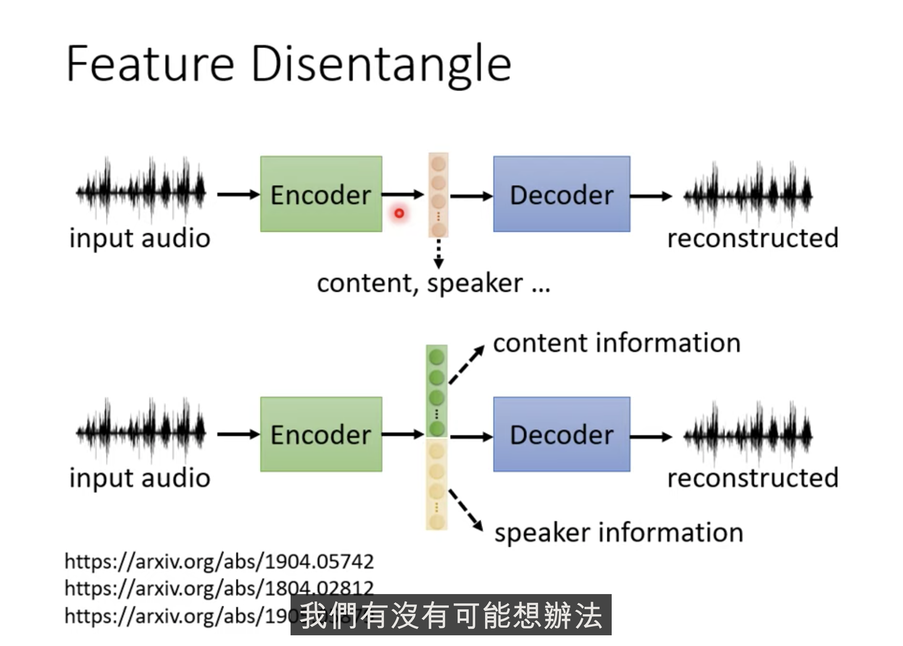
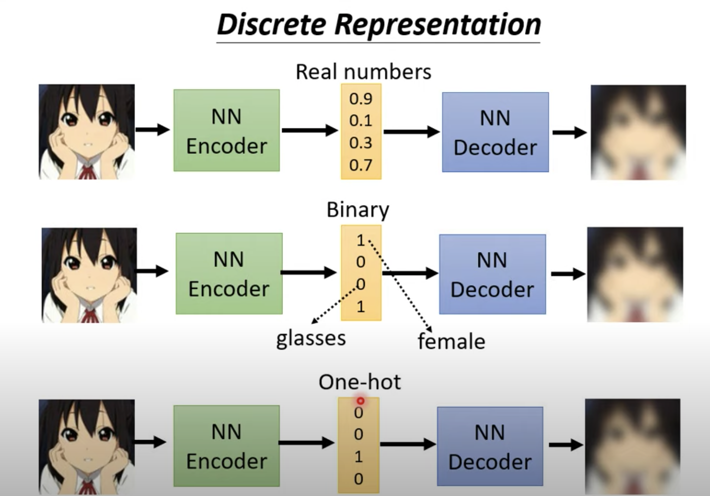

# Ref

[【機器學習2021】自編碼器 (Auto-encoder) (上) – 基本概念](https://www.youtube.com/watch?v=3oHlf8-J3Nc&t=1s)

[【機器學習2021】自編碼器 (Auto-encoder) (下) – 領結變聲器與更多應用](https://www.youtube.com/watch?v=JZvEzb5PV3U)

# Self-Supervised Learning

</img>

</img>

</img>

</img>

</img>

## Why Auto-encoder work?

</img>

事實上，unput data 的 feature dimension 只要是 correlated，那麼就可以被更簡單地表示，所以 auto-encoder 才會work

## Denoising Autoencoder

</img>

其實 BERT 做的事情跟 Denoising Autoencoder

他們是極其相似的

Masking <--> add noise 

Attention layer <--> Enocder 

embedding <---> embedding

Linear + softmax + reconstruction <--> reconstruction

</img>

</img>
# AutoEncoder Application:

1. Feature Disentanglement
2. Discrete Latent Representation
3. More Apllications

# Feature Disentangelement

特徵解耦合

通常Embedding的每個向量我們都不知道他是什麼意思，只知道他有豐富資訊 e.g.

1. 圖像 : 紋理、顏色
2. 文字 : 上下文關係、詞性、語意、句法
3. 聲音 : 聲音內容、語者聲紋...

</img>

特徵解耦合想要做到的事情就是，再訓練autoencoder時，做一些手腳，讓訓臉出來的embedding可以被切分開，哪些維度是什麼

</img>

</img>

可以做到語者轉換(但其實也沒有做得很好，還不能商用)

語者轉換過取用Supervised learning 來做

要把語者AB都找來說一模一樣的話，這有一些問題

A. 很難找到該語者(例如藝人 - 新垣結衣)
B. 可能語言不通

</img>

</img>

現在有了 Feature Disentanglement

兩個語者不需要講同樣的語言，也不需要講同樣的內容，只要一個Auto encoder 就有機會做到

</img>

各自訓練 auto encoder，把中間拿出來，拼在一起，餵給 decoder

</img>
</img>

# Discrete Representation

Autoencoder中間的 embddeing 一定要是向量嗎，能不能是別的?

1. binary vector - 解釋圖性特徵!?
2. Onehot - Unsupervissed Classitication !?
3. Text as latent representation
4. Tree as representation

## Binary, Onehot

</img>

最知名的 : Vector Quantized Variational Auto-encoder (VQVAE)

</img>

中間很像 attention ， 總之就是拿出一個 descrite 的向量

把 VQVAE 用在語音上，似乎NN可以學習到KK音標之類的東西

## Text (Need RL)

3. Text as Rrepresentation - 摘要!?

</img>

Seq2Seq2Seq Model - Fully Unsupervised

</img>

其實蠻難訓練的

中間那層 embedding 電腦會發明自己的暗號，人類看不懂，但是機器可以正常還原

怎麼辦呢? 加上一個 Discriminator - 他知道該句子是不是人寫的，那麼摘要給什麼呢? 給標題或是標題加上副標題

</img>

文字怎麼餵給 Discriminator ? 不是 Vector欸.... ---> 用 RL 硬做，就可以做出來了

整個架構看起來很像 Cycle GAN

</img>

還行的結果(電腦還知怎麼縮寫)

</img>

爛掉的結果(電腦亂縮寫，亂摘要)

[Learning to Encode Text as Human-Readable Summaries using
Generative Adversarial Networks](https://arxiv.org/pdf/1810.02851.pdf)

</img>

# More Applciation

## Generator

Encoder - 壓縮器
Decoder - 產生器(Generator) - 給他向量，他給你文字(或圖、或聲音)

</img>

也就是說除了 GAN 以外， VAE 也是 Generative Model

## Compression

Encoder : 壓縮器

有損壓縮 =)

</img>

## Anomaly Detection(One class classification)

</img>

</img>

</img>

只有正常資料，沒有異常資料時

e.g. 識別是否是真人人臉

</img>