# 2021

* 一種難以訓練的情況 - Feature Scaling 不一致，這使得每個方向的 Gradient 有的很大有的很小

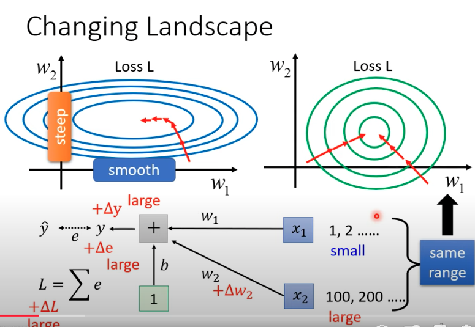</img>

## Feature Normalization

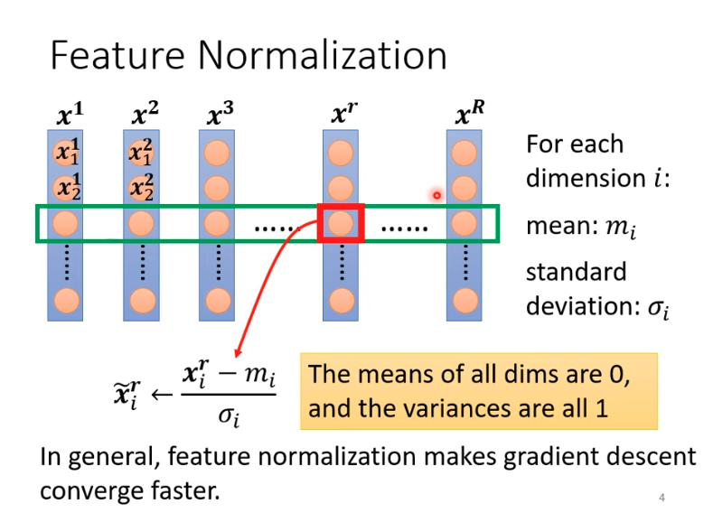</img>

* 橫的是總共有的特徵 $x^1$ to $x^R$
* 縱的是 Instance 的數量，姑且稱作 $n_{1}$ to $n_{n}$
* 從單個 instance - $n_{i}$ 針對 feature level 做 normalization (平均為 0 ，標準差為 1 )，可以使得 Feature Scaling 一致，消除 Gradient 有的很大有的很小的狀況
* 調整後通常 loss 更快收斂
* 整個 dataset 做 normalization， $m$, $\sigma$ 向量長度為 $N$ (資料筆數)

## Consider Deep Learning ( Batch Normalization )

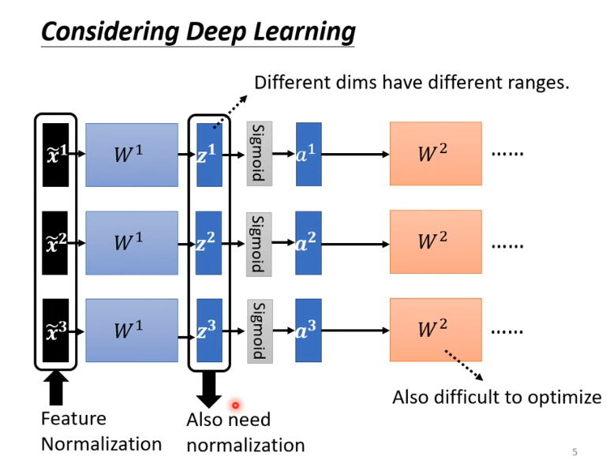</img>

* 每一次經過轉換，這裡是 DNN，其實也可以想成 feature transform， $z^1$ to $z^R$ 也是一種特徵，輸入接下來的網路，因此也需要做 normalization
* activation 之前或之後，其實差不多，都可以試試看，但如果用的是 sigmoid，0附近的 gradient 會比較大

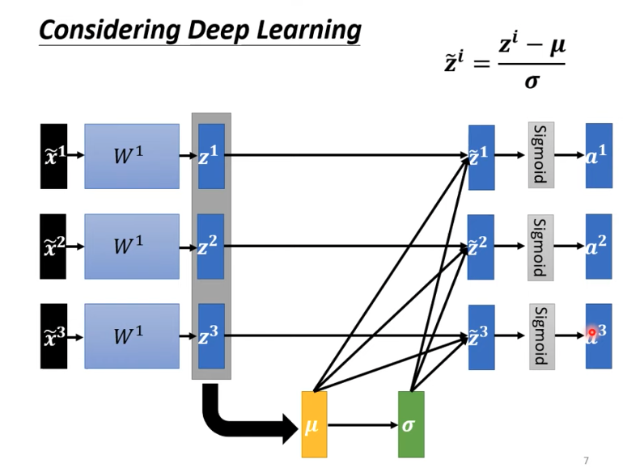</img>

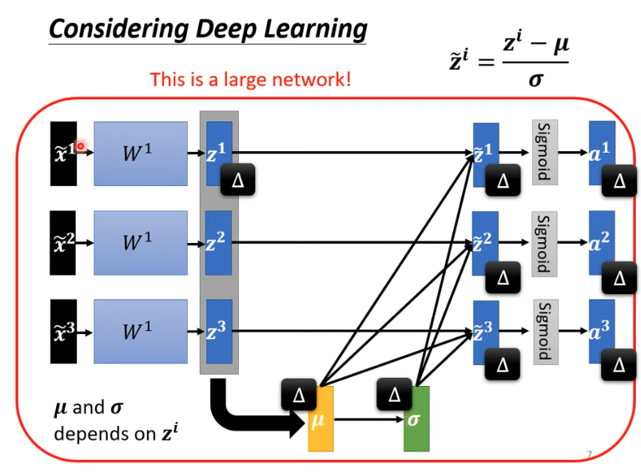</img>

* 和 Input Feature Normalization 不相同的是， $\mu$, $\sigma$ depends on $z$，所以$\mu$, $\sigma$ 也會改變，也是 network 參數的一部分

* 然而， Network 沒辦法一次吃全部的資料進行訓練 (GPU) ，必定是吃一個 batch, 一個 batch 的資料
* 所以， Netowrk 一次只會吃進一個 batch 的資料，對 64 筆 data 的 feature dimension 做 normalization
* **因為是 Batch normalization，所以如果你的 batch 是 1，就沒有意義，適用於 batch 較大的時候**
* $\mu$, $\sigma$ 都是一個 vector，長度是 batch size
  * $\mu$ - 代表每一個 instance 中 feature component 的平均值
  * $\sigma$ - 代表每一個 instance 中 feature component 的標準差
* **64 個 examples 怎麼做 - 因為 GPU 的限制，所以沒有辦法做整個 dataset 的 feature normalization，只能以 batch 做抽樣作為近似**

## Linear Transform for normalized features

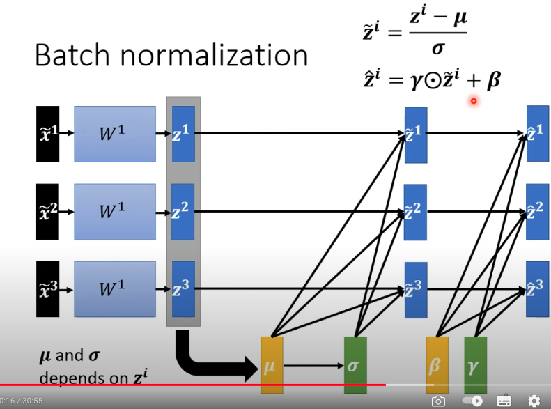</img>

* feature 經過 normalize ， 設計上也怕實際資料分布並非 mean = 0, std = 1，所以設定 $\gamma$, $\beta$，做線性組合，初始值會是 1 vector & 0 vector

## Infernece on Testing data (Production)

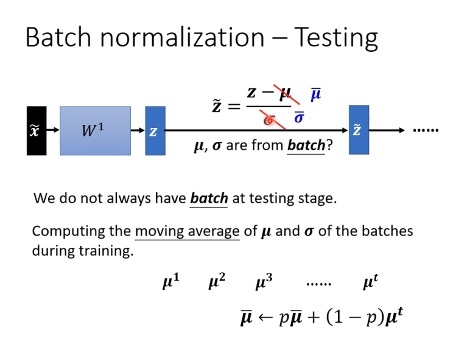</img>

* Production 沒辦法累積到一個 batch 才做計算 (如果是 realtime service)
* 每一次 batch 都會得到一個 $\mu$, $\sigma$，訓練完成後會把 $\mu_{t}$, $\sigma_{t}$ 存起來，基本上是 moving average，視為訓練資料的整理分佈，給 inference 的時候使用

## Performance

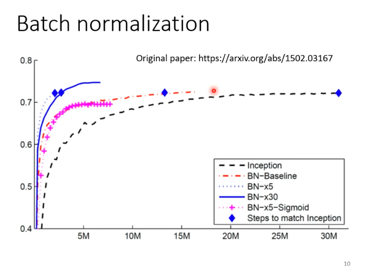</img>

* 收斂更快，同樣的 Accuracy

## Why? - Internal Covariate Shift OR Smooth Error Surface?

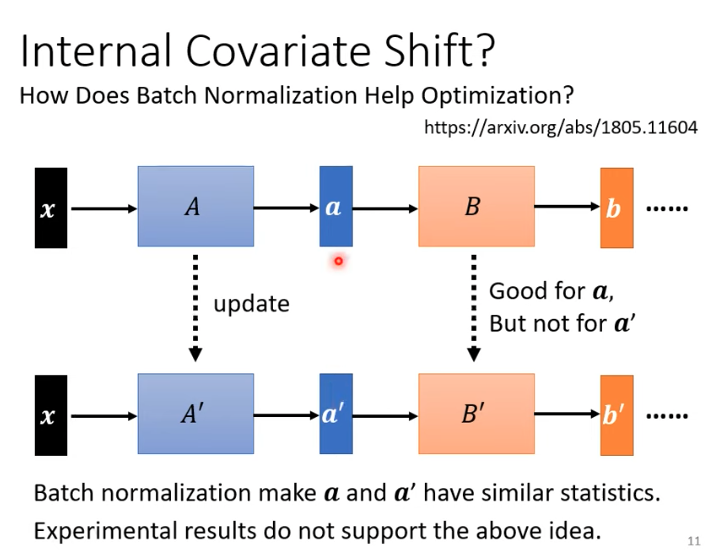</img>

* 原論文 - 2015 - 觀點被打臉

* 新論文 - How Does Batch Normalization Help Optimization?
  * Error Surface 變得更平緩 - 有理論的支持以及實驗的支持
* 讓 Error Surface 變得更平緩，也可以有其他方法，論文又提到，可以再去看

# A lot of normalization

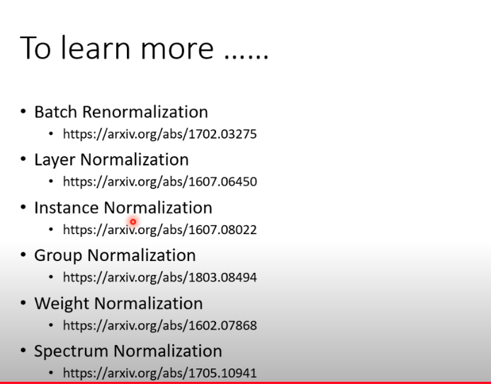</img>

# Batch Normalization vs Layer Normalization

-----
-----

# 2019

# Batch Normalization

* [Lee](https://www.youtube.com/watch?v=BZh1ltr5Rkg)
* Feature Scaling 不同得feature，會需要不同的learning rate，變得較不好訓練
* [Batch Normalization: Accelerating Deep Network Training by Reducing Internal Covariate Shift](https://arxiv.org/pdf/1502.03167.pdf)
  + 2015
  + 18008 citations

# Hidden Layer?

* $a^{1}$其實是layer2的feature，我們可以想像網路前面幾層是feature extractor，同理，每一層的input都可以是下一層的feature
* 這種做法對NN很有幫助，解決了一個稱作Internal Covariate Shift的問題(原論文聲稱)

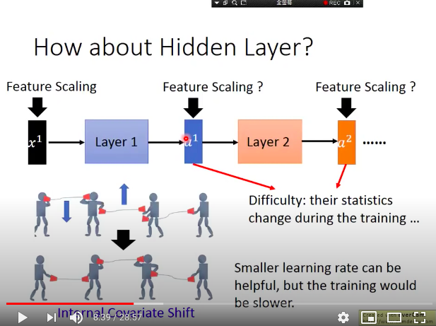</img>

* 如果對於每一個layer，input feature都是mean是0 variance是1，那麼training就會更容易一點
* 當網路越深層，ICS越大
* 而因為layer的weight一直改變，導致我們無法很輕易地得知每一次中間輸出的參數的mean跟variance，因此解決這個問題的技術就是Batch mormalization

# Batch

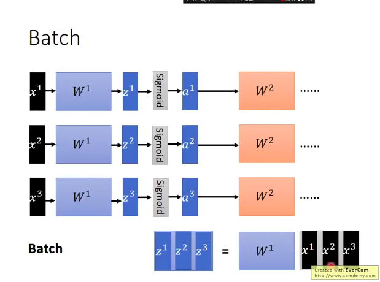</img>

* 一批有3筆資料for example

# Batch normalization

可以apply在activation func的input也可以apply在activation func的output，現存比較多的是apply在activation func的input
$x^{1}$ -> $z^{1}$ -> $a^{1}$

* 其實我們不喜歡input值落在activation func的平緩處，因為這樣會有梯度消失的問題，因此先做normalization就比較容易在把值控制在附近，那些地方的微分值會比較大
* **換句話說，對於容易梯度爆炸以及梯度消失的值，透過Batch Normalization，可以收縮到較好的微分值之處，這使得訓練變得更容易，也讓網路可以訓練更多層**

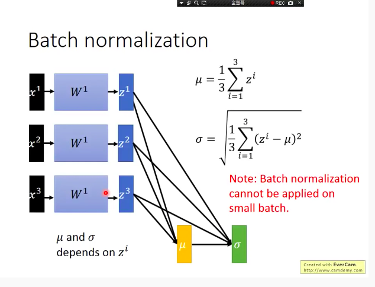</img>

* 其實我們希望的是該batch可以代表整個training set的statitsic，所以當你batch size太小時，就別用了!

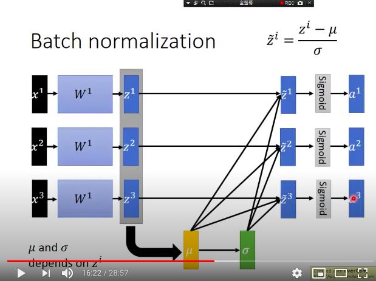</img>

* 注意 `sigma` 是elementwise的?

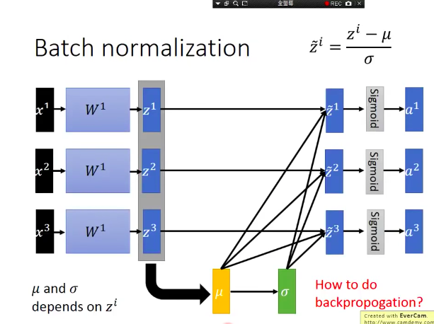</img>

* 這樣怎麼train?
* 事實上$\mu$和$\sigma$也是變數，不能被視為const，BP需要通過他們，從$z$到$z'$中間也必須視為一個網路
* 當你改動了$W_1$等同於改動了$z_1$等同於改動了$\mu$, $\sigma$

## Modified

* 如果你使用的activation func gradient最大不是在0，或是mean和vatiance不是0跟1，在其他的地方會表現得更好，那麼你可以改動他，做一個線性轉換
* 意思就是說，你的activation function如果比較特別，才做這個轉換(即$\gamma, \beta$)Linear transform
* 這裡需要注意的是$\gamma, \beta$是可以手動設計的，$\mu, \sigma$是根據data去learning出來的

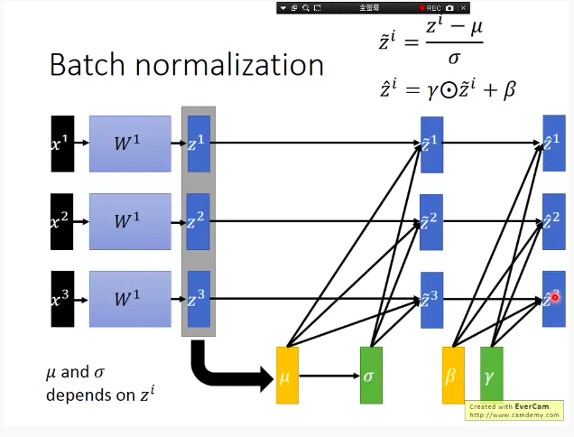</img>

## Testing stage?

* 事實上我們需要的是training set的stats，如果遇到整個training set太大，或是你的training是online的，那就很困擾
* 通常預測一直也只預測一筆data....

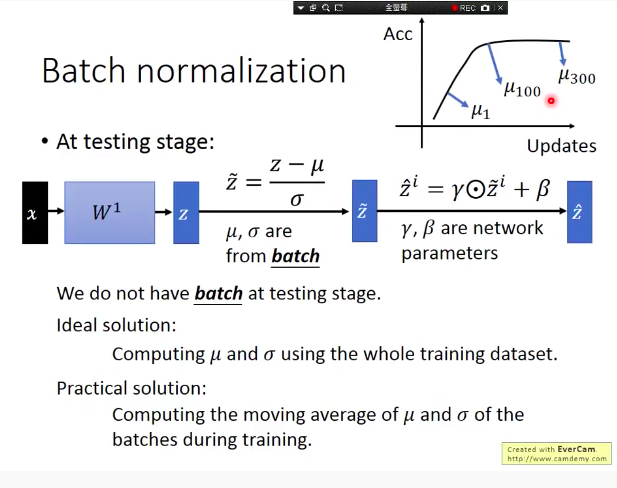</img>

* 可以取最靠近training結束時的mean和variance來代表整個training set的參數
* 為什為什麼不取$\mu_1 ~to~\mu_300$的的平均? - 因為$\mu$不斷的在變化，到了最後Accuracy效果最好，這時候是對z做估算最好的值
* 或者是我還是全部都取，但是越接近training結束時的weights越大

## Benefit?

* 讓訓練變簡單 - which means 可以設大一點的learning rate
* 更少產生梯度爆炸和梯度消失
* 原本如果使用sigmoid func，那麼很容易產生前面兩個結果，不過用了BN，如果你的activation func是sigmoid或是tanh，那麼就會特別有幫助(對那種有平坦區的activation function特別有效)
* 對參數的initialization影響更小（$w$乘上了$k$倍，normalization之後就是沒差的）

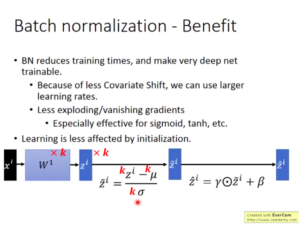</img>

* BN也可以視為一種regularization，因為遇到outlier會更robust
* BN主要是在training效果不好的時候作用較大，如果單純是testing的時候效果不好，有別的方法不見得要用BN

# 論文圖

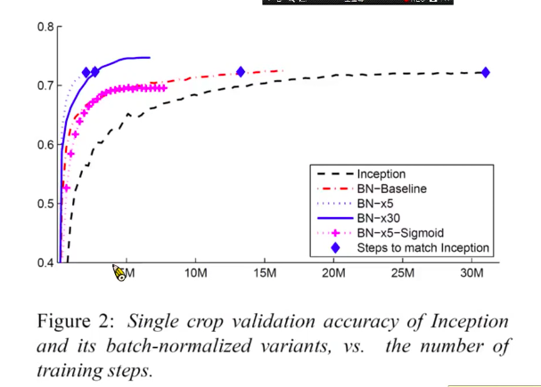</img>

* 這張圖是要說啥呢，是要說有BN可以把learning rate條大一點，藍色虛線就是調了5倍的learning rate，但是藍色實線 learning rate 30倍沒有比較好XD
* 如果是BN + sigmoid 會得到粉紅色線
* 藍色則是使用relu activation function

# Concerns

* Batch normalization在testing時使用training的stats，但是如果測試時目標離training時較不同(transfer task)，表現較差
* 如果特定的training process，無法用較大的batch數，那麼也會很差(例如object detection)，Group Normalization有解決方法

# Batch Normalization on Transfer Learning

* [Resource](https://medium.com/towards-artificial-intelligence/batchnorm-for-transfer-learning-df17d2897db6)
* 照理來說，BN的$\mu, \sigma$是用於估計training dataset的，transfer learning會apply在不同的dataset上，因此$\mu, \sigma$也需要適應到新的資料集上，合理的做法是fine-tune時$\mu, \sigma$可以繼續更新，並使用moving average的方式update，這個功能在tensorflow 1.x之中並沒有實作，在tensorflow 2裡面才有實作，因此除了Alexnet, VGG之外，其他有BN層的network要fine tune要記得在tensorflow 2裡面操作

# Layer Normalization
