# ChatGPT 的三個誤解

1. ChatGPT 不是罐頭回覆 - 每次輸入相同，輸出也有可不同，因為他會在 output probility distribution 上做 sampling
2. ChatGPT 不是網路搜尋結果
   1. 他是文字接龍，產生的網址只是幻想的，但是看起來很合理
3. ChatGPT 真正做的事情 - 文字接龍
   1. 輸入 text， output probability distribution，並且做 sampling
   2. 同個對話 Session， text 會被 concat ， 參數可能大於 1.7k 億(不知道，最後公開的 GPT-3 是這樣)
   3. 訓練時讀資料，但是推論時則是 Offline

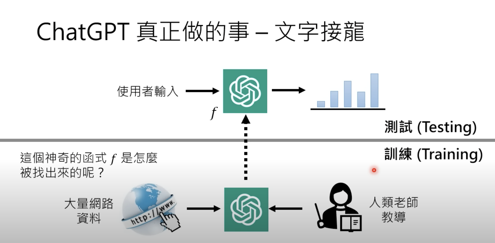</img>

# ChatGPT 訓練過程的摘要

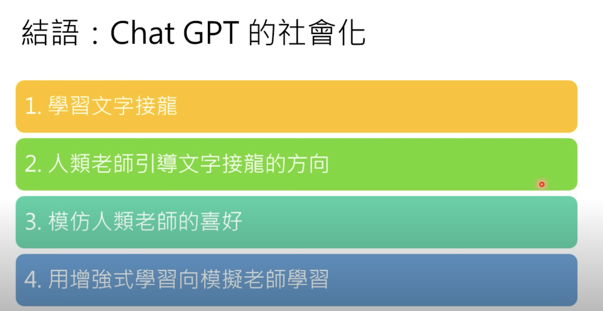</img>

* 文字接龍 - 什麼都接，Noise 很大
* 人類老師 - Teacher Model (Ranking) - 哪些比較合理，哪些不合理 (需要 label)，並且從 GPT 的回答中抽取 Negtive sample
* 強化學習 - GPT 的回覆會被評分，分數高 Reward 高，分數低 Reward 低，用於訓練 GPT 參數 (Instrution GPT 98% 像)
* 數學就沒辦法做，他是文字接龍，沒辦法給標準答案

# ChatGPT 的關鍵技術 (Pre-Training)

* Pre-train / Self-supervised learning / foundation model

* Chat
* Generative
* Pre-trained
* Transformer

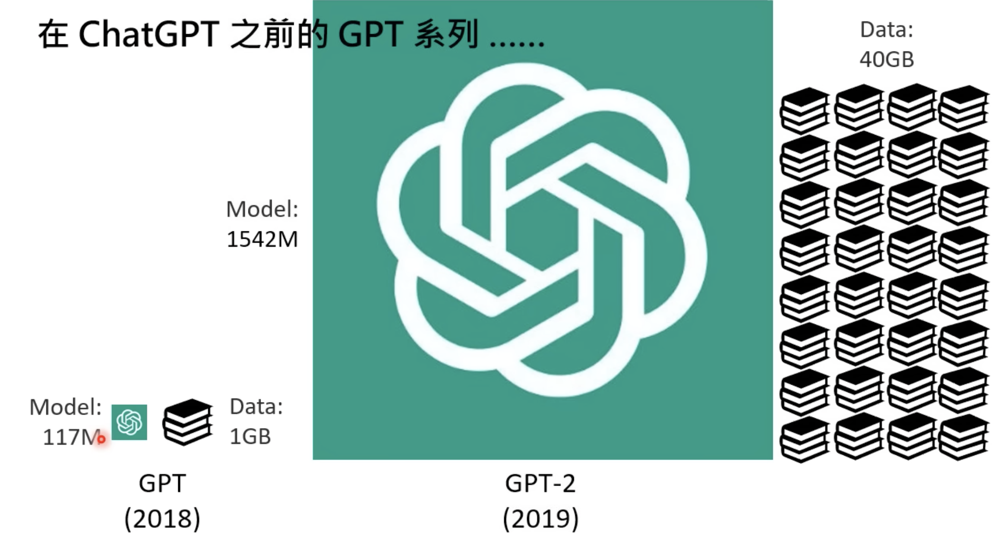</img>

GPT2 - 可以寫白痴小說，所以也被稱作獨角獸

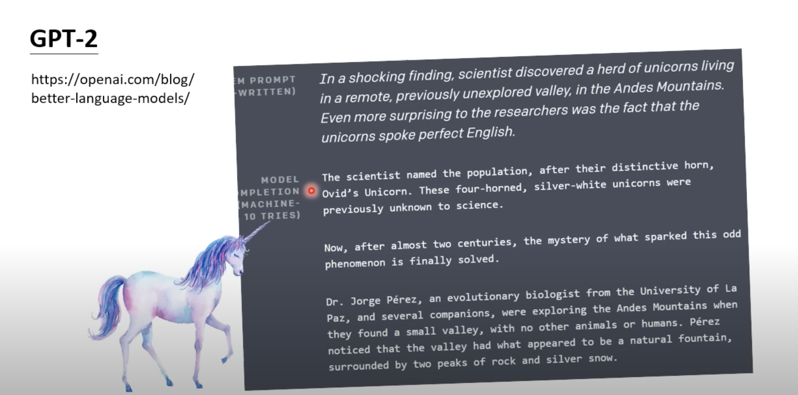</img>

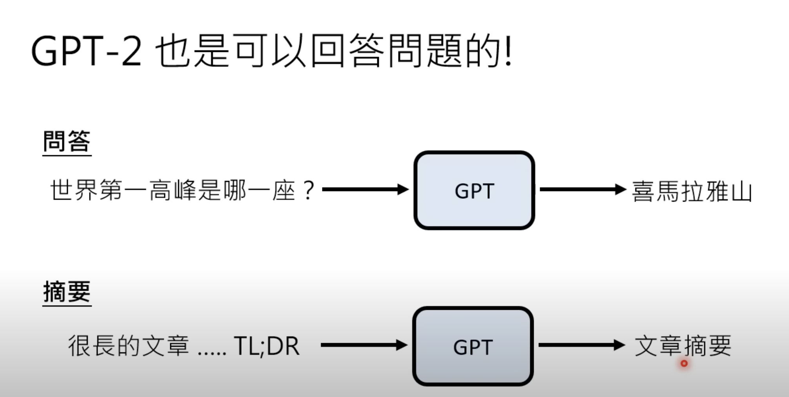</img>

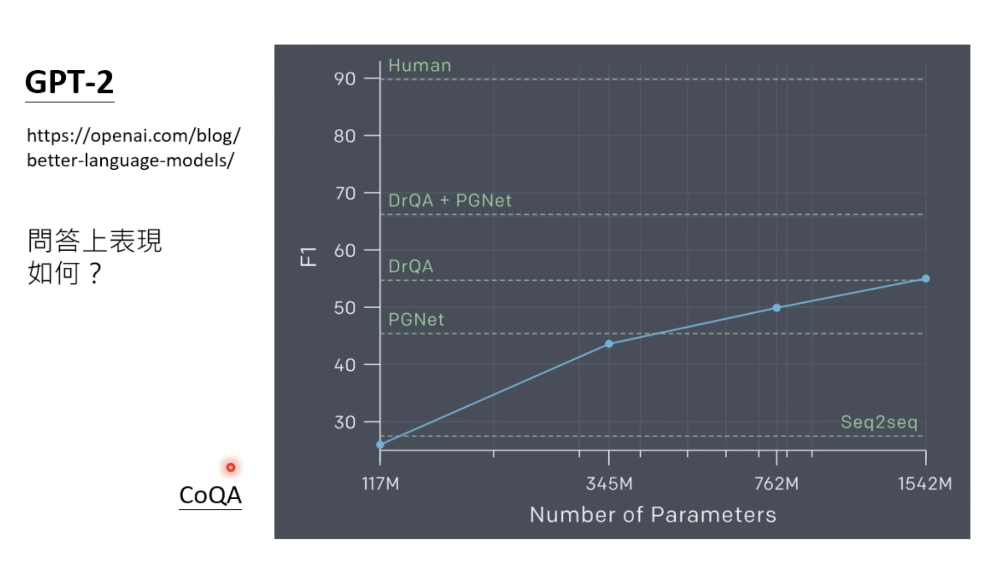</img>

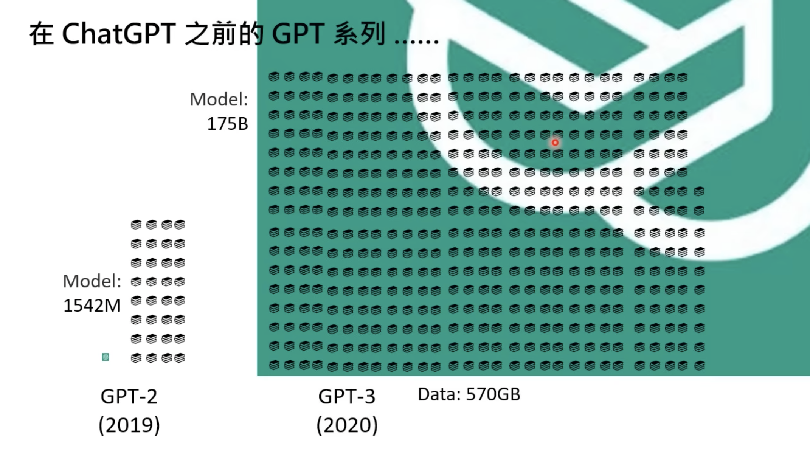</img>

* 模型已經太複雜，卻乏良好的訓練策略
* 但其實已經可以寫程式了

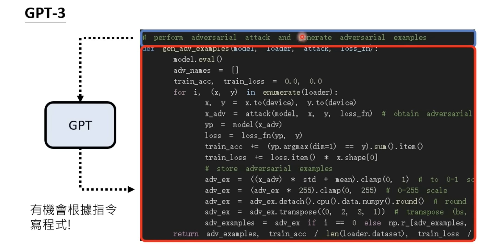</img>

## 缺點

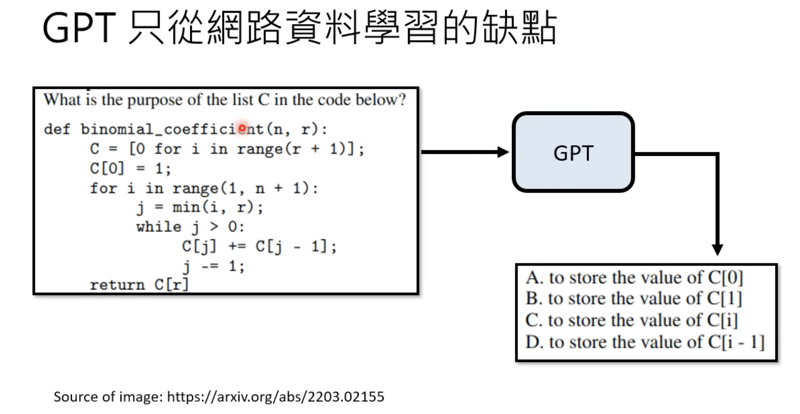</img>

* 他讀過很多文，但他給的不一定是你要的

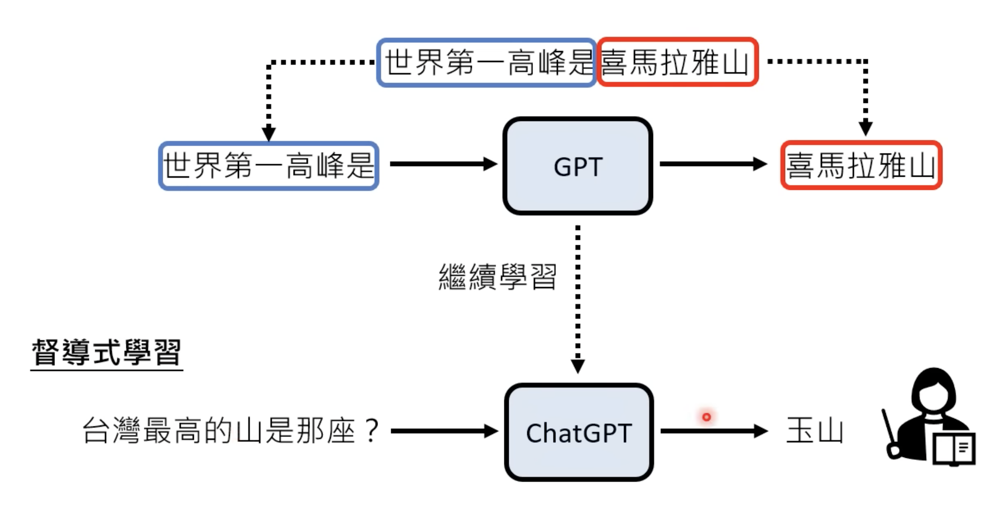</img>

* 可以輸出 100 種答案，但是要被排序，哪些是要的，哪些不要

**Label Data**

Teacher Model 需要 Question <---> Good Reply, Bas Reply Pair, 適用 QA Model 產生的，而非 Human

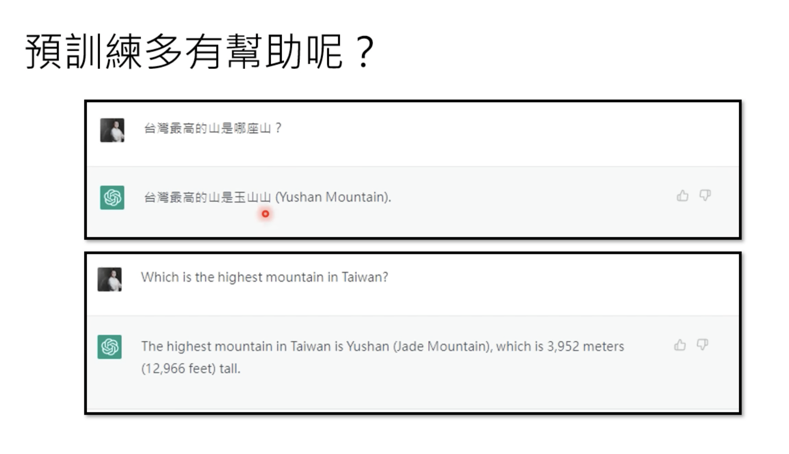</img>

* 只需要交一種語言，不需要交多種語言

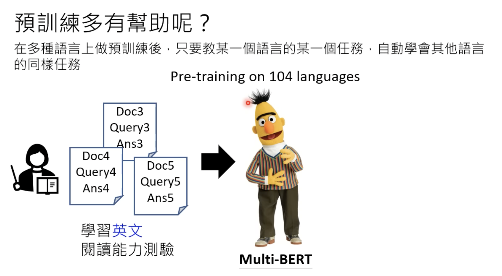</img>

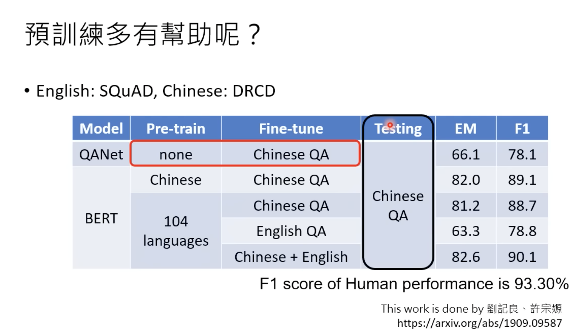</img>

* 開始逼近人類表現

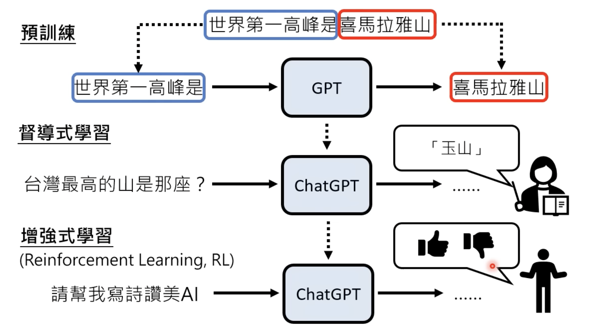</img>

* RL --> 更容易收集 label
  * 不需要給正確答案，只要給，這個答案是 positive 或者 negtive (從申論變成選擇)

TODO - https://www.youtube.com/watch?v=aZ_jXZvxyVg&list=PLJV_el3uVTsOePyfmkfivYZ7Rqr2nMk3W&index=10