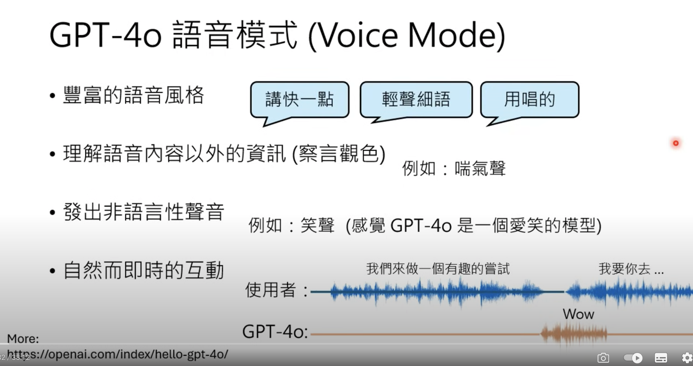
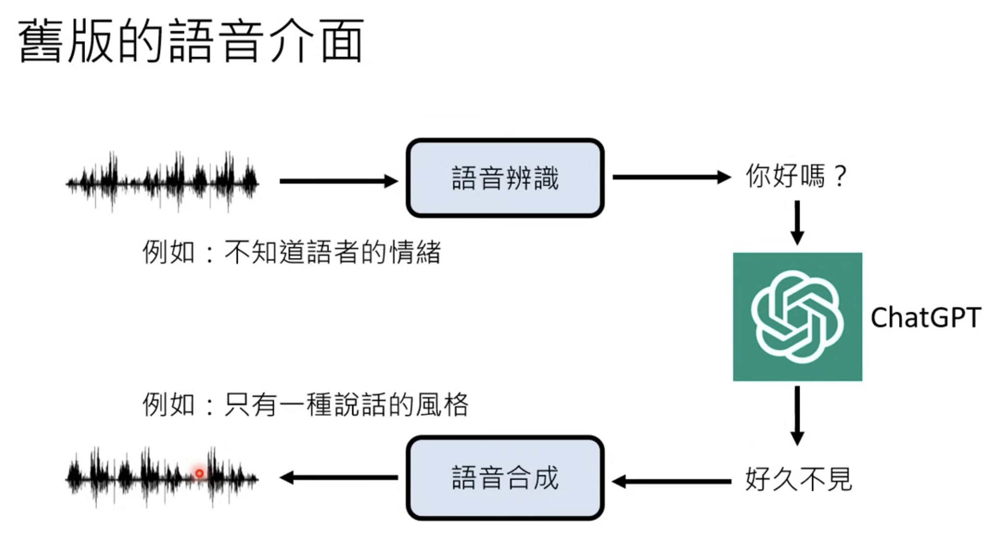

# ChatGPT原理頗析1 - 三個誤解

1. ChatGPT 不是罐頭回覆 - 每次輸入相同，輸出也有可不同，因為他會在 output probility distribution 上做 sampling
2. ChatGPT 不是網路搜尋結果
   1. 他是文字接龍，產生的網址只是幻想的，但是看起來很合理
3. ChatGPT 真正做的事情 - 文字接龍
   1. 輸入 text， output probability distribution，並且做 sampling
   2. 同個對話 Session， text 會被 concat ， 參數可能大於 1.7k 億(不知道，最後公開的 GPT-3 是這樣)
   3. 訓練時讀資料，但是推論時則是 Offline

</img>

</img>

* 文字接龍 - 什麼都接，Noise 很大
* 人類老師 - Teacher Model (Ranking) - 哪些比較合理，哪些不合理 (需要 label)，並且從 GPT 的回答中抽取 Negtive sample
* 強化學習 - GPT 的回覆會被評分，分數高 Reward 高，分數低 Reward 低，用於訓練 GPT 參數 (Instrution GPT 98% 像)
* 數學就沒辦法做，他是文字接龍，沒辦法給標準答案

# ChatGPT 原理剖析2 - 預訓練(Pre-Training)

* Pre-train / Self-supervised learning / foundation model

* Chat
* Generative
* Pre-trained
* Transformer

</img>

GPT2 - 可以寫白痴小說，所以也被稱作獨角獸

</img>

</img>

</img>

</img>

* 模型已經太複雜，卻乏良好的訓練策略
* 但其實已經可以寫程式了

</img>

## 缺點

</img>

* 他讀過很多文，但他給的不一定是你要的

</img>

* 可以輸出 100 種答案，但是要被排序，哪些是要的，哪些不要

**Label Data**

Teacher Model 需要 Question <---> Good Reply, Bas Reply Pair, 適用 QA Model 產生的，而非 Human

</img>

* 只需要交一種語言，不需要交多種語言

</img>

</img>

* 開始逼近人類表現

</img>

</img>

* RL --> 更容易收集 label
  * 不需要給正確答案，只要給，這個答案是 positive 或者 negtive (從申論變成選擇) (一種非常方便的偷懶收 label 方式)
  * RL --> 當你沒辦法給出正確答案時，你只知道這個方向是對的或是不對的，也可以使用

# How to Train a ChatGPT

* 語料 - 預訓練
* Supervised learning - label (Question, Answer) pairs
* RL - positive feedback / negative feedback

* sometimes, you could get the pre-trained output (文字接龍)

# ChatGPT 帶來的研究問題

1. 如何精準提出需求 - Prompt Engineering (催眠 / 詠唱)

</img>

</img>

* Prompt 是鄉民試出來的，未來有更聰明的方法嗎?

2. 如何更正錯誤

</img>

</img>

</img>

* 改一個錯誤，會不會弄錯原本對的東西? --> Neural Edting

3. 偵測 AI 生成詞彙和物件

</img>

* 可以用 ChatGPT 嗎?
* 以前用計算機、現在有工程計算機、Google、計算模擬實驗室，ChatGPT 可以使用，而且是接下來人類的最低標準

</img>

4. 不小心洩漏秘密

</img>

* 還是可以騙過 ChatGPT ， 但結果是生成的，不會是真的

</img>

* Machine UnLearning

</img>

# GPT-4o

https://www.youtube.com/watch?v=CgQ3lUOpXgc

</img>

</img>

</img>

* 現在確實可以透過現有技術，完成 chatgpt4o，但運算效率會成 bottleneck
  
</img>

* 官方說明是一個 End2end 模型，也就是說，這些不同的模型組件，已經被模型化

</img>

# How to build 2 end2end model for chatgpt4o from existing algorithm?

</img>

* Pre-train (word structure)
* Alignment
  * Fine-tune (pairwise questions / answer)
  * RLHF (Reinforcement Learning from Human Feedback)

</img>

* 一樣是 seq2seq，做聲音接龍，以下有很多挑戰
  * sampling rate

</img>

* 要先變成一個 Speech Unit ， 在 Decode

</img>

* 從結構上看， Speech Unit 的複雜度會高於文本，每一個文字都可以形成一個 Speech Unit，而 Speech Unit 又會有非語言表徵

</img>

* Speech Unit 可以保留聲音特徵，文字的話只會有音訊內容

</img>

* 而 Demo 中， ChpatGPT4o 可以知道有幾個人在講話，這需要有標記資料來標記一段話是誰再說

</img>

</img>

* 而紐約時報也證實， OpenAI 4月時用 Youtube 的影片在訓練語言模型，現在知道是訓練語音版語言模型了

</img>

* Youtube 很多背景音，會不會 gpt 講話有背景音? - 有，此時 demo 確實有 XD

</img>

* 確實可以只用語音，就讓電腦知道哪些地方要做語氣轉變，模型可以自動學會

</img>

* 100萬小時，實際上換成 Token，遠比開源 LLM 的資料量還要少，所以估計是做 Domain Transfer，而不是 end2end training

</img>

* 聲音訊號可以變成 Speech Token ， 其實對語言模型來說，他只是一種新的語言需要學習
* 而混合模式 (文字 + Token) 可以更快讓 LLM 上手

# Alignment

</img>

* 人類老師的訊料資料都是不同語者，但是 Demo 都是同樣的聲線，這表示 fine tuning 可能有 few-shot 的技術 (猜測)
* 也有可能做 Preprocessing - 把大量聲音檔案轉成同一個聲線

# Interface & 模型要同時聽跟說

語音 -> 沒有明確開始和結束
文字 -> 有明確開始和結束

</img>

</img>

</img>

</img>

* 也有可能有 3 個 Channel (Vision)

</img>

</img>

* 其實 Google 也做得到

</img>

</img>