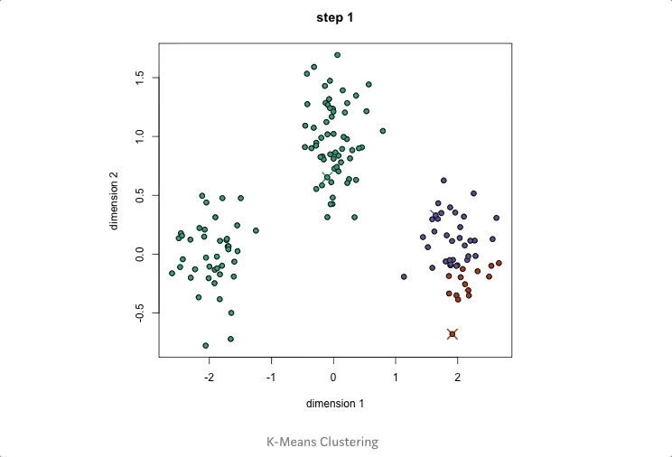

# Introduction
收集各種clustering 關鍵字，introduction level
[The 5 Clustering Algorithms Data Scientists Need to Know 19K+](https://towardsdatascience.com/the-5-clustering-algorithms-data-scientists-need-to-know-a36d136ef68)
## 框架
* Algorithm
* gif / image
* Pros and Cons
* Time Complexity
* Reproductivity
## KMeans

* 優點
    * 資源多，方便Survey
  * 缺點
    * 不具方向性，對於分散，歪斜，凹型 - 群聚效果不佳
    </img>
    可以看到群組中心分別在凹型的尖端，不適合用於凹型群組
    * 對Outlier以及distance數值敏感，建議先normolize過後在處理
  * 是否具備重現性?
    * scikit-learn : 否，初始點選擇的kmean++並不是保證可重現性的方式
  * 時間複雜度
    * $O(NKT)$
    * $N$為資料數, $K$為中心數(群數), $T$為迭代次數
  * 空間複雜度

## Mean-Shift

* single center

* Siliding window based algorithm 
  * random pick initial point $C$，with radius $r$
  * sliding windows is shifted towards regions of higher density
    * The density within the sliding window is proportional to the number of points inside it. 

* multiple center

* 優點 : 
  * 不用選群數
* 缺點 : 但是要選$window~size$，以及半徑$r$
* 是否具備重現性
* 時間複雜度

## DBSCAN

* 優點 : 
  * 不用選群數
* 缺點 : 但是要選$window~size$，以及半徑$r$
* 是否具備重現性
* 時間複雜度

## EM + GMM (Expectation_Maximization Clustering using Gaussian Mixture Models)

* 優點 : 
  * 自動output軟性分類 
* 缺點 : 
  * 仍然有隨機性
* 是否具備重現性
* 時間複雜度

## Agglomerative Hierarchical Clustering

* 階層式聚類分為兩種，由上至下(Top-down)，由下至上(bottom-up)
* 由下致上的算法將每個資料點視為一個單一的群，接著跟其他群merge(當然，最近的群)，稱為hierarchical agglomerative clustering or HAC.
* 表現形式為一棵樹，最底層為所有samples
* 優點 : 
  * 不用選群數
  * 而且可以選擇對我們目標最好的群數
  * 當需要解釋階層架構時，非常方便
* 缺點 :
  * 需要特別找視覺化套件
* 是否具備重現性
  * 具備重現性，是決定性算法
* 時間複雜度