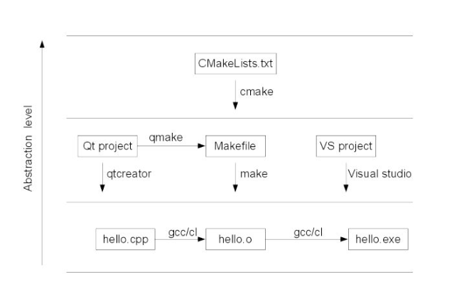

# compile and install
## 背景
* 被編譯安裝搞得太煩了，錯誤訊息很多，但有時候不能僅靠conda所指定的編譯方式，需要針對自己的硬體做特別的編譯
  所以來學習一些編譯相關指令與概念

例如:

* pip安裝spleeter時，ffmpeg沒有被完整安裝，甚至pip 安裝ffmpeg時，ffmpeg扔然有缺少的method
* conda安裝dlib時，該版本並沒有切合CPU的硬體加速，導致dlib的face dector跑得很慢，速度可以差到100倍

## 參考
### Blogs
[make 和 make install 的区别](https://www.jianshu.com/p/c70afbbf5172?fbclid=IwAR1agClLEnI0ndsuz2d8bteKXFIPAskVKsKH6D38sUV738i3VmHeQEnGeAE)

[make 、 make all 、 make clean 、 make install 区别
](https://blog.csdn.net/qing101hua/article/details/53228432?fbclid=IwAR3isxkwImSYyhgL2X9rUGuNpOxduk98x8sGEqjBVDj34sihg2DyoDyKXgo)

[比较Make和CMake](https://blog.csdn.net/yangzhenping/article/details/50667774?fbclid=IwAR2IPWHg0OgKDc8oS4PWjeFXnyMFGYWA2qliZSv-S-SMaiAZ6ecipdMgLh8)

[CMake和Make之间的区别](https://blog.csdn.net/android_ruben/article/details/51698498?fbclid=IwAR3V2WbJ8dhF1fhERsgkJnb-_qp50J1CQGiHuDtOe8MM2ewCmL9wmN1J7F8)

[make makefile cmake qmake都是什么，有什么区别？](https://www.zhihu.com/question/27455963?fbclid=IwAR08RaO0FURb65wDnnM9hNJ-ej99-rTNYr0-tcn9aUnOQ3kSkbg0-KTHKYE)

### TextBook

跟阿銘學Linux Chapter 9.3 安裝原始碼套件

## 概念與指令
* 編譯 : 程式碼 -> 機器碼
  * 所以是配合硬體的，特別是cuda之類的。
  * 編譯安裝可能是最完整的相關library，pip install則會選擇最安全一定可以裝的，導致有些method或是attribute沒有。
  * 常見的原始碼套件一般都是用C語言開發，因為C語言是Linux上最標準的程式語言，Linux上的C語言編譯器稱為`gcc`。
  * 利用`gcc`可以把C語言編譯成可執行的二進位檔案，所以，如果你的機器上沒有安裝`gcc`，就無法編譯原始碼
  * 下載`gcc`編譯器只需要google : gcc compiler install **your os system**，就可以找到答案。
  * 安裝原始碼套件並沒有通用步驟，解壓縮下來之後，一般可以在INSTALL，或README中找到相關的安裝步驟。
  * `gcc`的安裝一般都要很久，因為`gcc`的依賴套件非常多

## `./configure`
**`./configure` - 其實是一個sh script，會檢查硬體的目標特徵，例如有沒有GCC, CC，執行時並不需要CC或是GCC，這一步一般用來生成Makefile，為下一步編譯做準備，只有通過檢測後，才會生成Makefile**

你可以通過在configure後加上參數來對安裝進行控制，例如
   `./confugure --prefix=/usr`的意思是:
   * 將軟體安裝在`/usr`下面，之後執行文件就會安裝在`/usr/bin`
   * 同時依些軟件的配置可以通過指定 `-sys-config=`來設定
   * 有些軟件還可以加上 `--with`, `--enable`, `--without`, `--disable`等等參數對編譯加以控制
   * 可以透過 `./configure --help`來查看詳細說明
     * `./configure --help | less`
   * 驗證是否成功
     * `echo $?`
     * 或是`ls -l Makefile`, 確認時間是你剛剛安裝的時間

## `make`

**`make`是用來編譯的，他從Makefile中讀取指令，然後編譯，並且產生一個二進位檔案(binary file)**

1. 這一步就是編譯，大多數的源代碼包都經過這一步進行編譯(當然有些perl或是python編寫的軟體需要調用perl或python來進行編譯)
2. make過程中如果出現error，就要記下錯誤代碼(注意，不僅僅是最後一行)，然後你可以向開發者提交bug-report(一般在INSTALL裡有提交地址)，或者你的系統少了一些library，這些就是需要仔細研究錯誤代碼的地方。
3. `make`是Linux開發套件裡面自動化編譯的一個控制程序，他透過藉助Makefile裡面編寫的編譯規範自動化的調用`gcc`, `ld`以及運行某些需要的程序進行編譯，一般情況下，使用的Makefile控制代碼，由configure這個設置腳本根據給定的參數和系統生成環境
4. 編譯的時間一般都蠻久的，因為編譯通常需要CPU高速計算
* 驗證是否成功
  * `echo $?`

 

## `make install`
**`make install`是用來安裝的，他也從Makefile中讀取指令，安裝到指定的位置**
這條命令用來進行安裝，當然有些軟件需要先運行**make check**或是**make test**來進行一些測試，這一步一般需要你的root權限<b>(因為要向系統寫入文件)</b>

## `make`, `make all`, `make clean`, `make install`區別
1. `make` 僅編譯
2. `make install`, 編譯並安裝(比如安裝到/usr/bin之下，然後可以直接使用)
3. `make all` 就是 `make`
4. `make clean` 清除編譯結果
具體的內容都在Makefile裡面，只不過Makefile大多是由`configure`腳本自動生成，所以Makefile內容都差不多
* 驗證
  * `echo $?`
  * 看Makefile或是stdout的訊息，確認library裝在哪裡，那裡應該會有很多目錄，到該目錄ls一下。
## `CMake` vs `make`
**`CMake`是cross platfrom make的縮寫，是開放原始碼的跨平台自動化建置系統**
[check the 維基教科書](https://zh.wikibooks.org/zh-tw/CMake_%E5%85%A5%E9%96%80?fbclid=IwAR0C-tyrWreSC8Ok9ncDJO7NESKYYf4k9g_nYHQ1nK4BRcKiqJf1Or19hnA)
**`CMake`比`make`更高階，比較接近`Autotools`，而且支援多種不同的平台與編譯器**

**`CMake`執行的是CMakeLists.txt而不是Makefile**

CMake的優勢:
* 用來寫的CMakeList.txt文件的語言容易閱讀以及理解
* 他不僅靠**Make**來構建項目
* 他支援多個生成器像是`Xcode`, `Eclipse`, `Visual Studio`等等
* 跨平台發現依賴的System library
* 自動發現和工具鍊配置
* 輕鬆地將你的文件以一個**平台無關的方式編譯成共享庫**，比`make`更容易使用
  
## More about `Make`
* `Make`當原始碼發生變化時，自動地指出哪一個文件需要更新(就像是git compare的概念)，當這樣的情況發生時，**重新執行`Make`，他不會重新編譯整個程序，他緊緊更新那些直接或者間接依賴這些改變的原始碼**
* `Make`不局限於具體的語言，對於程序中的每一個非原始碼文件，`makefile`文件詳細的說明了需要執行的shell命令，這些shell命令能夠
  * 啟動編譯器產生目標文件
  * 鏈接器產生可執行文件
  * ar更新庫
  * 鏡像生成器格式化文檔
`Make`不局限於構建一個包，你也可以安裝或者解除安裝一個包，生成索引表或者其他你經常做的事
* `Make`的基本語法是 : **目標+依賴+命令**，只有目標文健不存在，或是目標比依賴的文件更舊，命令才會被執行，由此可見Makefile以及`Make`可以適用於任意工作，不限於編程，例如管理Latax
* **Makefile+make可理解為類unix環境下的項目管理工具，但是它太基礎了，抽象程度不高，而且在windows下不太友好(針對visual studio的使用者)，於是我們有了跨平台項目管理工具cmake**

## More about `CMake`
* 如果你不知道使用何種編譯器，你不能使用相同的編譯器去編譯所有不同種類的原始碼，你可以手動的指定哪一種編譯器，但是這樣又繁瑣又痛苦，`CMake`為每一種類型的目標平台按照正確的順序調用命令
* cmake的抽象更為友好，比如你可以用math表示數學庫，而不需要再具體指定到底是`math.dll`還是`libmath.so`，在windows下他會支持生成visual studio的工程，在linux他會生成Makefile，甚至他還能生成eclipse工程文件，也就是說，從同一個抽象規則出發，他為各個編譯器制定工程文件
* 总结一下，make用来执行Makefile，cmake用来执行CMakeLists.txt，qmake用来处理*.pro工程文件。Makefile的抽象层次最低，cmake和qmake在Linux等环境下最后还是会生成一个Makefile。cmake和qmake支持跨平台，cmake的做法是生成指定编译器的工程文件，而qmake完全自成体系。
* 另外，需要指出的是，make和cmake主要命令只有一条，make用于处理Makefile，cmake用来转译CMakeLists.txt，而qmake是一个体系，用于支撑一个编程环境，它还包含除qmake之外的其它多条命令(比如uic，rcc,moc)。上个简图，其中cl表示visual studio的编译器，gcc表示linux下的编译器
</img>

## from `gcc` to `CMake`
### `gcc`
1. `gcc`是GNU Compiler Collectoin(就是GNU編譯器套件)，也可以簡單認為是編譯器，他可以編譯很多種編譯語言(包括C, C++, Fortran, Java等等)
2. 當你的程式碼只有一個原始碼文件時，直接用gcc命令就可以編譯了
3. 但是當你的程序包含很多個原始碼文件時，用gcc命令逐一編譯時，你就很容易混練而且工作量大
4. 所以就出現了`Make`工具
### `Make`
1. `Make`可以看成一個智能的批次處理工具，他本身沒編譯和鏈接的功能，而是用類似於批次處理的方式 - 透過makefile文件中用戶指定的命令來進行編譯和鏈接
2. `Makefile`命令中就包含了調用`gcc`(也可以是別的編譯器)去編譯某個原始碼文件的命令
3. `makefile`在一些簡單的工程可以完全用人工，但是當工程非常大的時候，手寫`makefile`也是非常麻煩的，而且如果換了一個平台，`makefile`又要重新修改
4. 於是出現了`CMake`
### `CMake`
1. `Cmake`可以生成跨平台的編譯檔案
2. 但是`CMake`根據什麼來生成`makefile`呢? 他要根據一個叫做`CmakeList.txt`去生成`Makefile`
3. `CmakeList.txt`是誰寫的? 你自己親手寫的，寫完就可以跨平台了
4. 當然如果你用IDE，類似VS，這些他都幫你弄好了，你只需要按一下那個三角形
5. 