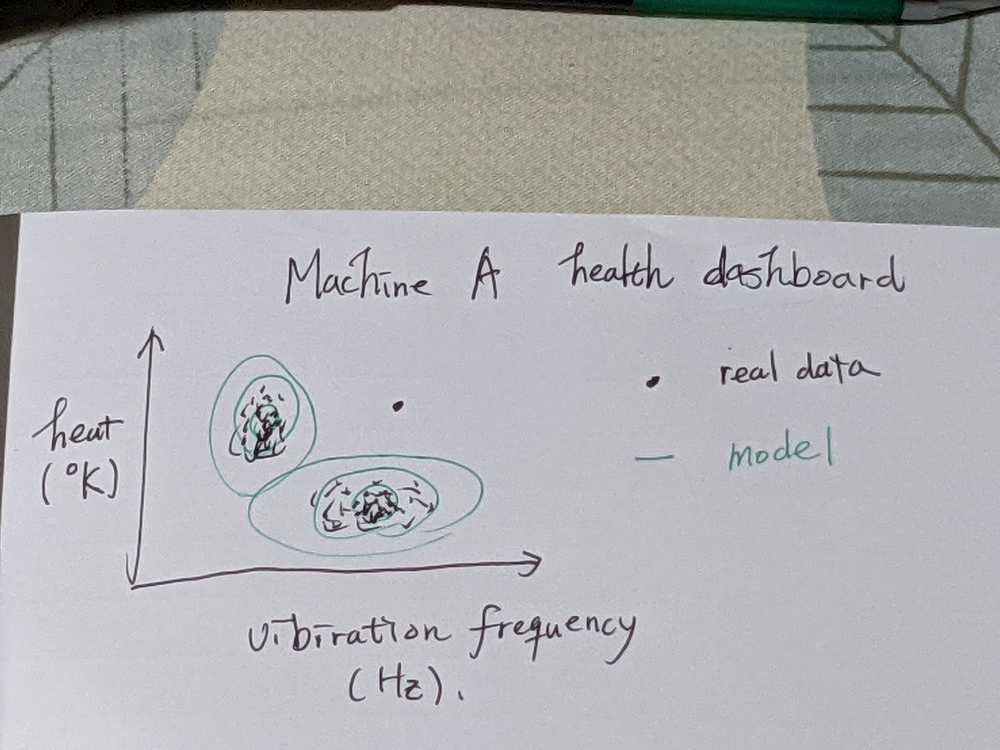
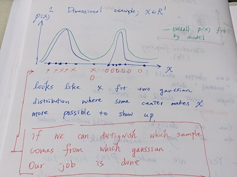
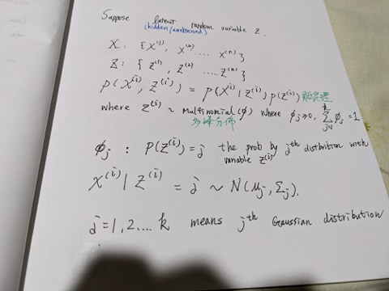
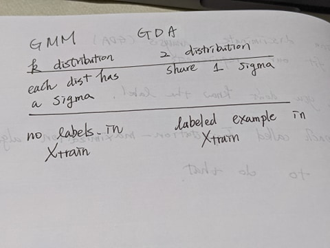
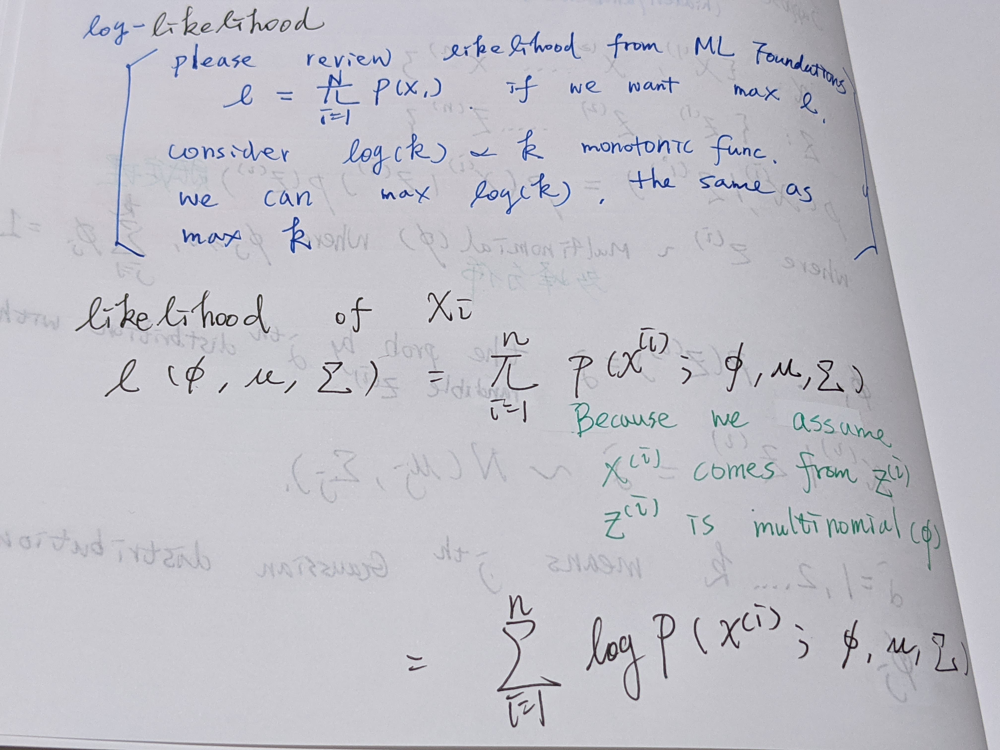

# KMeans

# Gaussina Mixture Model (Density Estimation)

Consider a task from IOT sensor data : 

## 1D example

## ALgorithm - warm up

 

## EM Algorithm

[(ML 16.6) Gaussian mixture model (Mixture of Gaussians)](https://www.youtube.com/watch?v=Rkl30Fr2S38&t=513s)

TODO 10:09

# Ref

[cs229 2018](https://www.youtube.com/watch?v=rVfZHWTwXSA&list=PLoROMvodv4rMiGQp3WXShtMGgzqpfVfbU&index=14)

[(ML 16.6) Gaussian mixture model (Mixture of Gaussians)](https://www.youtube.com/watch?v=Rkl30Fr2S38&t=513s)
