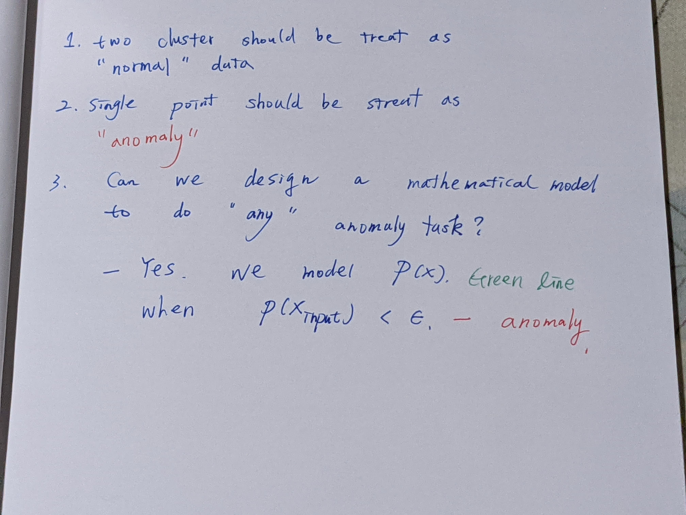
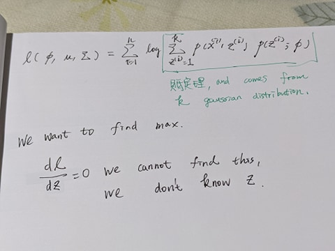

# KMeans

# Gaussina Mixture Model (Density Estimation)

Consider a task from IOT sensor data : 

## 1D example

## ALgorithm - warm up

 

## EM Algorithm

[(ML 16.6) Gaussian mixture model (Mixture of Gaussians)](https://www.youtube.com/watch?v=Rkl30Fr2S38&t=513s)

we re-format the  $p(x)$

$$
p(x) = \sum_{k=1}^{m} \alpha_{k} N(x | \mu_{k}, C_{{k}})
$$

where $k=\{1, 2, ..., .\}$ means $k^{th}$ gaussian dist, $\mu_{k}, C_{k}$ holds mean and std of $k^{th}$ gaussian parameters.

parameters : 

$\Theta = (\alpha_{k}, \mu_{k}, C_{k})$ for $k = \{1, 2, ..., \m}$

Expectation steps (guess, instead of single value, you guess the whole universe)

maximization : MLE by your guessing, get a modification by bayesian rule.

# Ref

[cs229 2018](https://www.youtube.com/watch?v=rVfZHWTwXSA&list=PLoROMvodv4rMiGQp3WXShtMGgzqpfVfbU&index=14)

[(ML 16.6) Gaussian mixture model (Mixture of Gaussians)](https://www.youtube.com/watch?v=Rkl30Fr2S38&t=513s)

[EM_algo from note](EM_algorithm.md)

[最大期望算法](https://zh.wikipedia.org/zh-tw/%E6%9C%80%E5%A4%A7%E6%9C%9F%E6%9C%9B%E7%AE%97%E6%B3%95)
