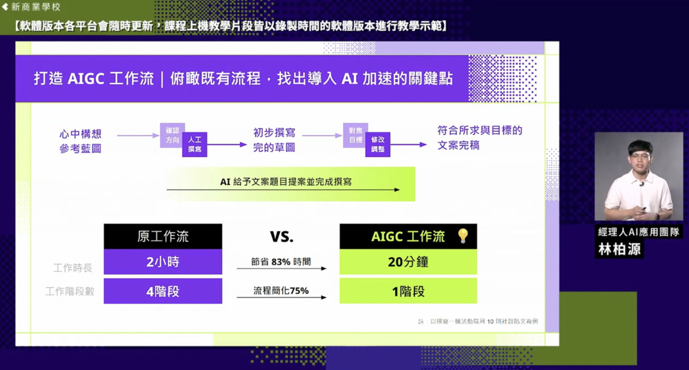

# For Plot

</img>

</img>

</img>

</img>

</img>

</img>

</img>

</img>

</img>

</img>

</img>

</img>

</img>

# For Sheet

</img>

</img>

</img>

</img>

</img>

</img>

# Gamma

</img>

</img>

</img>

</img>

</img>

有不同類型的簡報

1. 介紹型(讓溝通對象有初步了解)、說服型(讓溝通對象接受你的想法、打破成見)、報告型(週期性)
2. 目前最建議，用介紹型簡報

* GPT 也可以說他是簡報專家然後生成簡報架構

* Gamma

# 提案

PM / 行銷 & 銷售 / 設計 / 研發 / 工程師 / CEO / 目標客戶 / (某領域) 專家

目標客戶 - 會產生需求的原因，不會產生需求的原因，主要客戶，次要客戶