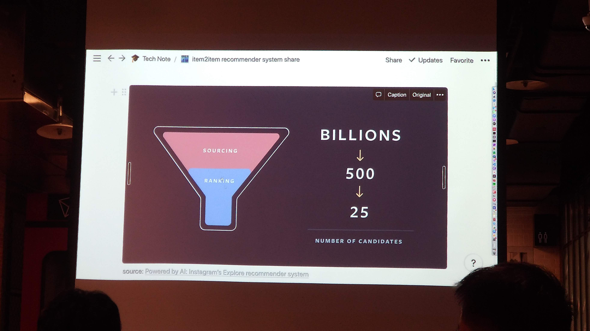
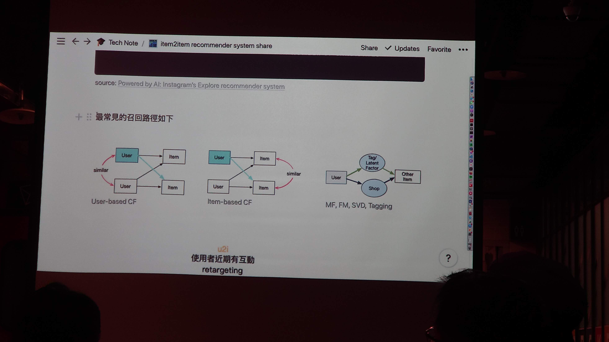

# Recsys Articheture

</img>

1. Sourcing / Candidate generation - 關鍵步驟
2. Ranking - 基於階段1做排序優化

# Sourcing model

</img>

1. user-based CF(u2u2i)

   * 先算使用者相關資訊來計算使用者相似程度，再從相似的使用者喜好物品中進行推薦，所以稱u2u2i

2. item-based CF(u2i2i)

   * 透過使用者點擊的物品來描述使用者，並計算使用者相似度，再從相似的使用者喜好物品中進行推薦，所以稱u2i2i

3. MF, FM, SVD, Tagging - latent factor / tagging

   * 透過使用者喜好的物品(MF, SVD)來代表使用者，接著把使用者分群，去找該使用者群喜歡的物品做推薦
   * 透過使用者喜好的物品，以及其他使用者行為(FM, Tagging)來代表使用者，接著把使用者分群，去找該使用者群喜歡的物品做推薦 

# u and i mixture

把u和i做各種組合，可以拼湊出目前市面上存在的推薦方法

1. u2i - 使用者互動過的商品，直接繼續推

   * retargeting email, push, ad - 各大需要註冊的網站，google / yahoo(任意有DMP的平台)
   * 繼續觀看該影片 - (netflix)
   * 你最近看過的商品/音樂 

2. u2u2i

   * UserCF 

3. u2i2i 

   * ItemCF
   * content-based recsys

4. u -> tag / latent factor -> i

   * MF, SVF, FM, SLIM, LDA
   * item tagging, user tagging 

other :

Knowledge base, graph, multi-view graph, RNN next play

# The characteristics of your product

你的資料集不會只有$(u, i, r, t)$，不要拘泥於Paper上的SOTA，你家產品的資料集也不是Moivelens

根據產業與產品，User以及Item往往有很大的差異性

* 訂閱制影音平台(netflix, spotify)
* 社群網路平台(facebook, linkedIn, twitter)
* 電子商務(amazon, taobao, alibaba)
* 線上訂房(Airbnb, booking)
* 新聞(google news)
* 遊戲(xbox, PS4, stream)

過去多數研究多專注在類似於**影片、電影、音樂串流**等平台，例如netflix, lastfm, movielens.

這樣的產品特色是**使用者互動量大**，一位使用者一週可以看兩部影片，聽數十首音樂，然而使用者未必會在一季在同個電商買兩次商品，因此相較於影音平台，電商經常對使用者所知甚少，對於Pinkoi主要銷售非生活日常用品的電商更是如此

那麼是否能夠分成幾個維度，進而比較各種產品所該關注的面向?

可以

| 特性        | 重要性排序                                  | 備註 |
|-------------|--------------------------------------------|-----|
| 新item時效性 | 新聞 >> 貼文 > 電影 > 遊戲 > 音樂 > 商品 > 房源 |     |
| 季節節慶時效性 | 商品 = 房源 > 新聞 > 貼文 >> 電影 = 遊戲 = 音樂|     |
| item數量級 | 貼文 >> 新聞 > 商品 > 音樂 > 電影 > 遊戲 > 房源|     |
| user 互動量 | 貼文 >> 音樂 > 新聞 > 電影 > 遊戲 > 商品 > 房源|     |
| item 被互動量 | 音樂 > 電影 > 遊戲 > 商品 > 房源 > 新聞 > 貼文(??) |     |
| item 被互動量 skewness | 商品 > 房源 > 貼文 > 音樂 > 電影 = 遊戲 > 新聞(??) |     |
| item content, side information | 房源 > 商品 > 新聞 > 音樂 = 電影 = 遊戲(??)|     |
| user side information | 音樂 > 電影 > 遊戲 > 房源 > 商品 >> 新聞(??) |     |

上表的貼文應該指的是例如facebook, linkedin, twitter上的貼文

# The characteristics of recommendation system.

1. 不是工程問題，照著規格做完不一定有效
2. 不是演算法優化問題，offline在固定的資料集上優化到最佳就有效，dataset只是當下訪站使用者母體的抽樣，一但dataset設計錯，模型再好也是全錯
3. 從使用者與產品角度考量進行設計才能有較好的成效，推薦系統應被視為產品的一塊

# Case Study

## e-commerce(pinkoi)

1. user數量 > item數量

   * user 增加的速度比item增加的速度快
   * 新user的佔比比新item的佔比大得多

2. 對item所知 > 對user所知 

   * 單一item通常有多個user的互動紀錄 
   * user經常只有幾次點擊與極少的訂單
   * item有文案、圖片、評價

3. user變化 >> item變化

   * item的特徵幾乎永久不變 - 可愛的耳環永遠都是可愛的耳環
   * user每次購買的目的不同 - user的喜好與意圖隨時間改變

4. user cold start 嚴重性 >> item cold start 嚴重性

   * 新商品暫時賣不掉沒關係 - 但新user體驗很差問題就大多了
   * 使用者不在意是舊商品還是新商品

基於以上分析，歸納出幾個設計算法(選擇算法)的想法

1. item數量少 - 計算量低
2. 我們item所知多，item變化低 - 容易做出精準且長久的i2i推薦
3. 新商品沒有立即被推薦影響小 - 模型不用太頻繁更新，不需要realtime update
4. 使用者往往是當下需求而不是長期偏好 - latent factor 以及 tagging 容易outdate

總合以上歸納，pinkoi的建模方向

1. 專注在u2i2i可能是最佳策略
2. u2i可以用使用者近期行為快速獲得，不需要模型
3. i2i透過長期資料算出精準的推薦，與user無關
4. 不要忘了熱門推薦，rule-based的非個人化推薦仍然是有用的

### Model design detail

Pinkoi沒說

但是他們做了一個i2i模型

且系統有有以下特性

#### Training

1. 單純只使用使用者點擊的資料
2. 沒有算embedding
3. 沒有使用商品文字資訊, meta data(材質、分類、顏色)
4. 沒有使用圖片資訊
5. 六十萬商品單機跑完約半小時

#### Runtime

1. 支援multiple items input
2. 支援negtive items input
3. 可動態調整準度和response time的平衡

   *  response time壓在1 core 100ms之內

4. 容易引入business logic，例如更主動promote新品
5. 可動態調整i2i explore 及 exploit，廣度和準確可選擇

講者推薦論文

| paper                                                                                                                                                                                                             | hint                                                                        |
|-------------------------------------------------------------------------------------------------------------------------------------------------------------------------------------------------------------------|-----------------------------------------------------------------------------|
| [Twitter WTF : The Who to Follow Service at Twitter](https://dl.acm.org/doi/pdf/10.1145/2488388.2488433?casa_token=4uDRKZbmdMQAAAAA:sfFIilzJB7-7sHMHKMJJDDYlD8-WKLk_I2zZFJK5MpCzww8xsEIKK3AEq4bKIBrEKBEq-v4D7kyT) | 1. In memory, single server   2. Graph random walk(PersonalRank) + SALSA |
[Related Pins at Pinterest: The Evolution of a Real-World Recommender System](https://dl.acm.org/doi/pdf/10.1145/3041021.3054202?casa_token=GiCebJtBbg8AAAAA:RYa3rM5V7uXgWF1XBXXAxf7D8X6zS3RflO5WzX5ZHAZzakVAjfxHx9RQUVxLq0Dp1RGCPUzeeI3z)|1. Engineering challenge analysis and discussion(The RSs challenge)|
|[Real-time Personalization using Embeddings for Search Ranking at Airbnb](https://dl.acm.org/doi/pdf/10.1145/3219819.3219885?casa_token=3va8AIIEgaoAAAAA:gsFYAi4M_85RfCN_6IiKH0WPBWsqK9GOcXCFTT3Ms-K1NN74rcmcZcL3g_4WfpqqGBDb_Niw-uRE)|1. The house rental market problem is quite unique, no previous solution before.    2. A great case study to understand a special product characteristics and the techinique airbnb used for develop real-time personalization search ranking and similar listing recommendations(data, embedding)|
|[Billion-scale Commodity Embedding for E-commerceRecommendation in Alibaba](https://dl.acm.org/doi/pdf/10.1145/3219819.3219869?casa_token=d4c4SgxZUUwAAAAA:tkdePVckXhGckcmCAxM4xaYFura44xbOgmPOB4gYuYbPZ_FIJyEUVrFgLYwRTPt91RZ4KJkFHcRH)|1. check out that how alibaba overcome scalability, sparsity and cold start problem in developing billion-scale RSs(graph + embedding)|

# PIXNET

1. PIXNET的使用者行為

1/8/2021

以筆者本身舉例，筆者常常是因為要找食記、找影評，而**不小心**進入到PIXNET網站，而在完成當時的需求(例如找到餐廳，找到影評刷了一輪)，就結束瀏覽，這樣的行為有一些特點

| 特性       | 描述                                                           |
|------------|----------------------------------------------------------------|
| 使用者意圖變化性大 | 同個User在不同時間進站，意圖不同，今天進站找吃的，3個月後進站看影評        |
| 使用者旅程碎片化      | User可能是google搜尋紀錄點開，未必會有連續瀏覽行為，可能點開很多種不同網站 |
|使用者訪站時間序列不具季節性|User不會固定查看網站，而是有特定需求進行大量瀏覽|

# Reference

[Private note from ML/DM Monday pinkoi item2item recsys sharing](https://github.com/YLTsai0609/Meetups/blob/master/1228_item2item_pinkoi/note.md)

# Appendix

| model          | pros | cons | note |
|----------------|------|------|------|
| FM/MF/SVD like |      |      | 1. 本質上是對Input做分群，以群為單位來增加訓練資料(比起單個使用者而言)   2. 若Input為User/Items/User Tagging，User互動品項少時無法發揮較好的效益(?)|
