# Intro

講題 : **Scrum 是新的死亡行軍嗎?**

共筆連結 : https://hackmd.io/@mopcon/2021/%2F4chgST8vSxmiEbhwWOasEA

講者 : https://www.facebook.com/DavidLearningJourney/

綱要 : https://mopcon.org/2021/speaker/112

# 真 Scrum

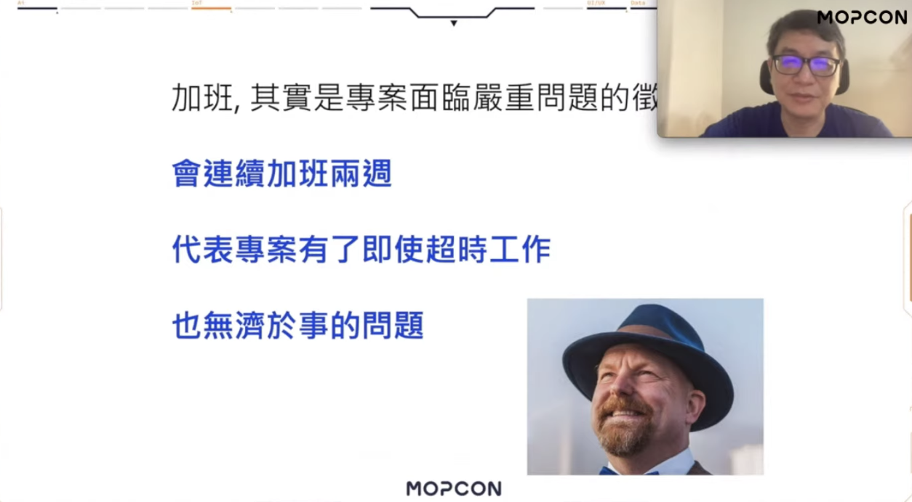</img>

</img>

會常常加班其實是一個現象，表達了專案需求不清楚，規劃不確實的這個事實

</img>

# 看板 / 機制 --> 可持續步調

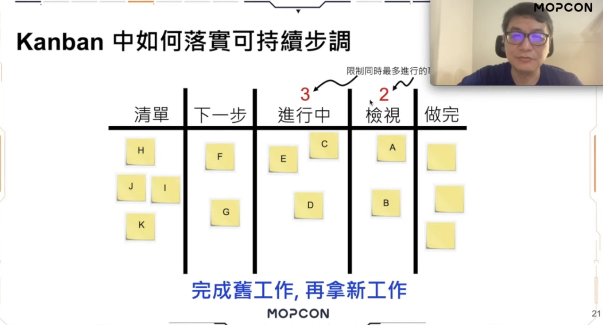</img>

每個區塊會有最多進行的內容區塊

1. 節奏可以維持
2. 工程師不是被壓榨

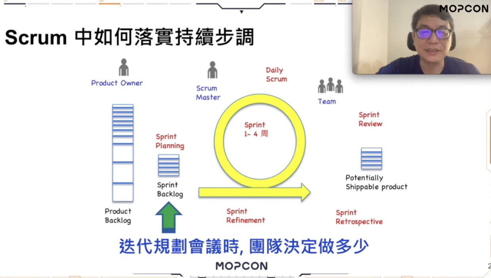</img>

1. Planning 時定案就是定案，不能多加內容
2. Refiement meeting 把需求搞清楚之後才可以定案

# 建議處理方式
## PO
</img>

說 No

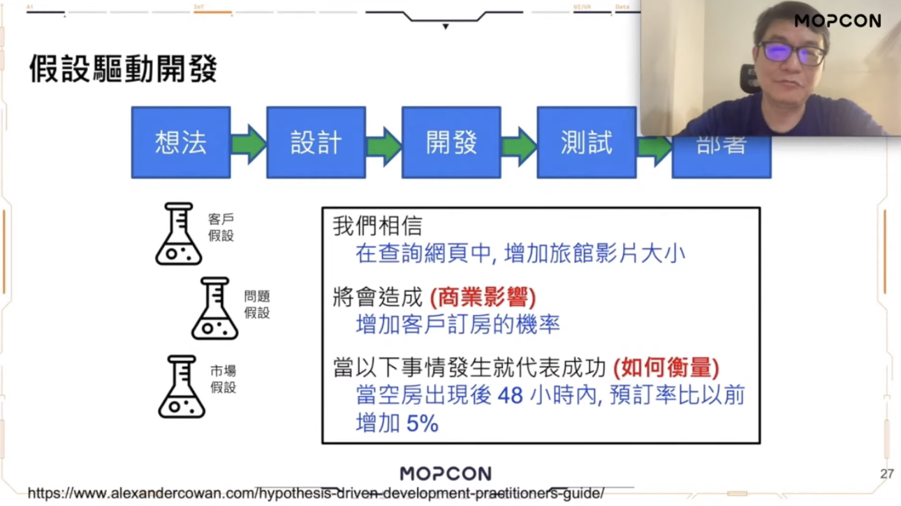</img>

需要設計衡量指標，功能上線才能說管不管用

收集資料說明有些需求是有問題的，所以才說 No

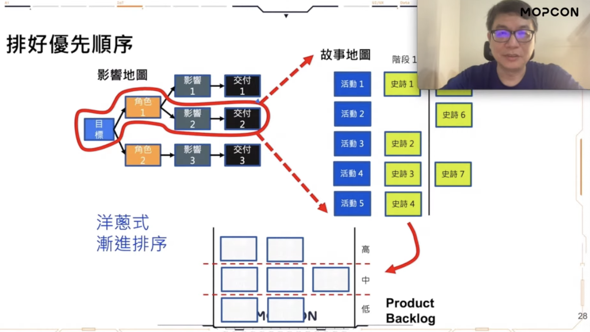</img>

其實加人，加班，都不一定可以解決問題

重要的，不重要的(拿去談判)

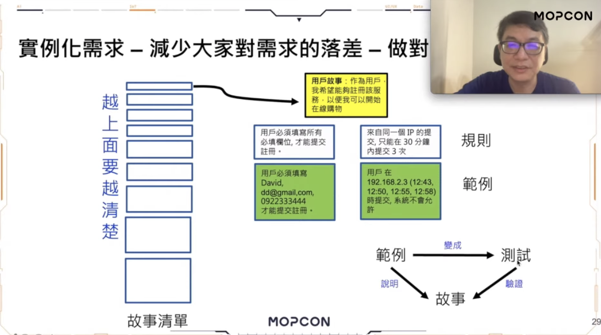</img>

實例化需求

## Scrum Master

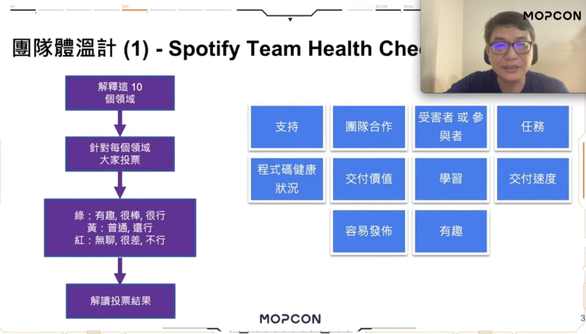</img>

針對10個面向投票，來衡量團隊狀況

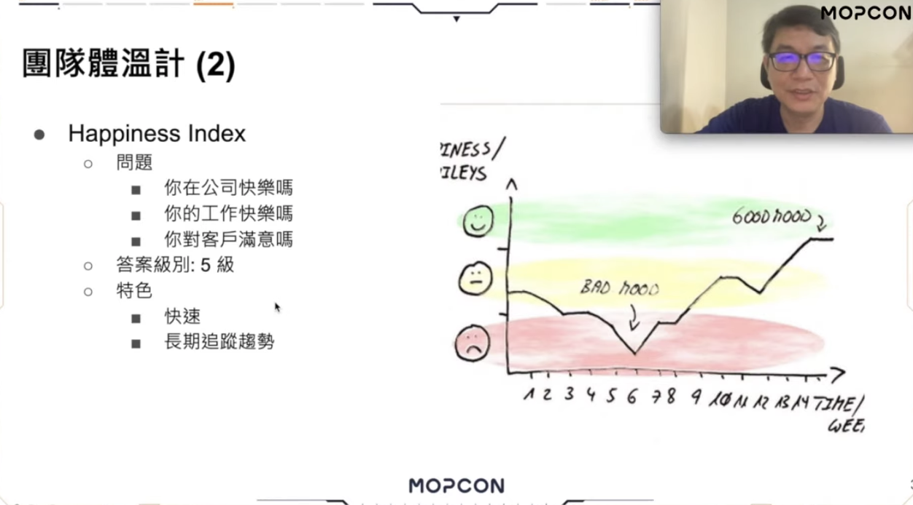</img>

更簡單的做法，如果第一個太複雜，容易追蹤

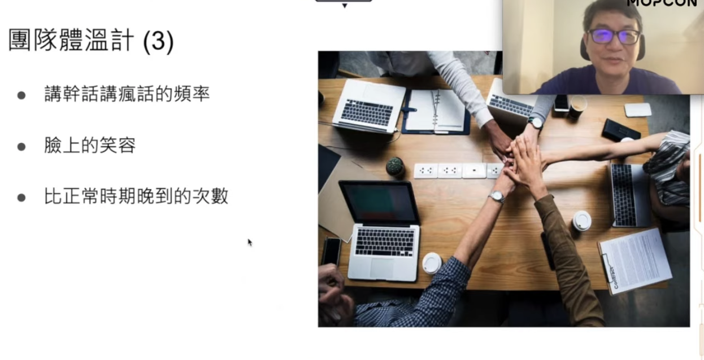</img>

也有非計量方法來觀察

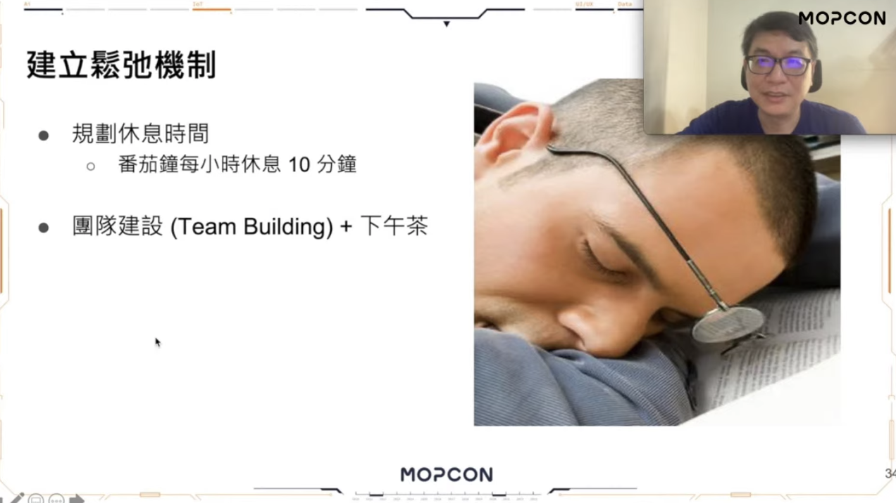</img>

鬆弛機制

## Team

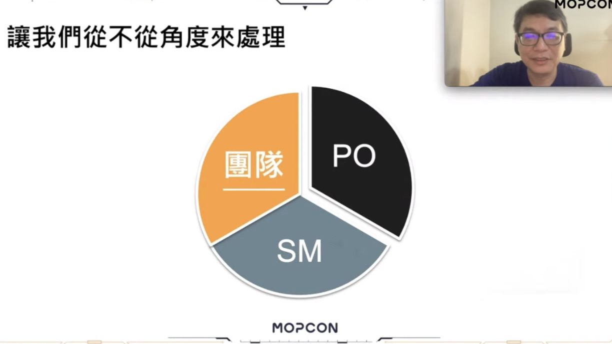</img>

專注在重要的事情上

不重要的，談判 --> 可能不做，可能什麼時候做

不要做任何會分心的事情

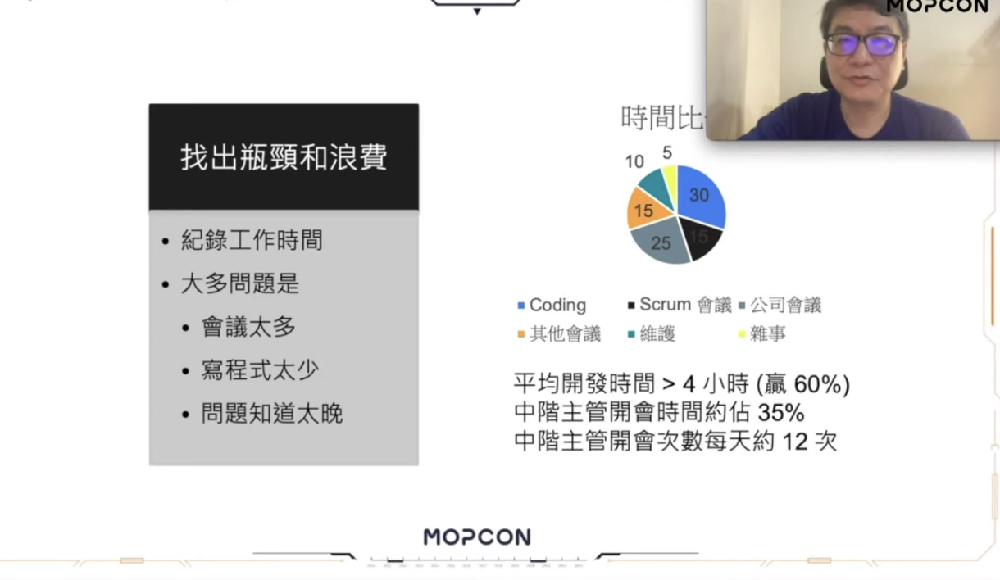</img>

找出瓶頸和浪費

開會時間 & 開會次數

贏 60% (全世界的60%)

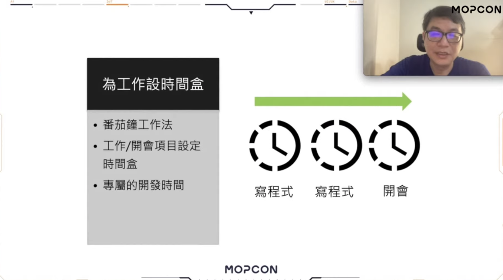</img>

會議 : 限制討論時間，專心討論完畢

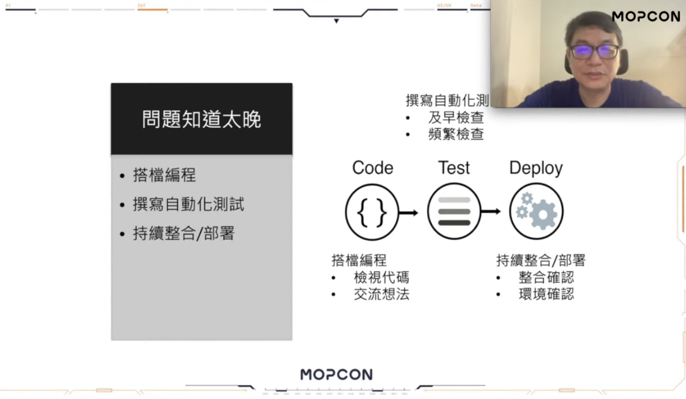</img>

1. pair programming (有限時間內，例如1小時)
2. 及早測試
3. 及早整合部署

# Summary

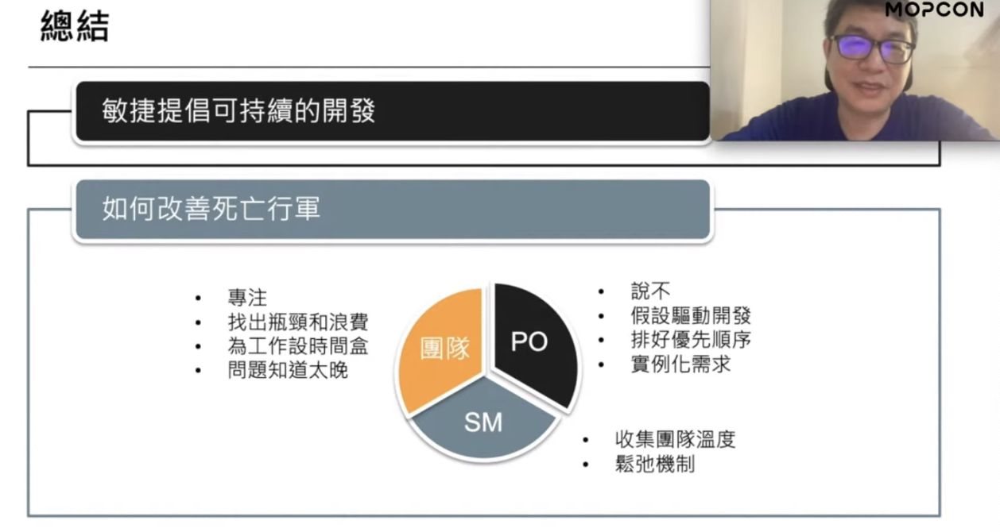</img>

# QA

## 如何在時間分配上可以討論

工程師需要自己統計自己的時間分配

1. scrum 會議時間 - 13% from scrum guide
   1. Planning - 1 ~ 2 hr
      1. 太多 --> 規劃不清楚，Refinement meeting
   2. Retro - 1 ~ 2 hr
2. 部門會議時間
3. 開發時間 - 每日平均開發時間

40 小時要考慮會議時間，開發、開會、帶人時間都要計算

## 需求模糊

**User Story 的驗收條件**

驗收條件要清楚，要有 refinement meeting

