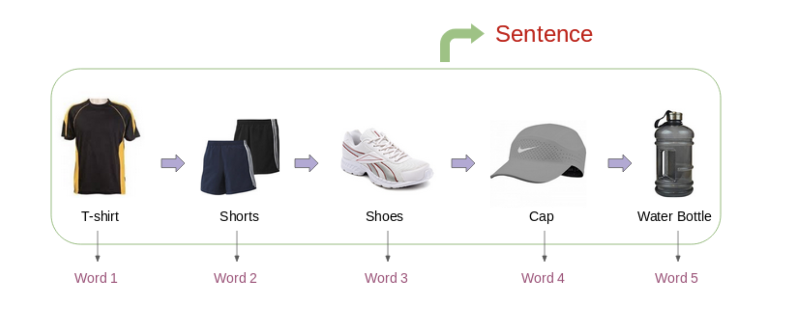

# Embedding 技術在推薦系統中的應用

1. Dimension Reduction - catrogirical (id類型的資料)，維度極高
2. user/item 可被簡化為 embedding ， 相較於傳統特徵工程，上線服務部署、實作簡單
3. ANN 技術蓬勃發展 - 可以快速做粗篩 (Sorucing)

## Apply Word2Vec on User Behavior
1. similarity items from user (user intent as a sequence)
   1. note : be careful that we need to bucket a sentense as an EDA (something similar)

</img>

* User / User-Session as `bucket`, word(item) in between
* learning wordvec ~ itemvec - could be used in realtime.

* Airbnb apply this tech as a feature extraction from user-click-sequence.

[airbnb_search_ranking - KDD2018](../airbnb_search_ranking.md)

* Frame word as listing (word)
* Frame sentense (sentense)
* SkipGram Model
  * go through the detail

# Histroy

2003 - word2vec 就有人開始研究

2013 - word2vec from Google

2016 - item2vec from microsoft (雙塔模型)

* 和 word2vec 不同的是，不考慮時間窗口(如果後續要還要考慮，那麼可以使用 attension network)
* 雙塔模型 
  * Recommendation (user x item)
  * NLP/Search (query x document)
  * user side 如果有即時資料，可以即時推論產生， item side 可以直接拿 offline embedding，快速 Retrieval
  * [微軟在 2013 用於文本搜尋、Youtube / Facebook / 百度等公司相繼使用，以應付 Large Scale Retrieval-Rank-ReRank](https://www.readfog.com/a/1652560590159319040)
  * [小紅書也直接採用雙塔 & 多目標來搭建推薦系統](https://github.com/wangshusen/RecommenderSystem)
  * 雙塔可以吃 id, side information, 可以做線上 ANN 即時推論

# Graph Embedding (TODO)

