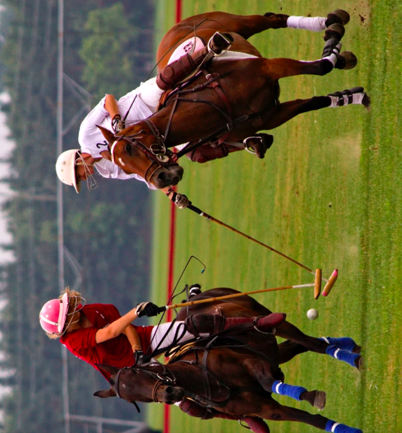
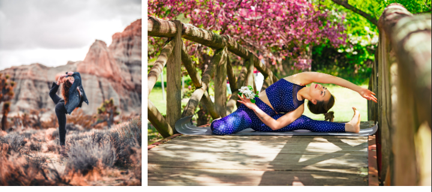
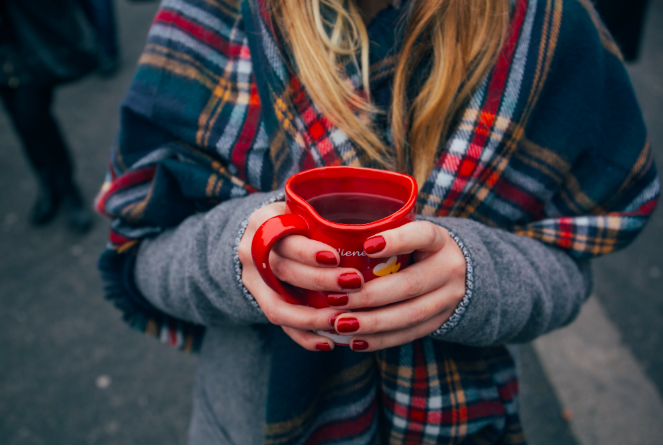
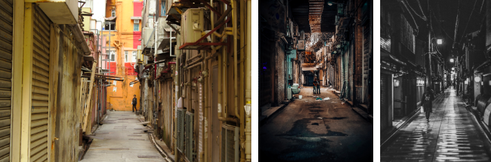
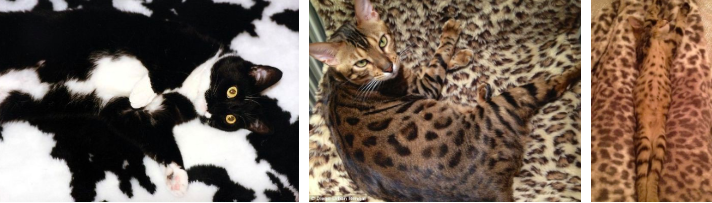

# 物件偵測時的圖片多樣性
[6 Obstacles to Robust Object Detection](https://towardsdatascience.com/6-obstacles-to-robust-object-detection-6802140302ef)

* 照片角度(轉90度還能偵測嗎?) rotation of image
</img>

* 各個視角 Viewpoint variation
</img>

* 物體刑變 deformation

</img>

* 物體遮擋 Occlusion

</img>

* 光條件 illumination conditions

</img>

* 各種背景 Cluttered or textured Background

</img>

## 學術圈解決不同光場下偵測率的問題了嗎?
* 還沒，論文偏少，甚至還有論文說，目前的Model有這樣的問題，我們提供了一個完整的分析框架，但是我們還沒想出解法[1]，另一組人馬試圖進行解決，主要是透過rule-based的方式對相機進行校正[2]，不過我想triplet loss + 不同光環境下的照片，應該能夠稍微緩解這個問題

# 備註
1. [Object Recognition under Lighting Variations using Pre-Trained Networks, 2018](https://ieeexplore.ieee.org/abstract/document/8707399)
2. [Active Control of Camera Parameters for Object Detection Algorithms, 2017](https://arxiv.org/pdf/1705.05685.pdf)