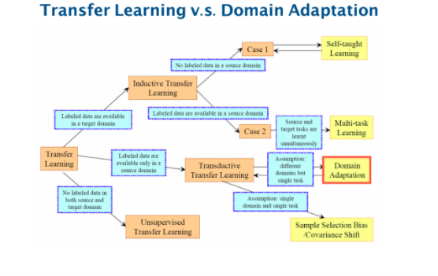
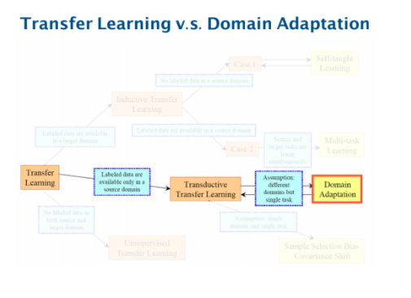
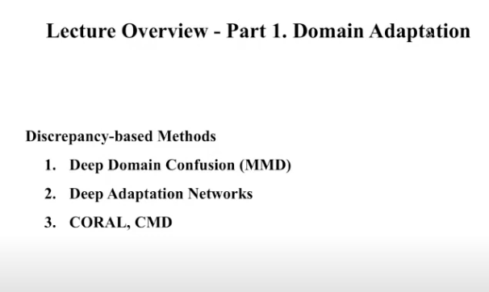
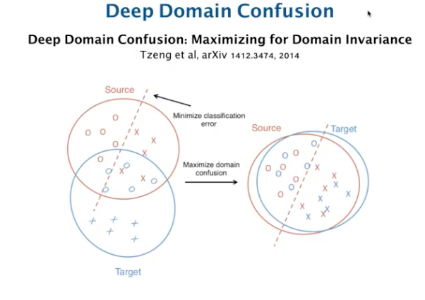
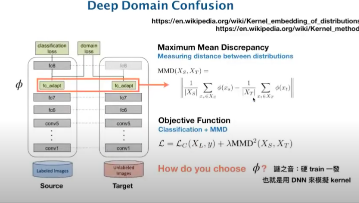
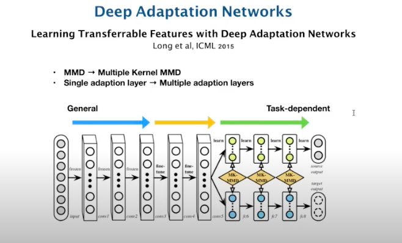

# 2020, 03, 08 李弘毅助教團

* video https://www.youtube.com/watch?v=gvfLq4sPW4k&list=PLJV_el3uVTsM8QoIIe9JrSDjB0e1UkbEC&index=14
* side https://drive.google.com/file/d/15wlfUtTmnb4cEAHZtNJ9_jJE26nSNhAX/view
* source domain(fully labelled), target domain(no labelled)
* 事實上是transfer learning想要解決的一個子問題

</img>
</img>

* 自從2014年開始有3種門路來做domain adaptation
    - Discrepancy-based methods
    - Adversarial-based methods
    - Reconstruction-based methods

# Discrepancy-based 

</img>
</img>
</img>

* domain confusion，讓target domain的資料在一個network中輸出一個embedding vector，source domain也在同一層輸出一個embedding vector，創造一個新的loss function，讓這兩個vector能夠盡量的接近，並把objective function定義為source domain的classfication error加上距離的平方(將其視為regularization term)

follow up paper
</img>

* 在更多曾裡面對每一層的embedding vector都計算距離然後全部加總起來變成loss的一部分

</img>
</img>

* 這兩天在測量距離上用了更高的次方來產生更確的估計，就這樣

``` 
as a few shot learning problem

新的target doamin : 少量資料
將原本的nn最後一層拔掉作為feature extractor
於是乎我們有feature_nn
在使用該datasets的images以及所屬於的label，在nn中依樣產出feature vector
產生一個distance feature，再train一發，可作為一種簡易的嘗試
```

# Adversarial-based methods

* 是最主流的方法

TBC 22:44

# Reconstruction-based method
