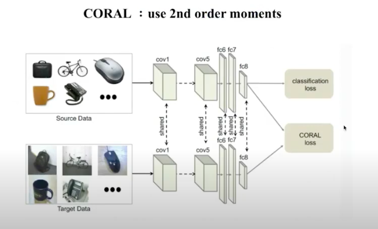

# 2020, 03, 08 李弘毅助教團

* video https://www.youtube.com/watch?v=gvfLq4sPW4k&list=PLJV_el3uVTsM8QoIIe9JrSDjB0e1UkbEC&index=14
* side https://drive.google.com/file/d/15wlfUtTmnb4cEAHZtNJ9_jJE26nSNhAX/view
* source domain(fully labelled), target domain(no labelled)
* 事實上是transfer learning想要解決的一個子問題

</img>
</img>

* Inductive transfer learning - 歸納式遷移學習，從多個過往案例(source data)歸納出普遍性，再演繹到新的樣本中(target data)
* Transductive Transfer Learning - 輔導式遷移學習，過往案例直接對新的樣本進行判別

* 自從2014年開始有3種門路來做domain adaptation
    - Discrepancy-based methods
    - Adversarial-based methods(主流 on 2020)
    - Reconstruction-based methods

# Discrepancy-based 

</img>
</img>
</img>

* Discrepancy(差異化的)
* domain confusion，讓target domain的資料在一個network中輸出一個embedding vector，source domain也在同一層輸出一個embedding vector，創造一個新的loss function，讓這兩個vector能夠盡量的接近，並把objective function定義為source domain的classfication error加上距離的平方(將其視為regularization term)

follow up paper
</img>

* 在更多曾裡面對每一層的embedding vector都計算距離然後全部加總起來變成loss的一部分

</img>
</img>

* 這兩天在測量距離上用了更高的次方來產生更確的估計，就這樣

``` 
as a few shot learning problem

新的target doamin : 少量資料
將原本的nn最後一層拔掉作為feature extractor
於是乎我們有feature_nn
在使用該datasets的images以及所屬於的label，在nn中依樣產出feature vector
產生一個distance feature，再train一發，可作為一種簡易的嘗試
```

# Adversarial-based methods

* 比起(比較早期的想法)差異化訓練(拉近source domain features 以及 target domain features的距離)，能不能讓model自己硬train一發，效果會更好!?
* 近年來大部分的Domain adaptation都使用這類的方法
* Adversarial - 拮抗的概念，在一個訓練當中有兩個互相矛盾的概念，讓他們越train越好

</img> 

* (創始性)第一篇在Domain adaptation裡面加入一個Domain classifier的paper
* 兩個重點 - Maximum Domian Confusion / Target Label Correlation
* (Maximum Domain Confusion)讓 domain classifer搞混source domain的features和target domain的features

* 情境

  
</img>

## Domain Confusion

</img>

* $L_{cls}$ - domain classfier
* $L_{conf}$ - domain confuser

</img>

$Iteration~t$

* 學一個好的domain classifer - Freeze NN weights，用一個classifer預測該資料從Source來還是Target來，並計算binary cross entropy (GAN裡面的discriminator update)

$Iteration~t+1$ 

</img>

* 讓domain classifier更難學，我們freeze住 domain classifer，輸出預測，問他該資料是從Source來還是Target來，計算classifier預測的distribution和uniform distribution之間的cross entropy，更新Feature Extractor的weights(GAN裡面的Generator update) - 基本上就是希望Feature Extractor產生出來的feature可以騙過domain classifer
* 最後我們學到的Feature就會是source domain / targwt domain invariant的features(也就是source domain和target domain共用)

## Label Correlation

TBD 28:51

# Reconstruction-based method
