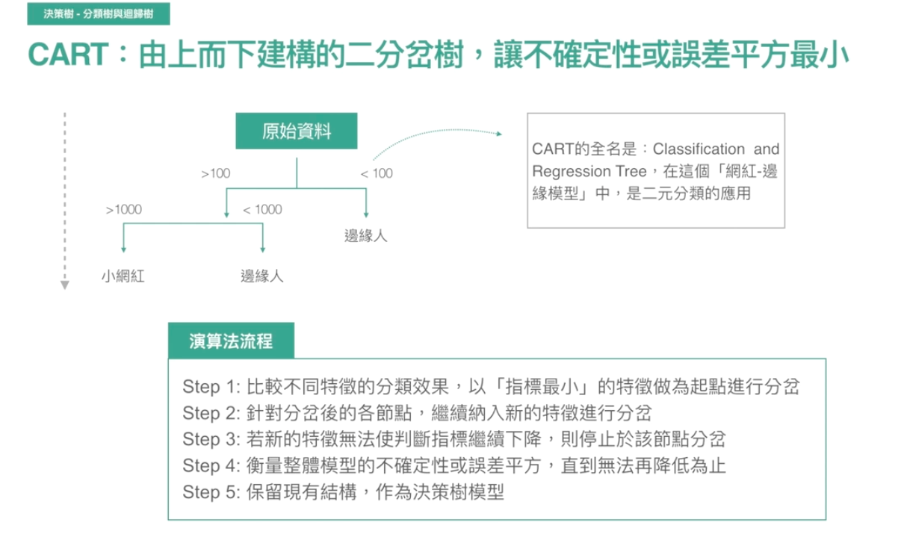

# Introduction

</img>

</img>

</img>

# Hint

</img>

重要的一點 - 當你使用決策樹時，目標通常都是希望結果能夠具有解釋性，已經有樹狀結構來幫助我們
那我們也必須選出那些顯而易見的，直覺的特徵

我們也能夠用Logistic Regression，但我們選用決策樹時，我們更在意**決策的路徑**，以及這些變數以應要最先關注哪些，讓我們做更好的決策

</img>

這樣的做法能夠讓決策過程視覺化，容易被人類理解，進而建立對資料的信任感

## Gini inpurity and entropy

</img>

</img>

* 舉例，小網紅/邊緣人
* 值很大，很不純，值很大，很純(即目前的特徵將資料切分的足夠好)

</img>

* 舉例，看姓名猜性別

</img>

* 心中有樹，log就是切一半!

</img>

* 另一種直覺式的思考，面對一個未知的問題，問題的資訊量和複雜度呈現對數關係!
* 隨著資訊的揭露(做過的猜測越多)，複雜度會大幅下降，我們的推論會越來越有把握

</img>

* Information gain : 增加了多少有用的資訊，降低了多少不確定性

# Classfication Tree and Decision Tree

</img>

* 在每個節點會全部都做一次，這樣才能比較哪個帶來的Information gain更大，進而把它放在比較前面的Root

</img>

* 另一種直覺 - 有寶物嗎? - 無法再找到寶物 - 死路

</img>

</img>

* 一個有意思的地方，分得不夠好的時候 - 資料不夠多 or 特徵不夠多
* 特徵太多時 - 太難被人類理解，階層關係過於複雜，5 - 7層最好

</img>

</img>

* Overfitting - 另一個直覺的解釋，讓你覺得一定就是怎樣怎樣的東西(通常都不是正確答案)

# 個案演練

* 航空公司的商業案例
