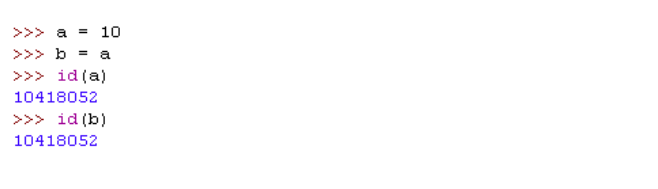

# Resource
* [Python記憶體管理及釋放](https://www.itread01.com/content/1546061954.html)
  * 全局變數 globals
  * 垃圾回收
  * 引用技術
  * 記憶體持機制

# globals
可以自己殺
``` Python
def clear():

    for key, value in globals().items():

        if callable(value) or value.__class__.__name__ == "module":

            continue

        del globals()[key]

```
* 但是這樣依賴全局變數其實不太好

# 垃圾回收
* python可以直接給值 - 物件的型別和既已體都是在執行的時候確定的

# 引用計數 Reference count
</img>
</img>
* Python系統自己維護標籤，把reference count == 0的殺掉