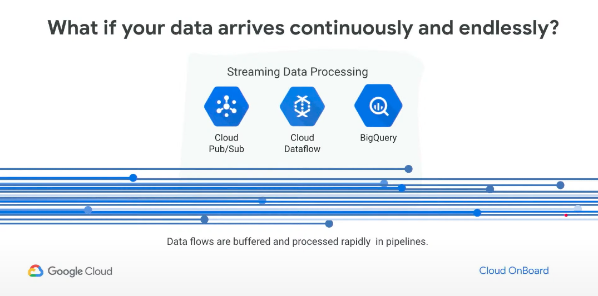
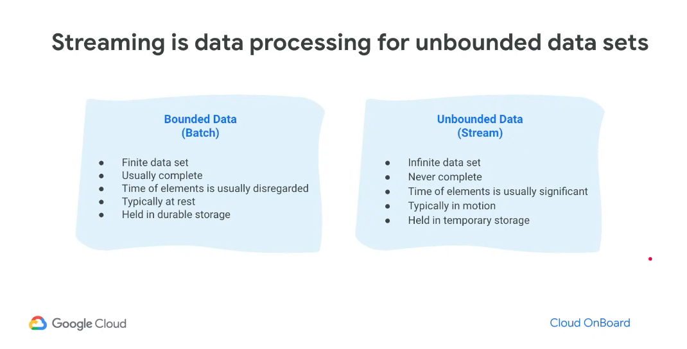
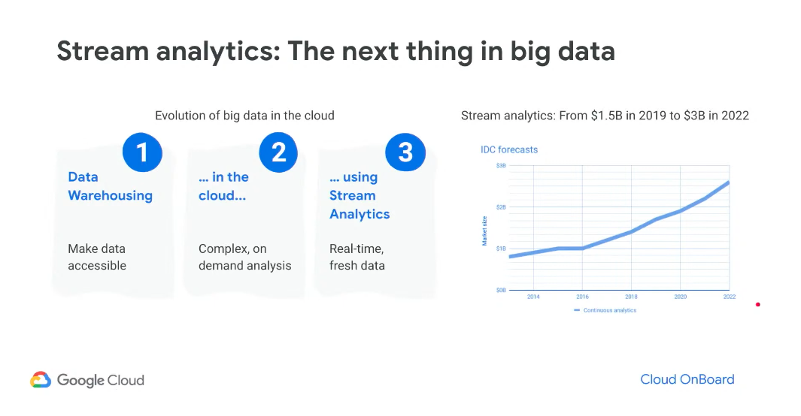
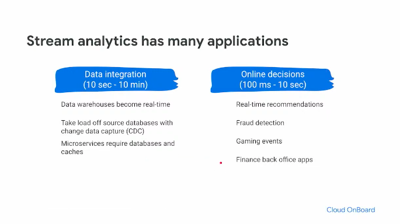
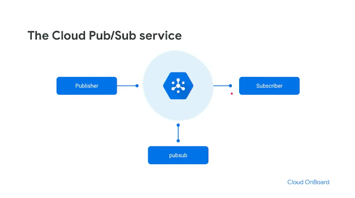
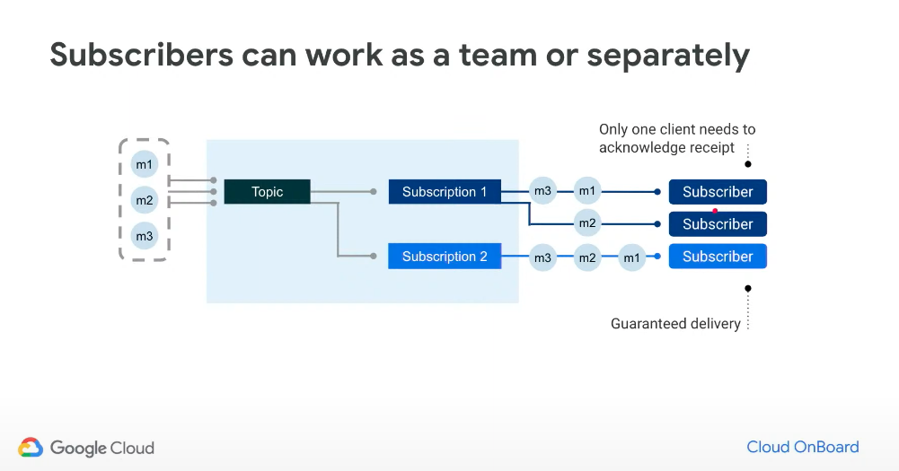
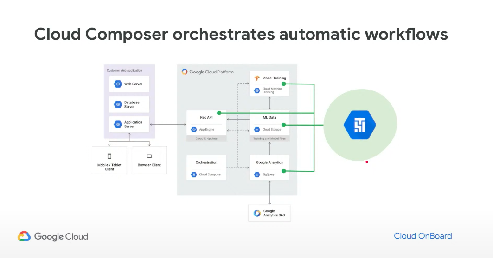
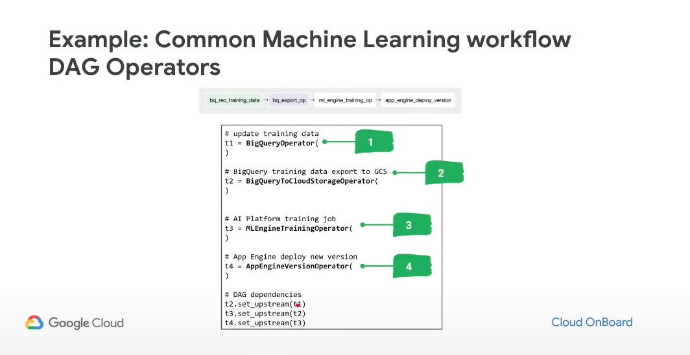
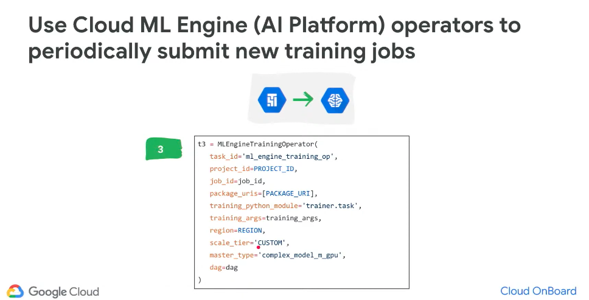

# GCP Streamming

</img>

</img>

</img>

</img>

Cloud Pub/Sub - Message Queue

Dataflow - Uniform, Serverless ETL

# PubSub
</img>

</img>

1. worker資料可能會又重複性的問題，因為PubSub壹定會傳資料給subscriber，但是不一定會記得?
2. 一定要ack給pub-sub，pub-sub才知道worker做完了，然後把它取消

# Operational Management

1. cloud function
2. cloud composer
3. Apache airflow

### Cloud Functions

Event-based microservices
Fully managed, serverless, secure

Triggers : 
    1. Cloud Pub/Sub, HTTP, Cloud Storage

Code : 
    1. Pythob, Node.js, Go
    2. Deploy functions from a Cloud Storage bucket, Github, or Bibucket repo

Stackdriver integration

[Is it support GPU? - maybe use could scheduler](https://stackoverflow.com/questions/59727294/control-gpu-machine-to-start-and-stop-from-one-function)

</img>

### Cloud Composer

</img>

Airflow on GCP

</img>

Composer其實可以管理Pipeline的Trigger

QA : food-app爾後排程是否可以把Food Image prediction Daily Task 以及 app engine綁在一起，每當gcs的推薦結果算好之後trigger app engine 重新 loading?