# Ref

[使用 Google Kubernetes Engine 進行架構設計](https://cloudonair.withgoogle.com/events/taiwan-cloud-onboard-architecturemodernization-2021?utm_source=facebook&utm_medium=unpaidsoc&utm_campaign=FY21-Q2-apac-APAC1497-onlineevent-er-TWCOBArchModernization_gh_MC&utm_content=invite_facebook&utm_term=-&fbclid=IwAR0_ExRfd9VYUywYaxAkMxo1G9ihOP2gXYWkbSBGjEgmgbbEckoWxTDZzy8)

# GKE Introduction
## What is Kubernetes Engine

### Container

1.1 最古早 - 買機器，裝系統，弄網路，弄程式語言環境

實體機部署的缺點 : 如果應用程式要跑在不同系統上，很麻煩

1.2 在Container流行之前，透過VM(Hypervisor)來解決這個問題

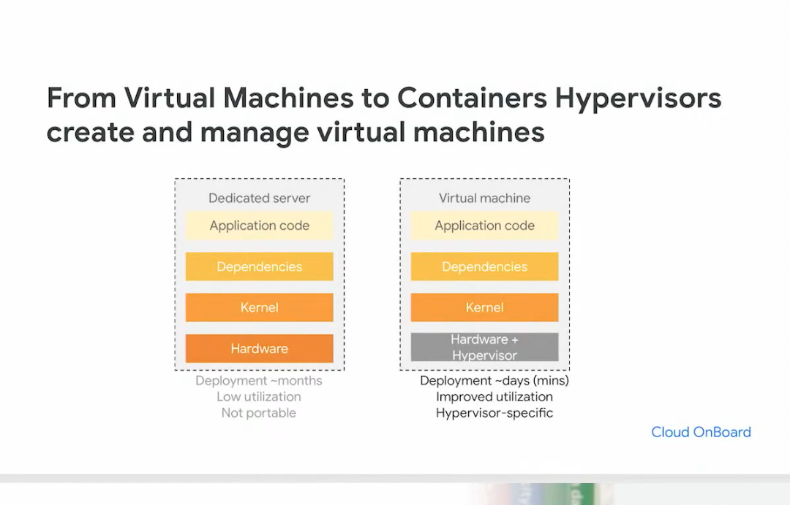</img>

1.3 所以一個實體機器，上面就可以跑多個VM(例如一個是Java的服務，一個是C#的服務，一個是Scala的服務等等)，彼此透過內網溝通

VM部署的缺點 : 執行VM時會帶起一個作業系統，作業系統很肥大，同一台實 體機器可以跑的VM數量有限，不超過10個

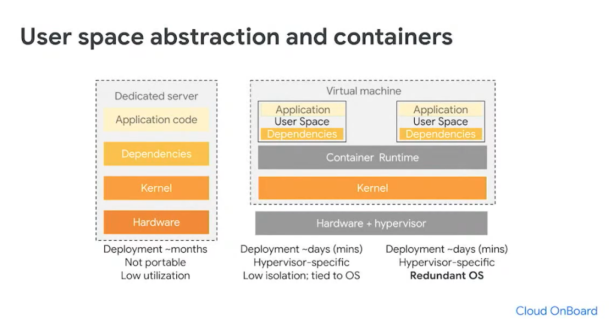</img>

1.4 Google 又做了一層抽象層(2010)，叫做Container Runtime，Application Dependency就屬於Container，這個技術只需要一個作業系統，就可以跑多個Application，又把資料效率提升，一個實體機可以跑幾百個/幾千個Container

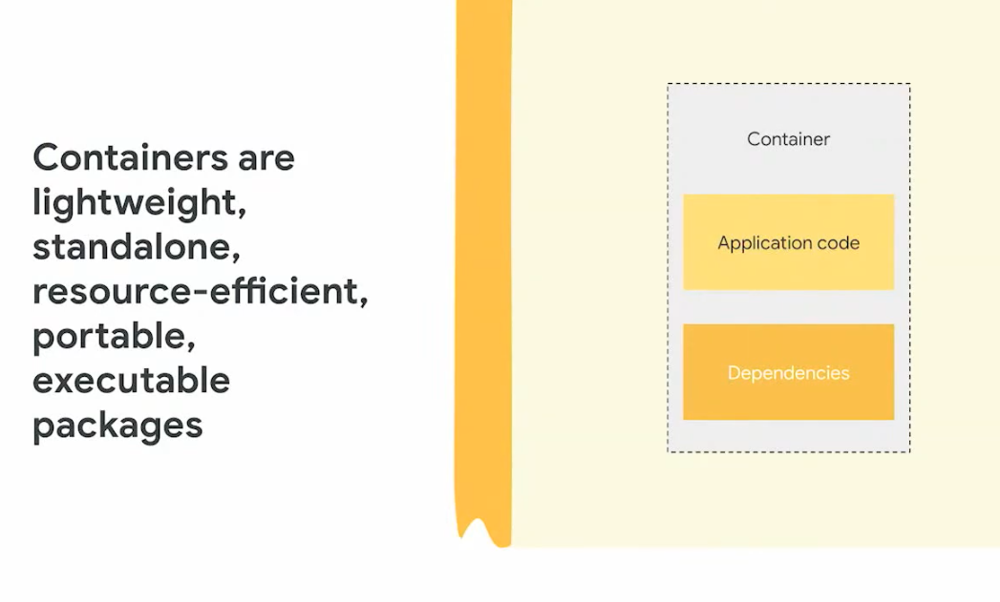</img>

1.5. Container 的另一個優良設計，把dependency和application視為一體，所以只要一台電腦可以跑，其他電腦有Container runtime，就可以執行!

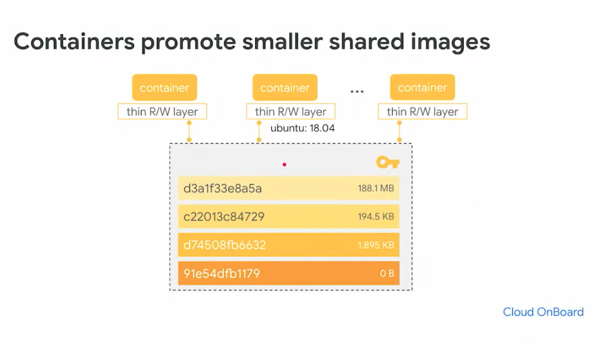</img>

1.6. Container 的另二個優良設計，base image，可以在任何有發佈的image上進行加工，社群快速活絡

1.7 部署技術從VM --> Container 帶來程式開發架構上的轉變，以往一個實體機只能部署少數VM，所以設計上或盡可能地把服務綁在一起，Container興起後，架構走向使用多個Container，而每一個Container專注做自己的事，讓可維護性和可規模化的程度提升(micro service)，其實像是Netflix, Facebook 都是由上千個service所構成

1.8 那麼一大堆service的溝通管理就成了一個新的問題，這個問題Google內部做了一個解決方案，open source之後就成了 Kubernetes

</img>

### Kubernetes

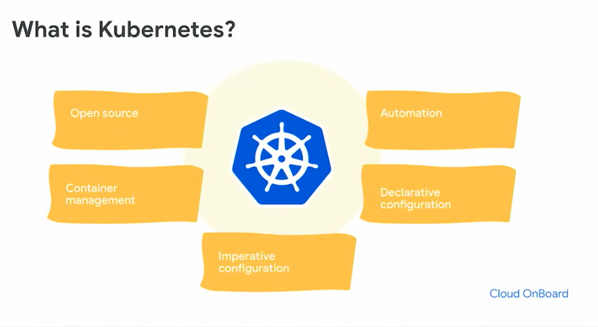</img>

Declarative configuration : 宣告式語法，就像SQL，你告訴你想要的，而不是告訴他該怎麼操作

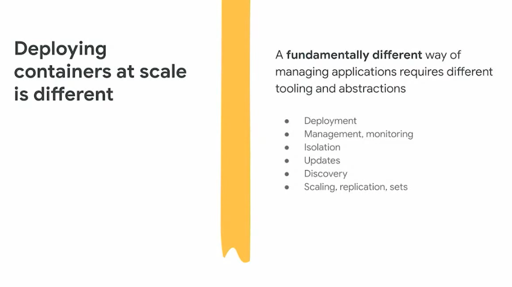</img>

Container at scale 會遇到什麼問題?

1. container 應該部署在哪一台實體機上(traffic的分佈 / 實體機的loading)
2. 應用程式升級(如何更新而不使服務停擺)
3. ...

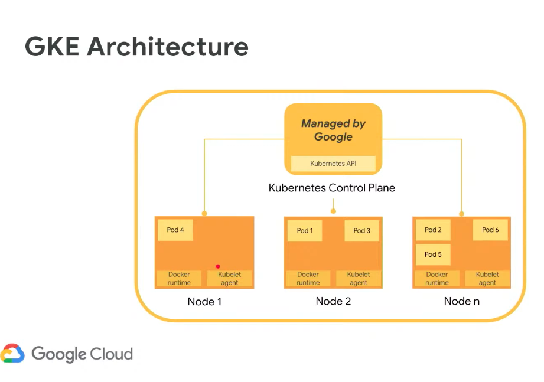</img>

Control Plane - 控制中心

如何類比一個電腦 vs Kubernetes?

1. 工作管理員 (Monitor)
2. 作業系統 --> kubernetes
3. 一大堆process來支撐你的服務 --> 一大堆container來支撐你的服務
4. process --> container

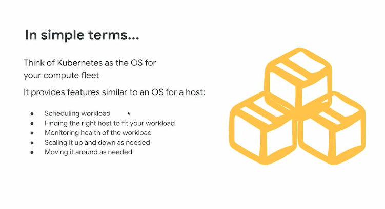</img>

也就是說 kubernetes 可以想成分散式系統 OS ，那麼還是有infra管理的問題，也就是每個實體機器該有的計算資源如何分配和擴充

所以就要來業配了，Google代管的infra

GKE!

### GKE

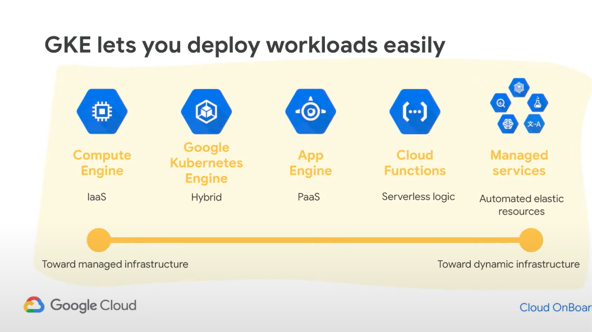</img>

其實很多地方都可以跑Container

GKE 介於 GCE 和 GAE 中間

如果想要更快的開發，更少管控做體，往右邊走，反之往左邊(通常表示更好的效能)

### Computer Option on GCP

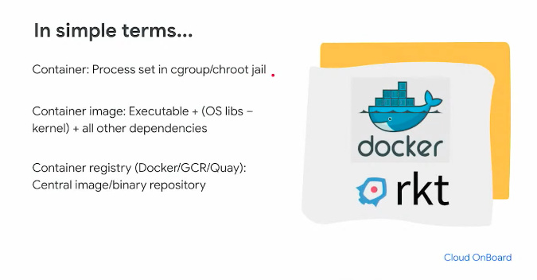</img>

Container : process set in `cgroup/chroot`

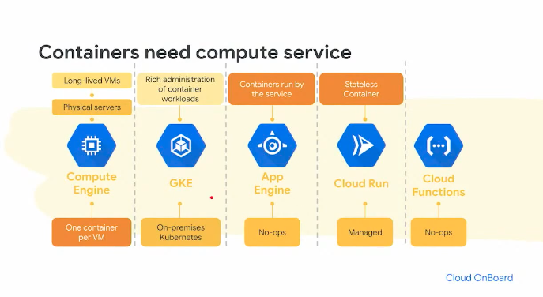</img>

## Kurbernetes Architecture

### Kubernetes Operating Philosophy
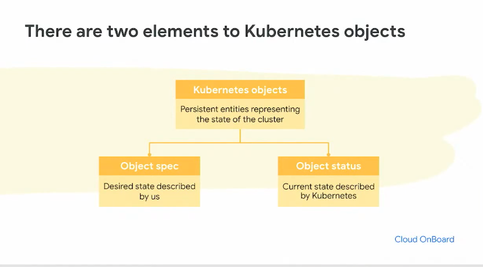</img>

kubernetes 的架構中都是 object

1. desired status
2. current status

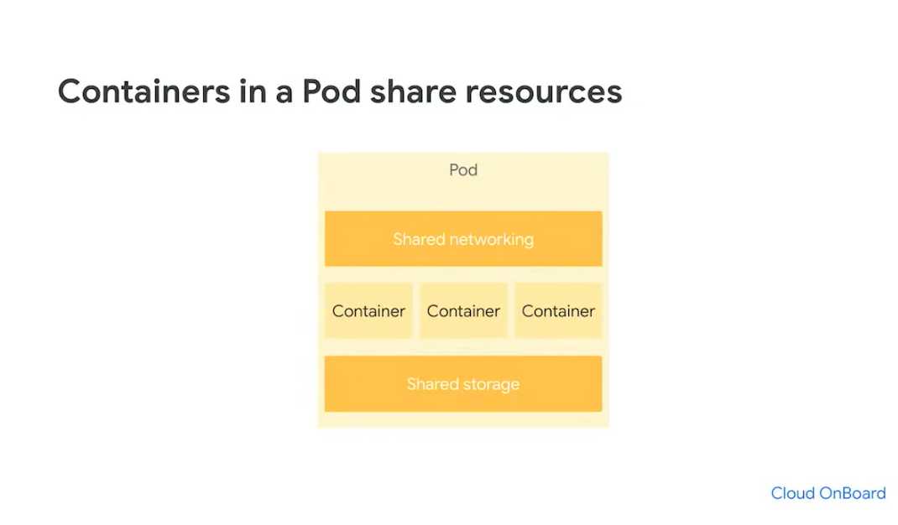</img>

pod : 

一個 pod 中有多個 container

為神魔這樣設計呢? 

1. 因為許多container在應用場景中常常需要交換存取資料
2. 許多container有一致的生命週期

e.g. 網站 

niginx - frontend container(proxy, ssl)

mysql - backend container

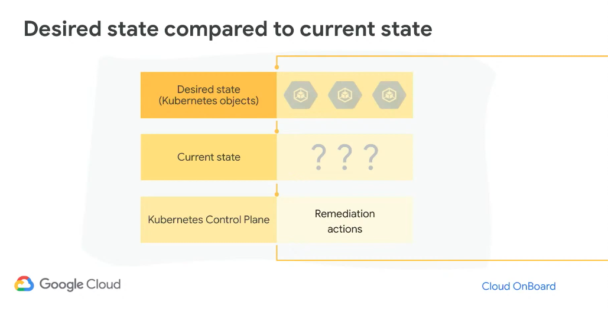</img>

### Kubernetes Cluster

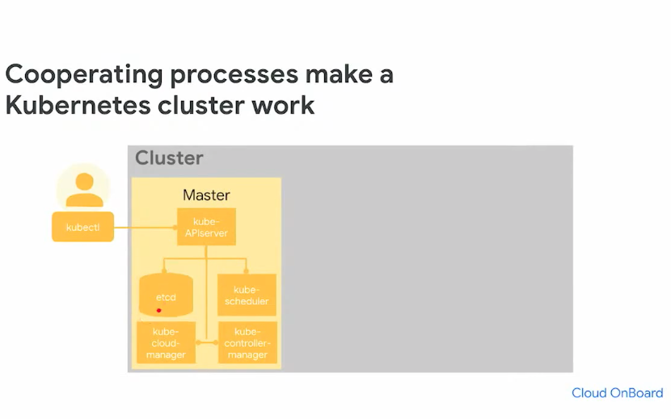</img>

使用者透過 `kubectl`(kubernetes control) 來操控 Master(Monitor)

Master:

1. `etcd` : 放meta data的地方，例如node當前的狀態

所以你描述想要的狀態，你會透過`kubectl`告訴api server，他就會去問`etcd`有沒有滿足，沒有就透過 `kube-scheduler` , `kube-controller-manager` 去調整

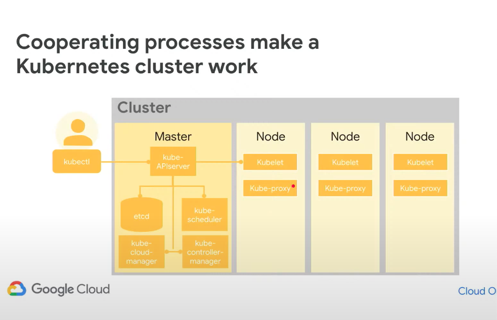</img>

`kube-scheduler, kube-controller-manager` 會去告訴 Node 中的`Kubelet` - 該部署了，該調整資源了

那麼`kube-proxy` 是幹嘛呢，用於 node / node 之間的溝通

控制層稱為 Control plane

資料曾稱為 Data plane

### GKE Concept
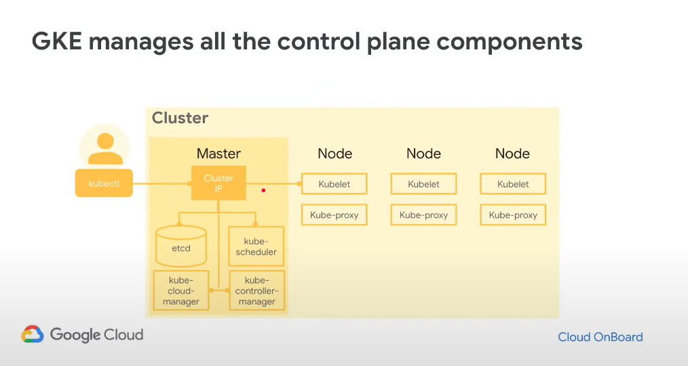</img>

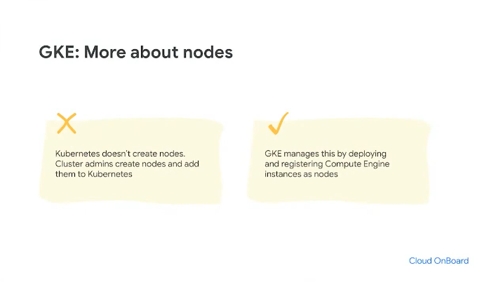</img>

kubernetes 並沒有定義 node 長怎樣，也就是說如果是自己架kebernetes的環境，要自己把每個 Node 準備好，然後跟COntrol plane註冊，GKE的話就是直接包辦

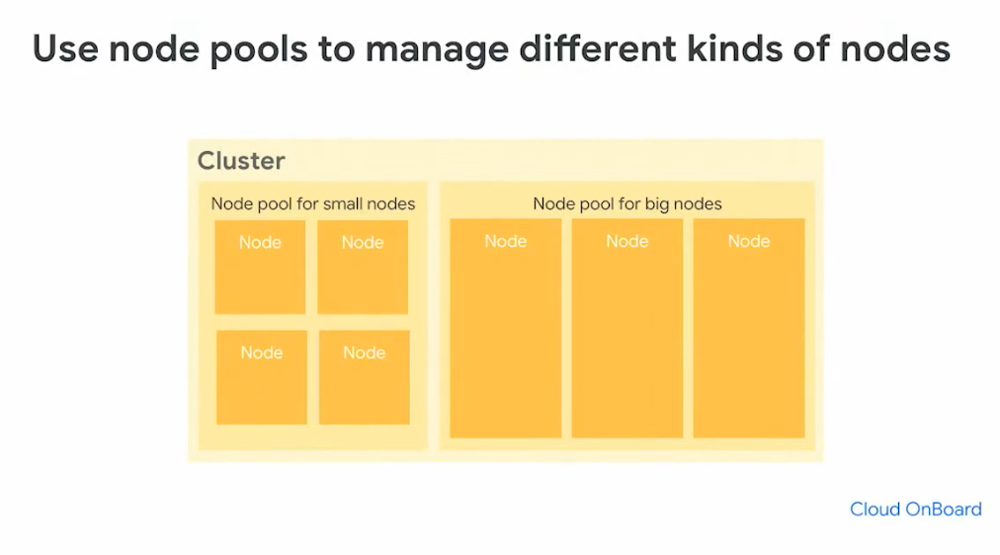</img>

GKE 還建立了一個稱作 Nodepool的概念，在該pool中的node都可以使用不同的硬體資源，例如可以建立兩種 pool ，一個可以使用GPU，一個只能使用CPU

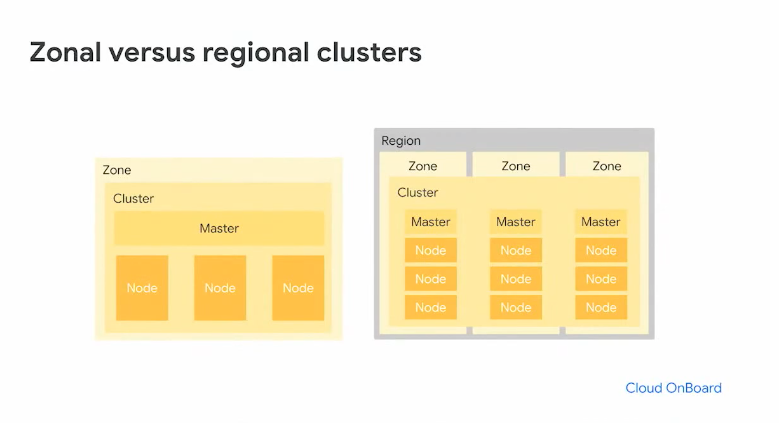</img>

Zonal cluster - 同一個地方，也就是那個地方機器壞掉了，你的Node就會死一片

Regional cluster - 單一個Zone故障了，幫你起另外一個Zone

</img>

也可以依此定義安全性設定

### Object Management

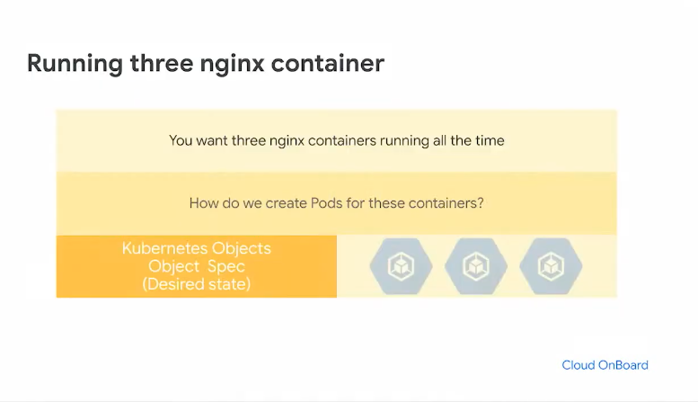</img>

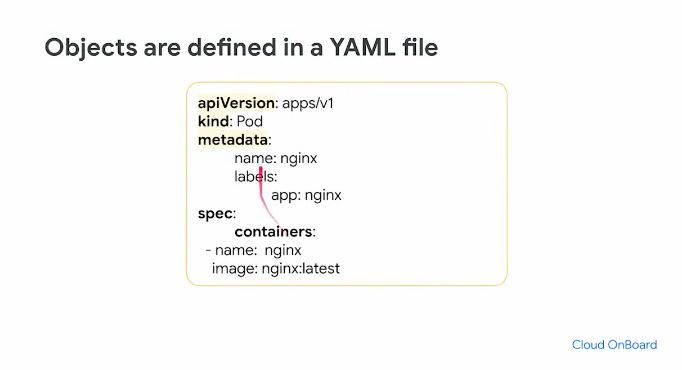</img>

透過 `yaml` 來定義 spec

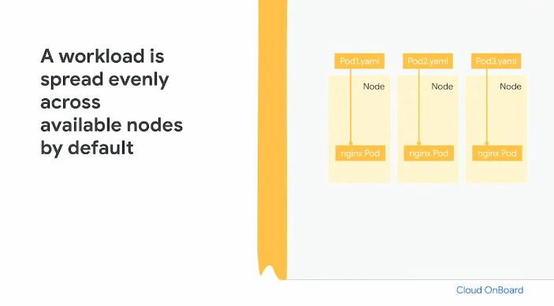</img>

多個 pod ?

把 config 丟給api 3次，但是換名字

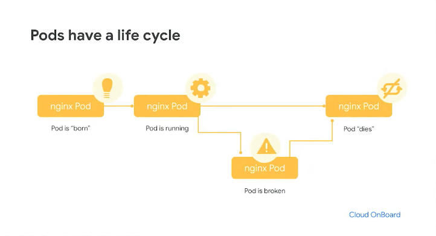</img>

在 `kubernetes` 的架構中， pod 不總是活得好好的，而是會透過不同的pod賴支撐你的application，也可以同時運行多個pod，這樣一來如果你正在服務的pod死掉了，其他pod就會立刻接手服務

## Kubernetes on GCP

# GKE Getting Start

# GKE Architecture and Safty

# GKE Setup GKE for CI/CD

# Cloud-Build - Getting Start