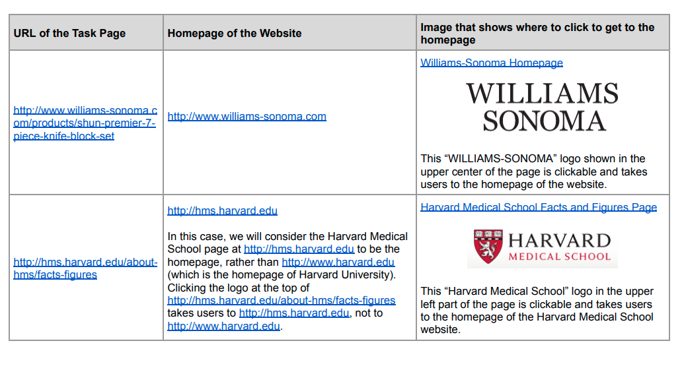

# Ref

[Quality Rater Guideline](https://static.googleusercontent.com/media/guidelines.raterhub.com/zh-TW//searchqualityevaluatorguidelines.pdf)

[introduction in chinese](https://www.wpandseo.tw/2856/seo-google-quality-rater-guideline/)

# Introducttion to Search Quality Rating

1. Search engines exist to help people find what they are looking for. To do that, search engines must provide a diverse set of helpful, high quality search results, presented in the most helpful order.
2. Medical search results should be high quality, authoritative, and trustworthy.
3. Search results for "cute baby animal pictures" should be adorable.
4. Search results for a specific website or webpage should have that desired result at the top.
5. Searches that have many possible meanings or involve many perspectives need a diverse set of results that reflect the natural diversity of meanings and points of view.
6. Search results should provide authoritative and trustworthy information, not lead people astray with misleading content

# Understanding Webpages and Websites

## What's the purpose of a webpage?

examples

type of page|purpose|note
-----|-----|-----
news website homepage|to inform users about recent or important events||
shopping page|to sell or give information about the product||
video|yo share cute video of a cat||
currency converter page|to calculate equivalent amounts in different currencies||

* NOTE: 可以從標題/標籤知道該網頁類型，如何判定內容是否符合網頁目的?

## Your Money You Life(YMYL)

YMYL pages/topics potentinally impact a person's future happiness, health, financial stability, safety.

high PQ(page quality) score rating YMYL pages.

## Understanding Webpage Content

1. Main Content(MC)
   1. directly helps the page achieve its purpose.
   2. [example 1](https://guidelines.raterhub.com/images/cxqHhjhk8cDmdDl9g1wj.jpg), [example 2](https://guidelines.raterhub.com/images/ia8lFFjEeLwDAo3yvyqc.jpg)
   3. quality of MC plays large role in PQ of a webpage.
2. Supplementary Content(SC)
   1. does not directly help the page achieve its purpose.
   2. One common type of SC is navigation links that allow users to visit other parts of the website
   3. [example 1](https://guidelines.raterhub.com/images/1KAbCaODzmIWsIdtcR47.jpg), [example 2](https://guidelines.raterhub.com/images/xxp7viBblC9kYJWyXbkS.jpg)
3. Advertisements/Monetization(貨幣)
   1. may be labeled as `ad`, `sponsored links`, `sponsored listings`, `sponsored result`
   2. can be click to determine whether ther are Ads(outside of that website, change when you reload the page, different user see different ads on the same page)

## Understanding Website

* related entity (author page in pixnet)

</img>

1. an important part of PQ rating is Understanding `the reputation of the website`
   1. also represent real companies, organizations, ...
   2. a websites's reputation is based on the experience of real users.

# Overall Page Quality Ranking

* it seems like a classification task
  

</img>

important factor:

1. the purpose of the page(evaluated by human)
2. Expertise, Authoritativeness, Trustworthness
3. Main Content Quality and Amount
4. Website information / who is responseible for the MC
5. Website reputation / reputation about who is responseible for the MC

## E-A-T

how to measure E, A, T for us?

