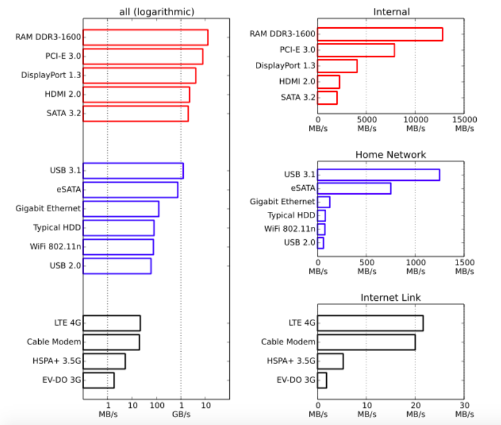
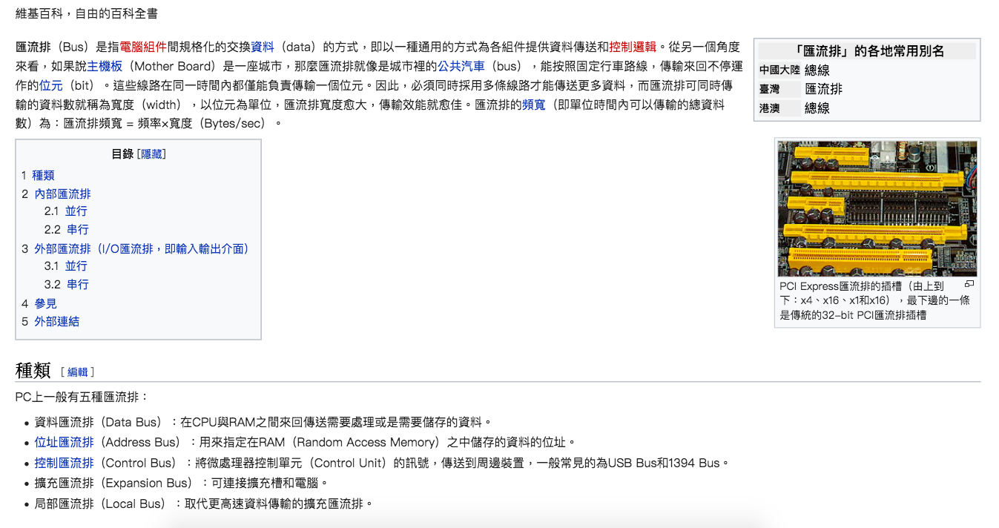
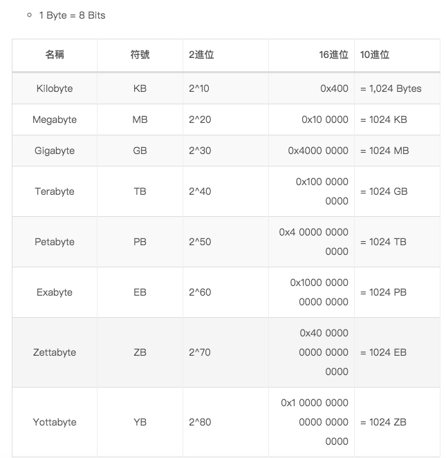

# Hardware Introduction

* 快速對硬體有個OVerview，了解各個組件，並提供各個更深入的關鍵字。

## Source 

1. 高效能Python 程式設計 O' Relly
2. Wiki

# 基本電腦系統

構成電腦的基礎元件可被簡化成三個基本部分，**計算單元**，**記憶單元**，**以及他們之間的連接**。每個單元都具有不同的特性，我們能夠利用這些特性來理解他們。

* 計算單元 : 每秒鐘能夠做多少運算
* 記憶單元 : 能夠存放多少資料，讀寫速度有多快
* 連接機制 : 把資料從一個地方搬到另一個地方能夠多快完成

透過這些建構區塊（building block），我們能夠討論各種複程度的標準工作站，例如，標準工作站能夠被視為具有中央處理器(CPU)作為計算單元，連接到隨機存取記憶體(RAM)與硬碟(作為兩種獨立記憶單元，各有不同的容量與讀/寫速度)，最後還有匯流排(BUS)連接所有元件。

不過，我們也能夠深入更多細節，並且看到CPU本身包含數個記憶單元 : L1, L2，有時候甚至有L3, L4快取，他們的容量不大，但是速度非常快(從幾KB到幾MB)，這些額外的記憶單元以名為**後端匯流排**，例如Intel的Nehalem CPU使用Intel QuickPath Interconnect取代前端匯流排，並且重新組織諸多連接。最後，我們在這裡忽略網路連接(書裡面)，相對於許多其他的計算與記憶單元，那實際上是非常緩慢的連接。

* Summary : 電腦基本上可以被簡單區分成4個區塊
  + 計算單元
  + 記憶單元
  + 通訊層 - 硬體
  + 通訊層 - 網路
* CPU可以被稱作計算單元，但也可以進入裡面計算細分，裡面還是有記憶單元(L1, L2, L3, L4快取)。

# 計算單元

# 記憶單元

# 通訊層

基本區塊之間有很多種不同的溝通模式，但全部都是一種稱作**匯流排(Bus)**的變形，例如**前端匯流排(frontside bus)是RAM與L1/L2快取之間的連接**，他將**準備好被處理器轉換的資料移動到集結地，準備計算，並將完成的計算移出來。**

另外，還有其他匯流排，像是作為硬體裝置(例如硬碟以及網路卡)到CPU及系統記憶體之主要通道的**外部匯流排(external bus)**，這個匯流排通常比前端匯流排還要緩慢

事實上，L1/L2快取的許多優勢皆可歸因於較快速的匯流排。能夠將計算所需的資料以大區塊的方式排進緩慢的匯流排(從RAM到快取)，接著以非常快的速度從後端匯流排(從快取到CPU)提供他們，讓CPU可以做更多的計算，而不需要等待太長的時間。

類似地，**使用GPU的缺點有很多都是源自於他所連接的匯流排**，因為GPU通常是週邊設備，它通過PCI匯流排進行溝通，**這比前端匯流排慢恨多**，因此讓資料進出GPU會是負擔相當大的操作。

異構計算(hetergeneous computing)，(即同時有CPU和GPU在前端匯流排的計算區塊)的出現主要是為了減少資料傳輸的成本，讓GPU計算成為更可行的選項(即使是有大量資料必須被傳輸的情況)

除了電腦內的通訊區塊之外，網路也能夠被視為另一個通訊區塊，不過這個區塊遠比先前所討論的更具有適應性，網路設備可以被連接到記憶體裝置，像是網路附加儲存裝置(network attached storage NAS)或是其他的計算區塊，像是叢集裡面的計算節點。無論如何，網路通訊通常比先前提到的其他通訊類型緩慢很多。

前端匯流排每秒鐘可以傳輸數百億個位元，網路則侷限在數千萬個位元的數量級

那麼，很清楚地，匯流排的主要特性是速度：能夠在給定時間內移動多少資料，這個特性結合兩個數量:

1. 一次傳輸中平均能夠移動多少資料(匯流排寬度)
2. 每秒鐘能夠做幾次傳輸(匯流排頻率)

注意，再一次傳輸中資料的移動總是循序的 : 資料區塊從記憶體中被讀出，然後移動到不同的地方。因此，匯流排的速度被分解成這兩個數量，因為他們能夠影響不同的計算面向

* 大的匯流排寬度能夠再一次傳輸中移動所有相關資料，**有助於向量化的程式碼(或是任何循序通讀記憶體的程式碼)**
* 若匯流排的寬度雖小，但是傳輸頻率非常高的話，**有助於必須對記憶體做很多隨機存取的程式碼**。

有趣的是，電腦設計者改變這些特性的方式之一是透過主機板的實體佈局：當晶片組被配置的互相靠近時，將他們連結起來的實體電路會比較短，那樣能夠獲得更快的傳輸速度。
另外，線路數量本身也支配的匯流派的寬度

因為介面能夠被調整，而為特定應用程式提供合適的效能，所以有數百種不同類型自然不令人感到意外，以下可以看到這個常見介面的頻寬
Home Work指的是家用網路，注意，這份圖表中完全沒有談到延遲(latency)，這支配了資料請求需要花多少時間才能夠被回應(雖然延遲的程度取決於電腦，但採用的介面天生就具有壹些基本限制)

</img>

* Summary : 
  + 前端匯流排(front side bus, FSB)是CPU L1, L2快取與RAM之間的通道
  + 硬碟，網卡到CPU的匯流排稱為外部匯流排(external bus)，通常比前端匯流排要慢得多
  + 使用GPU可能潛在的問題，GPU通常是週邊設備，他透過PCI匯流排進行溝通，這也比前端匯流排慢得多，因此GPU IO的時間成本就會變高
  + 異構計算(hetergeneous computing)主要就是想要解決IO的Bottleneck，讓GPU和CPU同時使用前端匯流排計算以及溝通。
  + $$匯流排頻寬 = 匯流排寬度 \times 匯流排頻率 （Bytes/sec）$$
  + 大的匯流排寬度有助於向量化的程式碼(一般的前端匯流排應該就足夠大了，我們可以在任何地方使用向量化，應該都可以有還不錯的performance)
  + USB(Universal Serial Bus) 通用序列匯流排，是連接電腦系統與外部裝置的一種序列埠匯流排標準，也是一種輸入輸出介面的技術規範，被廣泛地應用於個人電腦和行動裝置等訊息通訊產品，並擴充至攝影器材、數位電視（機上盒）、遊戲機等其它相關領域。
  + USB 2.0 480 MBits/s = 60 MB/s，表格參考[資料數量級](#additinal-matirials)，傳輸速度參考[wiki](https://zh.wikipedia.org/wiki/USB#USB_2.0)
  + USB 3.0 5GB/s，傳輸速度參考[wiki](https://zh.wikipedia.org/wiki/USB_3.0)
  + 根據以上兩者，一個Frame經由Motion JPEG傳輸 or h.264傳輸，我們可以做費米估計FrameRate。

## Bus 匯流排

</img>

* [Wiki](https://zh.wikipedia.org/wiki/%E6%80%BB%E7%BA%BF)

## Additinal Matirials

1. 資料數量集

</img>
