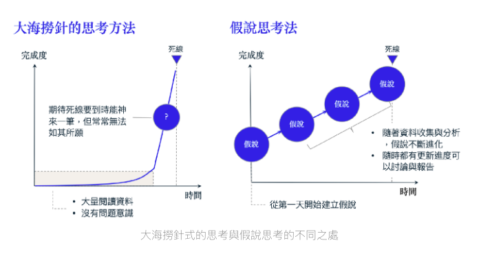
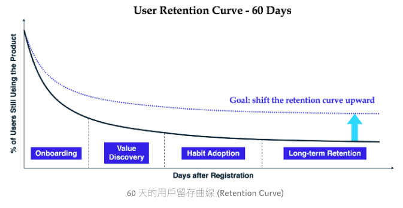
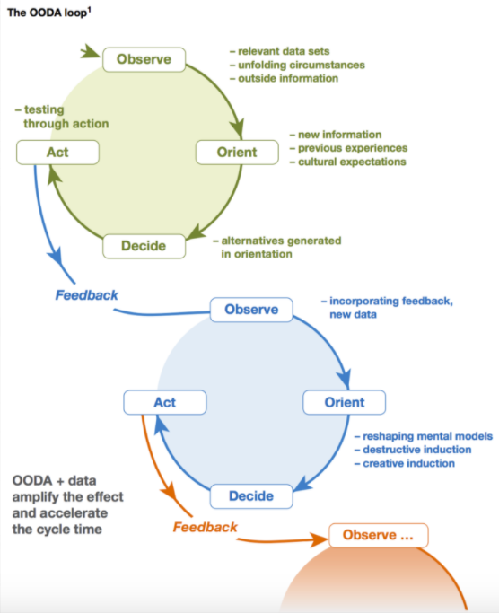

# Reference

[資料科學中的商業分析 2：假說思考對資料科學家來說至關重要](https://medium.com/@taweihuang1/%E8%B3%87%E6%96%99%E7%A7%91%E5%AD%B8%E4%B8%AD%E7%9A%84%E5%95%86%E6%A5%AD%E5%88%86%E6%9E%90-2-%E5%81%87%E8%AA%AA%E6%80%9D%E8%80%83%E5%B0%8D%E8%B3%87%E6%96%99%E7%A7%91%E5%AD%B8%E5%AE%B6%E4%BE%86%E8%AA%AA%E8%87%B3%E9%97%9C%E9%87%8D%E8%A6%81-6039146360e0)

# 所謂假說思考法(Hypothesis thinking)

* 策略顧問相當常用的方法之一，BCG甚至出了一本書在談論假說思考
* 各種商業問題/資料科學問題，經常需要透過**資料分析**了解**問題發生的原因**，並根據原因對症下藥，解決目前存在的問題
* 不斷提出**根據目前資訊最接近根本原因**，的猜想，並驗證該假說 - 並且是要有根據的猜測，其中有兩個重要的心態
  1. 不論目前的資訊多有限，都要有一個暫時的答案，也就是隨時能回答**自己的看法是?**，這樣的問題
  2. 透過提出的**假說**，讓該做什麼事情變得更清楚，因此有更多時間思考如何驗證以及驗證後如何執行下一步

</img>

# 假說思考的好處

1. 能夠持續**定位問題**，有清楚目標的往前進 - 如果再遇到問題的第一天就能夠在心裡建立**暫時的解答**，會很清楚的知道專案下一步就是**驗證這個暫時的解答是否正確**
2. 不論假說驗證完後是對還是錯，都能夠有下一步 - 如果目前假說是對的，可以深化分析，並試圖提出可能的解決方案，如假說不正確，可以趕快換到下一個主題去驗證新的假說
3. 可以有效利用過去的經驗 - **假說是基於現有知識的最佳解**，因此隨著你對問題領域的了解越來越深入，或是解決問題的經驗越來越豐富，一開始就越有可能提出正確的假說

# 資料科學中的假說思考

例子A : 資料分析師分析了上週推薦系統的表現，發現推薦清單的點擊率突然掉了12%，該怎麼辦呢? 這時候我們就要根據過去的經驗，提出幾個比較有可能是原因的假說

1. 是否有介面、產品功能或是其他面向的改變，造成點擊率下降?
2. 是不是資料源有問題，沒有將上週所有的點擊紀錄都傳送回來?
3. 是不是推薦模型的參數沒有更新，導致預測準確度有所誤差?
4. 是否最近活躍使用者的習慣獲釋profile有改變，需要設計新的推薦模型?

``` 
思考點 : 這樣的思考不該侷限在模型本身，而是務實的考量現實情況中可能會發生的情況，例如有訓練新的模型，但是參數沒有更新，以及上一次改版改了什麼? 是不是連動的影響到了推薦系統的表現?
```

例子B : 假設公司這一季的目標其中之一是能夠提升使用者留存率10%，因此產品經理跑過來詢問你，**我們能不能透過資料分析，幫助我們釐清留存率的問題?**，這時候可能會提出一些假說，

1. 使用者主要流失的時機可能會發生在onboarding/value discovery/habit adoption/retention時，使用者流失主要發生在哪個階段?
2. ...
3. ...
4. ...

上面的假說1是能夠驗證的，能夠透過產品的留存曲線看出來!

</img>

``` 
思考點
是否能夠正確的拉出使用者留存曲線，這一點與資料規模有關

1. 如果公司的資料庫規模不大，或許在1週之內就能夠把整個data pipeline清理乾淨，並整理出乾淨的資料來回答這些問題
2. 如果公司的資料庫規模大，而且還跨資料庫，例如有MS-SQL, MySQL, Oracle, Teradata等，那麼要透過資料回答這個問題的成本就非常高，這基本上會轉變成一個工程問題，為了回答 **使用者流失主要發生在哪個階段**，必須解決以下事項，才能得到乾淨的資料

    2 - 1.若需要串接這些使用者留存資料，現階段最接近乾淨資料的資料庫在哪裡?
    2 - 2.如果需要取得該資料庫的權限，中經必須經過哪些人?
    2 - 3.得以驗證這個使用者流失主要發生在哪個階段的這件事情，能夠產生多大的impact?，該怎麼說服這些中間人?
```

# 假說思考的關鍵步驟以及誤區

在採用假說思考方法進行專案時，我通常遵循 OODA 循環。這個方法由美國空軍上校約翰・柏伊德 (John Boyd) 提出，由觀察（Observe），定位（Orient），決定（Decide）與行動（Act）四個階段構成，反覆進行並透過環境給與的回饋持續優化循環。該方法最早應用於戰鬥機飛行員的訓練，作為交戰程序之一，並成為軍事戰略的一部份，後來也被應用於商業等領域。

</img>

## 觀察(observe)

透過既有的資訊，建立初期的假說 - 以例子A為例
能夠先基於過去經驗/對公司資料庫系統的理解/對指標變化的觀察，產生出上面提到的4個假說

好的假說，要簡單明確且能夠被驗證

容易闖入的誤區包含

* 直接把解決方案當成假說
* 天馬行空的產生假說，而非基於現有資訊

以例子B為例
年輕的資料科學家會提出 - **寄送push notification**可以使使用者和產品產生更多互動，進而提升留存率，這個假說，直接跳過了解決方案，而沒有釐清使用者不繼續使用產品的原因，並且，這其實是個天馬行空，沒有任何依據的論點，這樣的假說通常沒有辦法協助我們達成目標

## 定位(Oreint)

第二個步驟是「定位」(Orient)，當我們有一組初期的假說，下一步就要「決定優先順序」(Prioritization)，選出最 promising 的假說最為首要調查的目標。在「定位」階段，我們基本上要衡量「假說為真的可能性」，以及「研究該假說可以帶來的影響力」。
以推薦系統表現變差的案例，上週 town hall 產品經理有提到這次更新包含產品介面的改版，基於這項資訊，可以判斷「界面改版」可能是影響推薦清單點擊率的原因，因此可以去仔細詢問介面改版的範疇，如果推薦清單的介面也有被影響到，可以看看有沒有做 A/B 測試，有做 A/B 測試就可以透過實驗組跟對照組的比較，判斷是不是因爲界面改版照成推薦點擊的變化。
另外一個決定優先順序的方法是依照假說帶來的「影響力」。以提升留存率的問題為例，我們發現 onboarding 是流失最多用戶的階段，同時 onboarding 的使用者體驗也是最容易被優化的，而 habit adoption 階段的流失用戶並不多，也很難優化目前的產品，這時就會優先深化 onboaridng 流失原因的假說，也許更有機會可以快速優化產品。

``` 
思考點 : 
兩個決定驗證順序的關鍵

1. 上一次更新時更新的內容涵蓋到的部分
2. 按照假說帶來的影響力

```

## 決定(Decide) 與 行動 (Act)

最後一步就是「行動」(Act) —— 也就是透過不同類型的測試方法，蒐集與分析新的資訊，持續驗證或是推翻假說，並做好隨時調整假說的方式。怎麼測試與驗證假說，這是一個比較大的問題，因此會在新的文章跟大家分享。

``` 
思考點 

1. 基本上就會進入一個收集資料，畫圖看結果，小心檢查這樣的結果是否正確的反應自己調查的事實
2. 這樣的思考方式其實也對應到了尋找一個複雜系統的Bug

   2 - 1 觀察 : 目前的系統的運作跟想像的不一樣，根據上一次改code的地方提出bug發生的假設
    (1)...
    (2)...
    (3)...
    (4)...
   2 - 2 定位 : 上一次改動程式碼的地方? / 最能確定bug在哪的一段程式碼
   2 - 3 決定/行動 : unit-test!, print!
```
