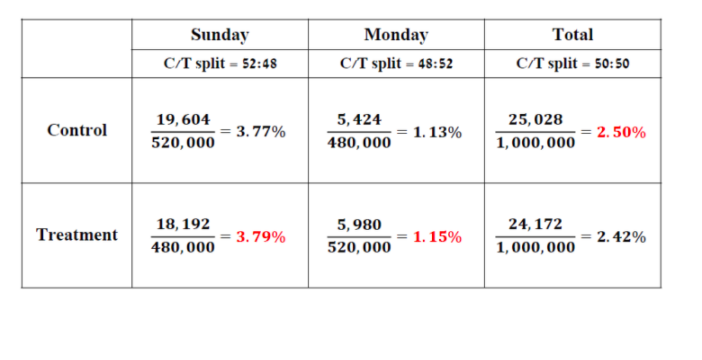
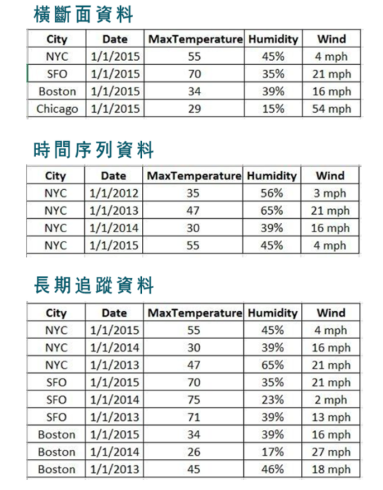
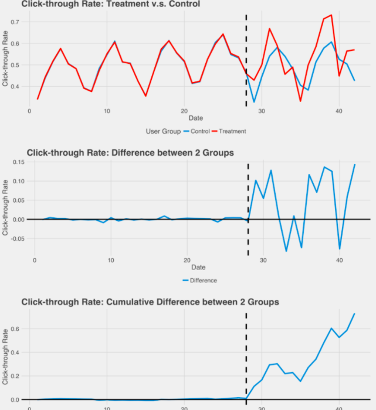
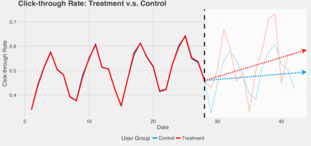

# Reference

[David 資訊品質 (InfoQ) 系列 2：資料蒐集階段的 InfoQ](https://taweihuang.hpd.io/2018/06/05/infoqdatacollection/?fbclid=IwAR1TEaoW4NXxS8PxTvgxYPJYH9myJ8JvP4ylJ4sOznVRLsvDgowV_76N5YY)

[From quality to information quality in official statistics 2016](https://content.sciendo.com/view/journals/jos/32/4/article-p867.xml)

# 資料分析pipeline的三個階段

1. 資料搜集 - 90%的專案時間在**定義問題**與**資料搜集**
2. 資料分析 - 考驗DS硬底子功夫的階段，同時也考驗DS能不能有創意的設計模型
3. 資料輸出 - 當你越有「使用者經驗設計」、「商業領域知識」、「資料工程」，你越能在這個階段達成目標

# 資料搜集需要衡量的幾個面向

1. 資料解析度(Data Resolution)
2. 資料架構(Data Structure)
3. 資料整合(Data Integration)

# 資料分析時需要衡量的幾個面向

1. 時間攸關性(Temporal Relevance)
2. 資料與目標的時序關係
3. 推廣能力

# 資料呈現階段需要衡量的幾個面向

1. 作業化/生產化
2. 溝通

* 這篇文章將會以A/B測試為主軸，解釋資料搜集階段的三個面向

## 資料解析度(Data Resolution)

1. 量測尺度 - 資料搜集個體的等級，是要比較**兩種個體**還是兩種市場??
2. 加總層級 - 要不要把變數加總再一起看，要看家戶的總所得，還是工作所得，投資所得?

A/B測試中，能否隨機將**相似且不互相影響(identical and individual)**的使用者分成實驗組與對照組，也就是是否能取得統計理論中的隨機樣本(random sample)，我們必須盡可能取得最隨機的樣本

假設你是訂房網站的資料科學家，產品團隊希望「提升房客人數來增加旅館收入」，因此設計了新的旅館廣告 UI 頁面，請你幫助他們衡量新的設計能夠為旅館帶來多少的收入。如果只是隨機將使用者分配到不同網站，這時最大的困難就是：會不會新設計旅館 (測試組) 新賺來的錢是因為搶食 (cannibalize) 舊設計旅館 (對照組) 的客人，當所有旅館的廣告頁面變成一樣時，其實是沒有辦法增加消費者訂房的意願使旅館收入增加。當測試組會影響對照組個體行為時，我們很難衡量新設計真正帶來的效益。此時，我們會建議挑選「相似的市場」做測試，比如說：**選擇多個使用者與房東有類似行為的行政區做測試，比較測行政區與採納就設計的。**

加總層級與辛普森悖論(simpson's paradox)
 

在「加總層級」部分，最需要小心的就是「辛普森悖論」(Simpson’s Paradox)。我們可以從以下例子來看：假設我們蒐集了兩天的實驗資料，蒐集了總共 200 萬個使用者，其中 100 萬個使用者是實驗組 (Treatment Group)，另外 100 萬個使用者是控制組 (Control Group)，計算出來發現點擊率 (Click-through Rate)，結果是控制組表現較佳。然而，我們拆解成禮拜天跟禮拜一的結果，發現這兩天單獨看都是實驗組比較好！會有這樣的原因主要是：(1) 星期天跟星期一的 CTR 差很大 (2) 星期天跟星期一實驗組 / 對照組的比率並不是 1:1。因此，「加總」是要謹慎評估的─在蒐集資料前，就要特別確保蒐集到的變數是不是真正可加的，如果星期日跟星期一實驗組 / 對照組的比率是一樣的，就不會出現下面的問題。

</img>

避免辛普森悖論的方法

1. 加總時使用等分配
2. 審慎考慮使是否有隱藏變數
3. 可能的話，切到最細的層去觀察結論是否一致

[check 辛普森悖论 学习笔记](https://jiaxiangbu.github.io/train_model/analysis/simpson_s_paradox.html)

[辛普森悖論](https://zh.wikipedia.org/wiki/%E8%BE%9B%E6%99%AE%E6%A3%AE%E6%82%96%E8%AE%BA)

[浅谈AB测试里常见的辛普森悖论](https://zhuanlan.zhihu.com/p/21068622)

## 資料架構

資料架構與資料的特性與蒐集方法有關，一般常見的結構化資料有三種型式：橫斷面資料 (cross-sectional data )、時間序列資料 (time series data)、以及長期追蹤資料 (longitudinal data)，其中的差別在：

橫斷面資料 (cross-sectional data)：每個個體 (observations) 在單一時間點的行為 (behaviors) 。
時間序列資料 (time series data)：單一個體在多個時間點的行為。
長期追蹤資料 (longitudinal data)：每個個體在多個時間點的行為。

</img>

* 在A/B測試中，橫斷面資料受到Seasonality影響，這時候可以將每日的點擊率相減觀察，下圖是相減以及累積相減

</img>

* 如果覺得noise還是太大，可以走一個回歸模型或是時間序列拆解(seasonality拆解)

</img>

## 資料整合(Daya Integration)

大部分資料分析專案的資料都來自許多不同的資料源，每個資料源會得到的變數型態也不盡相同，整併包含不同資訊的資料源常會有利於我們看到更多洞見，但也可能會讓資料變得一團混亂。因此，在進行資料整合時，要注意：

每個資料源蒐集資料的方式是什麼？蒐集的方式可靠嗎？什麼情境下資料源會變得不可靠？
不同資料源整合在一起的連結方式是什麼？會有像是關聯式資料庫的主 key 可以連結嗎？
資料整併後能夠幫助我們達成分析目標嗎？我們能夠解釋整併後的數據意義嗎？
資料整合會不會產生隱私問題？會不會可以辨認出去識別化資料中的個體是誰？

在 A/B 測試中，資料整合其實是至關重要的。比如說，在做使用者抽樣時，我們要怎麼確認使用者足夠有代表性呢？通常我們會希望「被抽樣的使用者」跟「目標研究的母體」在重要的特徵上是相近的，比如說：連續劇 App 公司會希望抽樣出來的樣本在觀看時間與使用 App 頻率是一樣的；搜尋引擎公司則會希望實驗對象不是「爬蟲」，所以希望實驗對象的搜尋次數在某個區間之內；如果是網路行銷公司，可能會希望使用者的年齡、收入等特徵跟該測試市場人口的分布類似。從上述的案例中，可以知道光「實驗個體抽樣」就會需要整合不同類型的資料。
