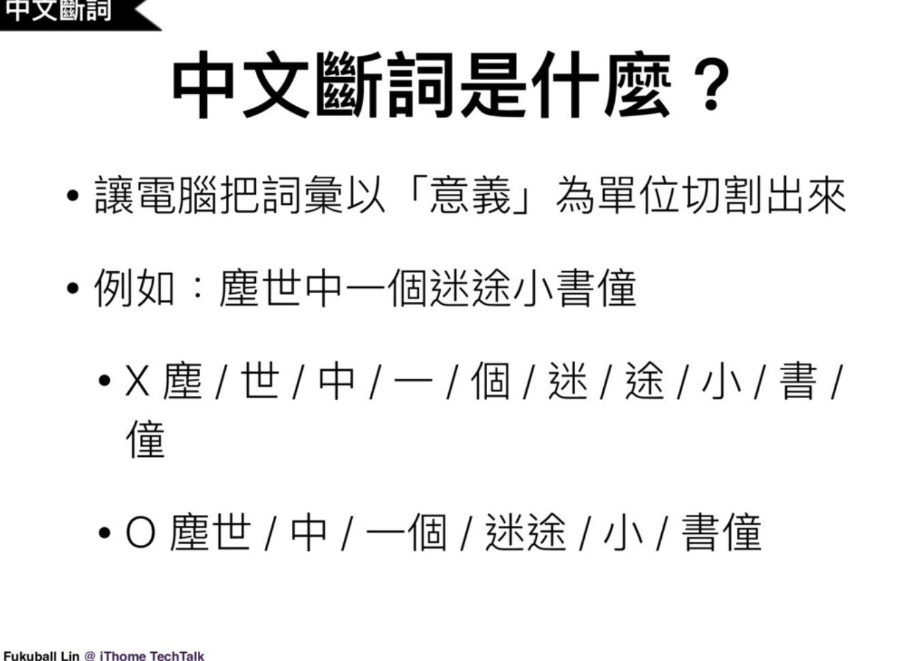
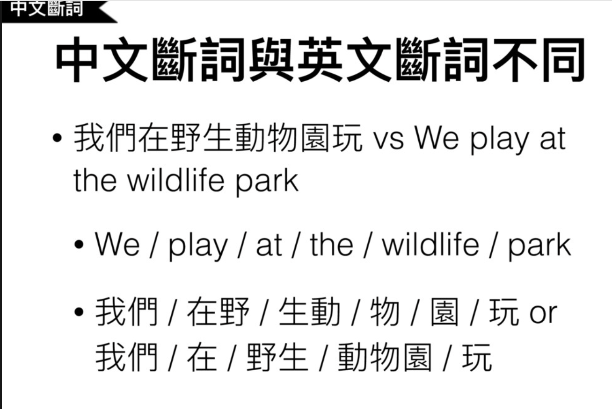
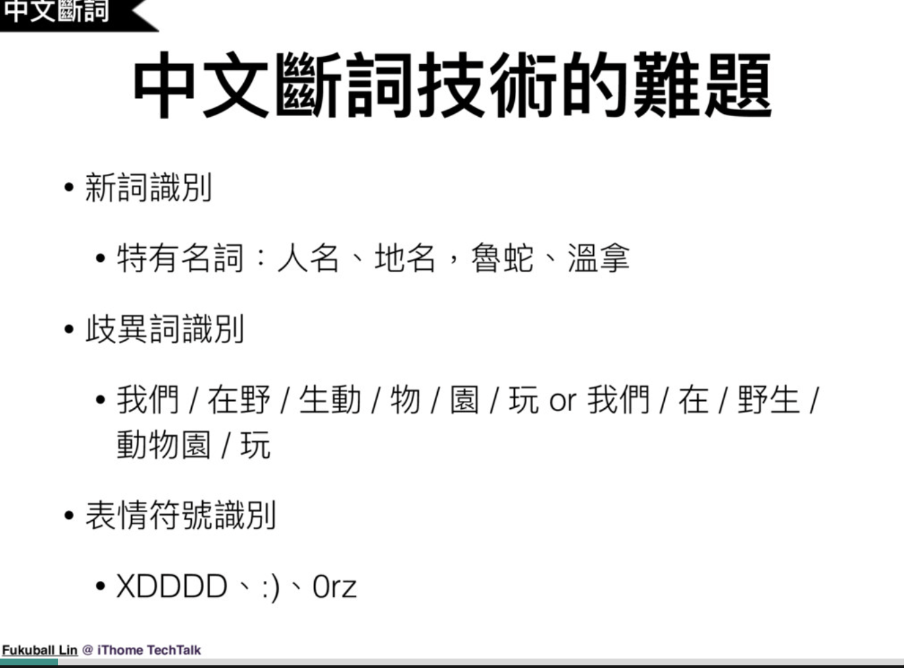
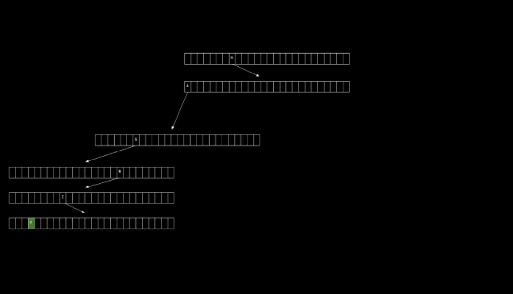
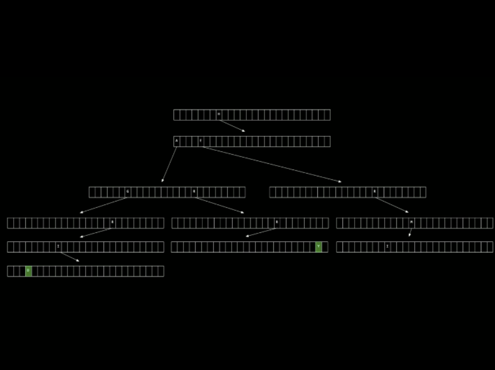
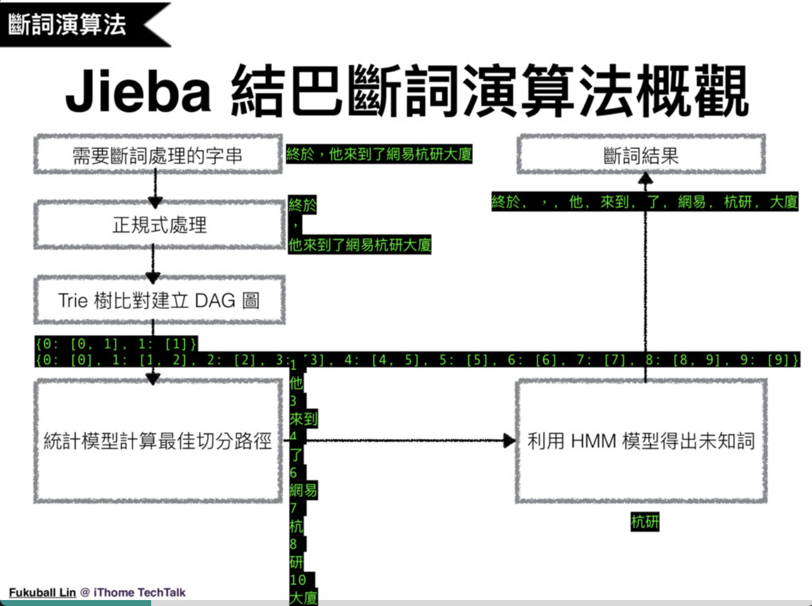
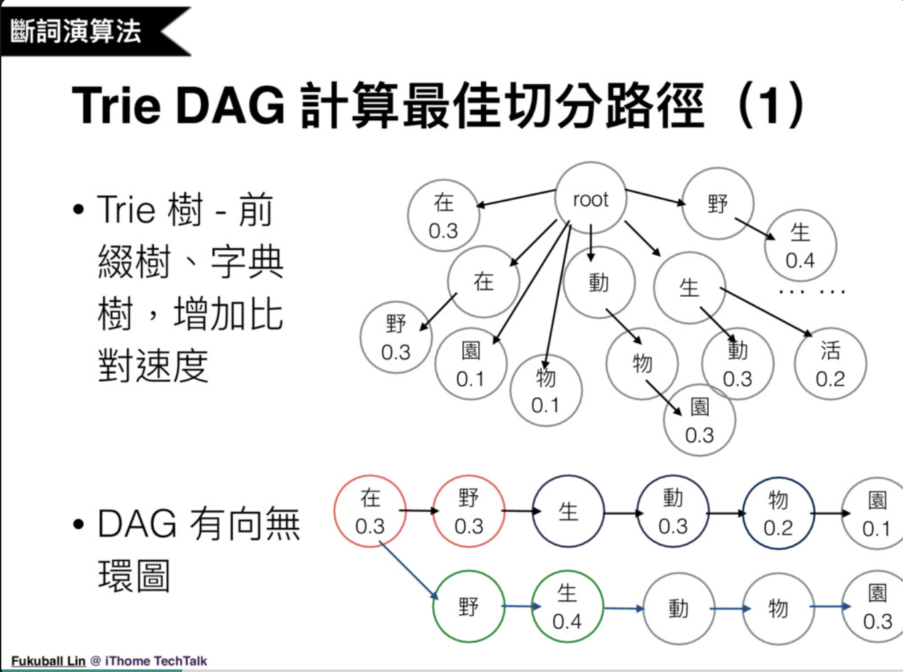
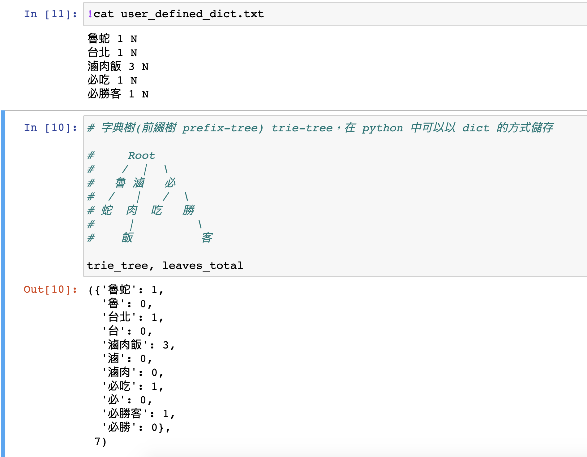

# Ref

[中文斷詞 : 斷句不要悲劇 Head first Chinese text segmentation](https://speakerdeck.com/fukuball/head-first-chinese-text-segmentation)

[Video](https://www.youtube.com/watch?v=sAHcU-3xO0w)

# Want

* 讓電腦把詞彙以 "意義" 為單位切割出來

</img>

</img>

</img>

# 常用解法

1. 正向最大匹配 : 我們 / 在野 / 生動 / 物 / 園 / 玩
2. 逆向最大匹配 : 我們 / 在 / 野生 / 動物園 / 玩
3. 雙向最大匹配 : 兩種都算一遍，取顆粒度最大
4. **全切分** : 切分出與詞庫匹配的所有可能，再用統計語言模型決定最優切分結果

# Algo in Jieba

* 已知詞 : Tire DAG - 全切分法，接著使用統計模型計算最佳結果
* 未知詞 : HMM 模型計算，並且辨識

## Review Trie
* a tree data structure which node is an array.
* use a lot of memory but offer actual constant time for searching
* e.g. search for name `Hagrid`

</img>

* how trie store `Harry` and `Hagrid`

</img>

* Time Complexity : searching $O(1)$ - actually, not average.
* Space Complexity : $N$ names, max length of names is $k$, for alphabet : $26 \times k \times N$ array size a.k.a. $O(kN)$

## The algo

0. preload dict, build trie
1. 正則處理 
   - 斷開符號和文字
2. Search in Trie
   - 比對句子中的字有沒有出現在字典中
     - 有 
       - 計算切分組合
       - 表示成 DAG
3. 計算最佳切分路徑
4. HMM 得出未知詞
5. 斷詞結果

</img>

### Trie and DAG (已知字)

video 27:00

</img>

* 大致上是這樣的過程，長出一個 trie，每個 node 是一個 array， array element 中有字以及機率值
* Trie 中，根據給定辭典，可能會長出如下 trie :  `在 (0.3)`, `在 -> 野 (0.3)`, `物 (0.1)`, `園(0.1)`, `動 -> 物 -> 園(0.3)`, `生 -> 動(0.3)`, `生 -> 活(0.2)`, `野 -> 生(0.4)`
* 有了給定句子 (Query) 在野生動物園玩，根據 trie 樹可以舉例出 DAG
  * 在 (斷1) --> 野 (0.3) --> 生 (斷2) --> 動 0.3 --> 物 0.2 --> 園 0.1 (prob = 0.3 x 0.3 x 0.2 x 0.1 = 18 x 10-4)
  * 在 (斷1) --> 野 (斷2) --> 生 (0.4) --> 動  --> 物  --> 園 0.3 (prob = 0.4 x 0.3 = 12 x 10-2)
  * N 組路線中，找機率最大的路線 (窮舉 / search / 動態規劃 ...)

#### Source code example

implementation in python jieba

* 根據給定的字典

```
我是一個詞 100 N
烤肉      1   Vt
...
```
產生一個Trie-tree，每個 node 都是一個字，node上為從根節點一路到葉節點所形成的字，在字典中被記錄的詞頻

* 使用一個自定義字典作為範例

</img>

### HMM

Video 30:30

沒看過的字 / 詞

魯蛇 - 只會被斷詞成 `魯`, `蛇`，因為字典沒有，所以單個字斷開會是最大機率

