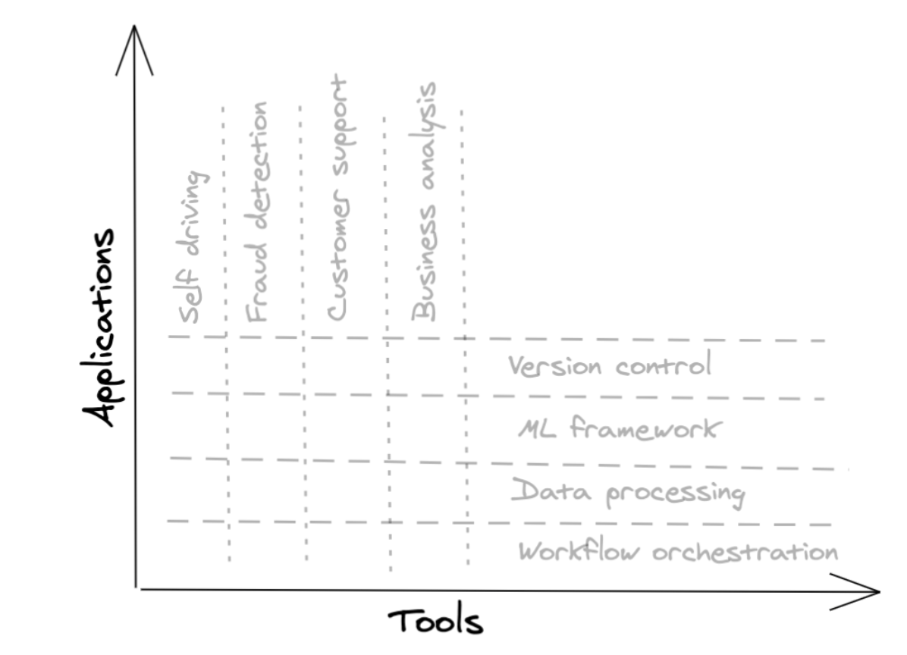
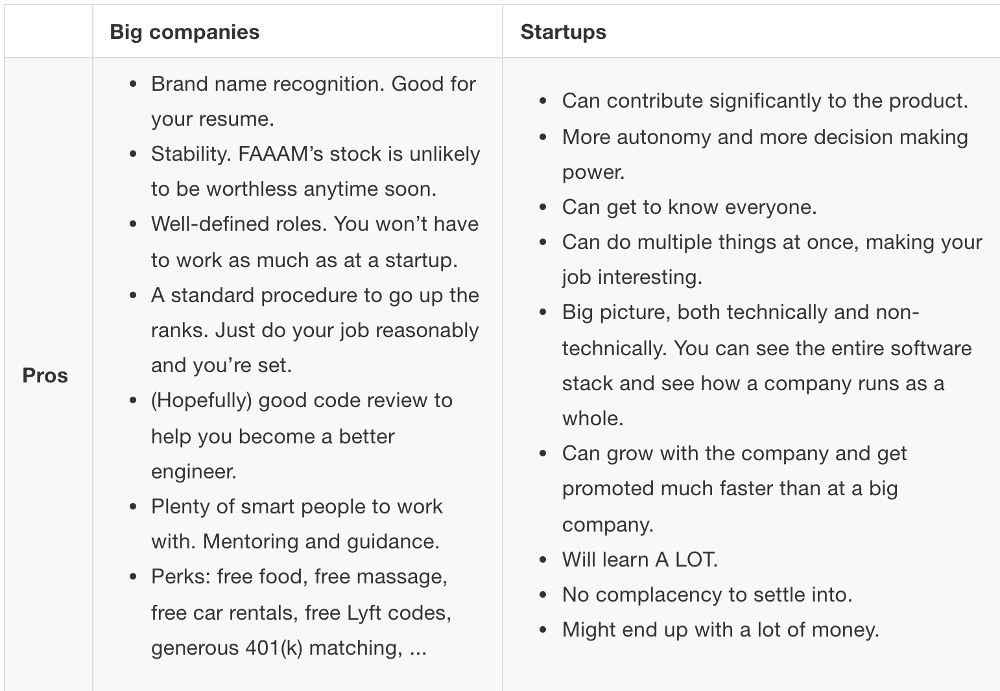
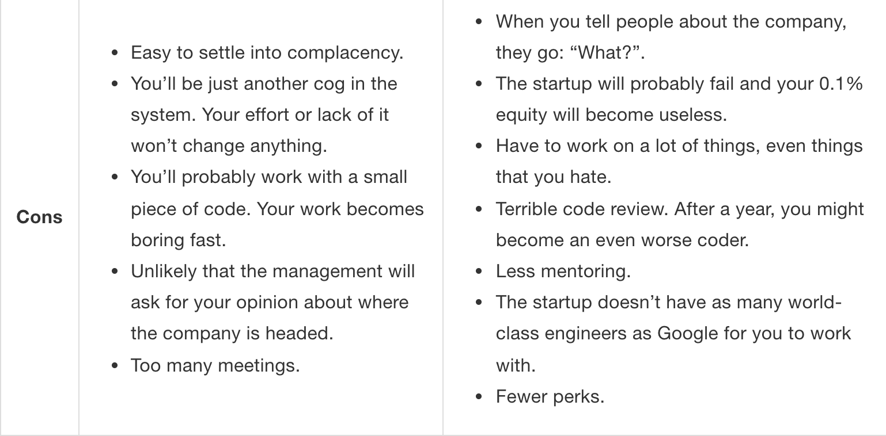
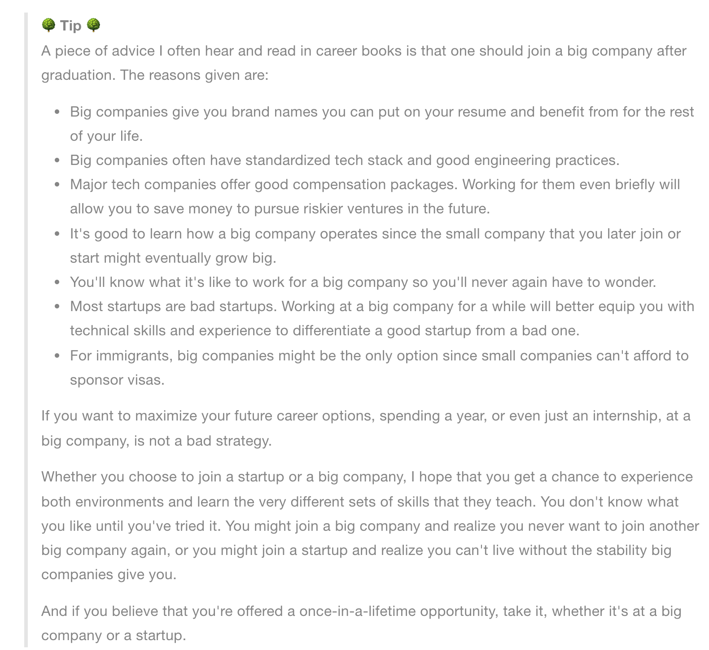
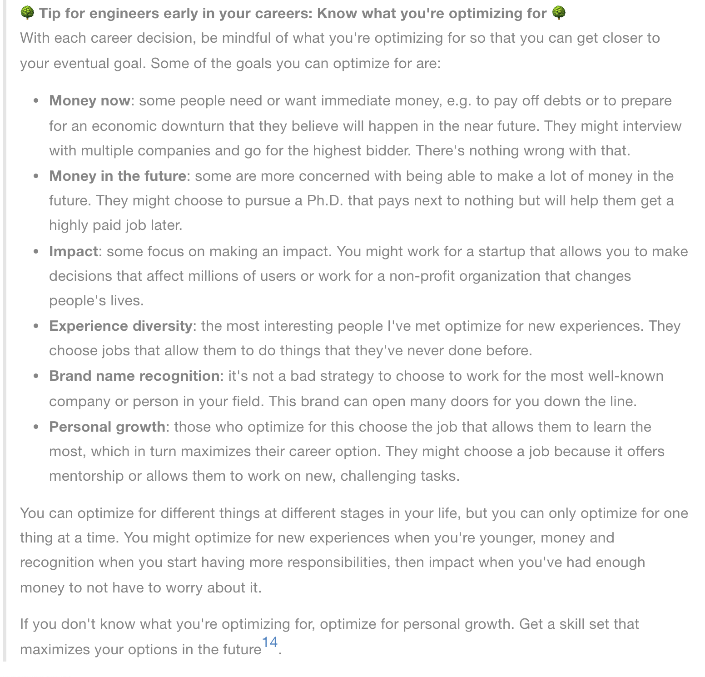

# Ref

https://huyenchip.com/ml-interviews-book/

# Types of companies

## Applicaitons companies vs tooling companies

Application 

- 專注於解決某個問題，在特定產業 
- e.g. 專門處理異常交易的公司

Tooling 

- 專注打造容易使用的軟體服務
- e.g. Tensorflow, spark, ...
- 有關鍵客戶後，容易達到自成長(不用找客戶)

type|employee|impact in early stage|
-----|-----|-----------------------|
application|# of sales > # of engineers|
tool|# of engineers > # of sales|

Tips:

1. Who - Main users of your product?
2. What - the use case you're targering?
3. How many - peoples, engineers, sales?

</img>

# B or C 

b2b - CRM software, peoject management tools, database management system, cloud hosting services.
b2c - consumer products are social networks - search engines, ride sharing services, health trackers.

different sales strategies and engineering requirements, 

C side tend to rely on viral marketing - (invite your firends and get your next order for free)
B side tends to require selling to each user separately

Tips:

b2b

1. How many customers? What's the customer growth rate?
2. How long is their sales cycle?
3. How does their pricing structures work?
4. How hard is it to integrate their product with their customers' systems?

b2c

1. How many active users? What their user growth rate?
2. How much does it cost to acquire a user? (Very important)
3. Do user pay to use the product? if not, how are they going to make money?
4. What privacy measure do they take when handling users' data? - next Cambridge Analytica.?

# Startups or big companies

</img>

</img>

</img>

</img>
