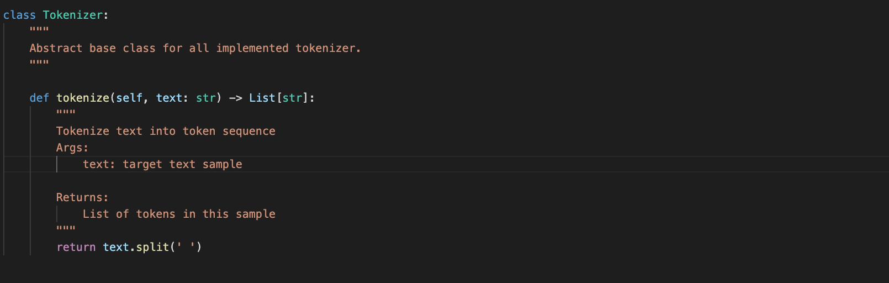
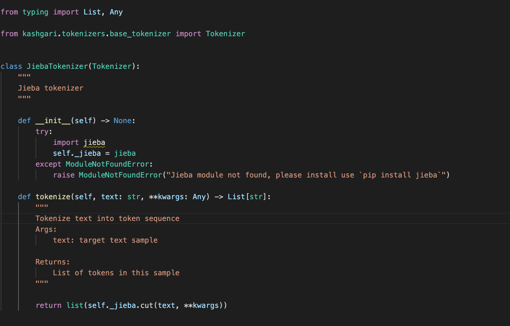
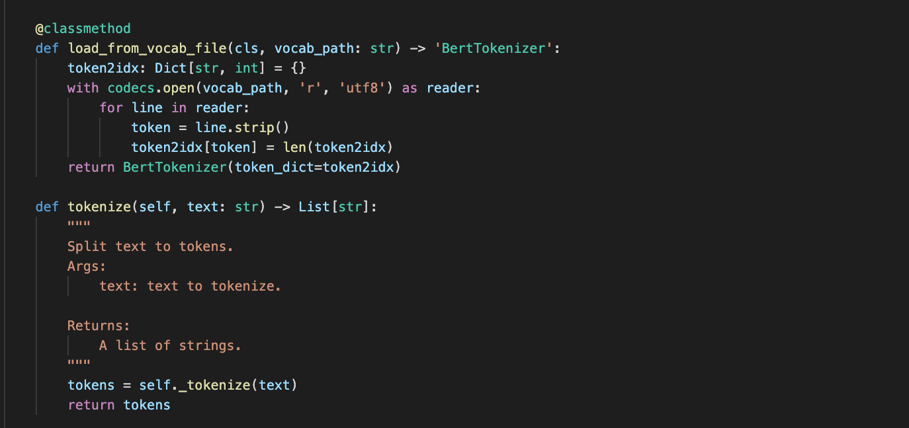

# kashgari

Kashgari是一套將BERT模型推展到產品級的套件，特色是
簡單，容易使用、了解、修改，規模化，且能夠直接部署到雲端上(tf-serving)

# Profiling BERT NER

# Code Analysis

[Kashgari github](https://github.com/BrikerMan/Kashgari)

有使用到的部分

Question berfore analysis : 

1. BERT的模型結構被藏在哪裡? - 藏在`bert4keras`
2. TextProcessor怎麼做的? - 是MultiProcessing嗎 - No, Single Processing
3. Tokenizer怎麼做的，怎麼自定義詞典 - BaseTokenizer, JiebaTokenizer, BertTokenizer,字典透過`vocab.txt`來定義

Training

`from kashgari.callbacks import EvalCallBack`

`from kashgari.embeddings.bert_embedding import BertEmbedding`

`from kashgari.tasks.labeling import (BiLSTM_CRF_Model)`

core model bert based on [bert4keras](https://github.com/bojone/bert4keras#%E5%8A%9F%E8%83%BD)

Inference 

TextProcessor, Tokenizer

# BertEmbedding


這裡的`BertEmbedding`繼承了`TransformerEmbedding`，看起來`BertEmbedding`中沒有比`TransformaerEMbedding`多太多東西，不過可以看到模型載入時會直接讀取相關的


`vocat.txt`

`bert_config.json`


接著進入到`TrainformerEmbedding`物件來看，可以看到`TransformerEbmbedding`繼承了`ABCEmbedding`，並且會被`Seq2Seq`以及`ABCTadkModel`使用到，那麼這一層定義了哪些事情?

1. 可以看到`kashgari`的套件中很多物件都定義了`to_dict`，這使得將物件以dict的方式表達變得容易，若要以API傳送相關參數也會方便很多
2. `load_embed_vocab` - 載入embedding model的辭典並把它轉換為一個token字典
3. `build_embedding_model` - 載入模型參數，並以`bert4keras`這個套件把模型建立起來，接著把每一層bert encoding layer的參數freeze


那麼`ABCEmbedding`物件中定義了哪些東西呢?


基本上的屬性有`embedding_size`, 以及`text_processor`，也是說當我們load bert model時，也可以傳入，text_processor

`ABCEmbedding`定義哪些行為呢?

1. `setup_text_processor` - 將text_prcessor中的一些屬性傳過來，例如`token2idx`
2. `build_embedding_model` - 宣告了繼承的物件要實作這個方法
3. `load_embed_vocab` - 宣吿了繼承的物件要實作這個方法
4. `get_seq_length_from_corpus` - 了解文本中序列長度會使用到的method
5. `embed` - 把input sentecne 經過 text prcoessor處理，再經由embedding model predict，最後回傳embedding result(np.array)


# vocab.txt

了解字典內容可以協助我們未來自定義字典所需要的背景知識，例如自己訓練一個特殊文本領域的BERT，又或是將使用者序列行為收集，訓練一個基於BERT的推薦系統，如[Bert4Rec](https://dl.acm.org/doi/pdf/10.1145/3357384.3357895?casa_token=iYb5P9jYAqMAAAAA:RAa2OHnp8NIAYm_fWUns1nPwJ4TNnSp9c_rPWOJOTCUQhfgeKi2ygArV5bfET3uusbp3HZfcpLRz)，都會需要建立自己的字典


那麼現有字典中有以下內容








1. 特殊token - `[PAD]`, `[UNK]`, `[CLS]`, `[SEP]`, `[MASK]` - 分別代表了padding, unkonwn, begin_of_sentence, end_of_sentence, masking
2. 預留token - `[unused1]` ~ `[unused99]`
3. 英文字母 - `abcde...`
4. 各種希臘字母以及數學符號
5. 各種圖案
6. 日文
7. 簡中/繁中(700~8000)
8. 英文單字，含特殊遮罩(8000~15000)
9. 中文字，符號，韓特殊遮罩(15000~21000)

這裡比較令人匪夷所思的是含特殊遮罩的內容，例如`##anger`, 或是`##黑`, `##鼻`等等

原來這個特殊做法稱作`WordPiece`，原論文中提到這種作法在2008年訓練de noising auto-encoder時也有使用到

`WordPiece`主要是將英文單字拆分的更小，比如`love`, `loves`, `loved` 其實指的都是`love`，用3個單字反而不會比1個單字學個更好，因此就有了一個算法(BPE - Byte-Pair Encoding)來針對語料找WordPiece，透過BPE就能夠產出如上圖的WordPiece

# Text Processor

接著把目光從字典`vocab.txt`轉到`Processor`，source code中該資料夾中有3個檔案

1. `abc_processor.py`
2. `class_processor.py`
3. `sequence_processor.py`


而物件的繼承關係即使用關係如上圖

`ClassificationProcessor`以及`SequenceProcessor`繼承了`ABCProcessor`，並且也使用了`CopusGenerator`物件

那麼ABCProcessor中定義了哪些行為以及屬性呢?


1. 各種特殊token(像是padding, unknown, begin_of_sentence, end_of_sentence)
2. 自定義字典以及index的對應關係
3. 字典以及input相關屬性 : `vocab_size`, `is_vocab_build`, `build_vocab_generator`, `get_tensor_shape`
4. 宣告了繼承processor必須實作的方法 : `transform`, `inverse_transform`

接著我們挑`sequence_processor`出來看，因為我們prediction中用的到就是這個

該物件中主要重寫了`build_vocab_generator`, `transform`, `inverse_transform`

`transform`中會根據輸入的句子前面加`bos`，結尾加入`eos`的token，並且有`unkonwn`的字就以`unkonwn` token取代，接著處理`sequence_length`以及`padding`

此外也實作了`inverse_transform`，算是一個相當貼心的功能


# Tokenizer

Tokenizer的部分，`kashgari`這個lib分成了

`base_tokenizer.py`, `bert_tokenizer.py`, 以及 `jieba_tokenizer.py`

可以看到`base_tokenizer.py`中的`Tokenizer`是相對簡單的，有空白就切分


`jieba+tokenizer.py`的部分

則是將`tokenize`換成了jieba的斷詞，相當簡單，卻也表現出了作者良好的設計，讓人清楚易懂


接著就看到`bert_tokenizer.py`

裡面定義了`BertTokenizer`

可以看到特殊token，以及是否要維持大小寫，載入BERT字典等方法


其中`tokenize`方法會經過諸多處理

1. unicode字元經過轉半型的Normalization
2. 並且將非分隔符的字元都join起來，`Mn`表示為[NonSpacing Mark](https://www.compart.com/en/unicode/category/Mn)
3. 如果有英文轉小寫
4. ...等一連串處理

並且也做了WordPiece的處理，算是寫的相對完整的tokenizer

# ABCTask Model

接著看到下游任務相關模型，`task`資料夾的結構如下


```
tasks/
├── __init__.py
├── abs_task_model.py
├── classification
│   ├── __init__.py
│   ├── abc_model.py
│   ├── bi_gru_model.py
│   ├── bi_lstm_model.py
│   ├── cnn_attention_model.py
│   ├── cnn_gru_model.py
│   ├── cnn_lstm_model.py
│   └── cnn_model.py
├── labeling
│   ├── __init__.py
│   ├── abc_model.py
│   ├── bi_gru_crf_model.py
│   ├── bi_gru_model.py
│   ├── bi_lstm_crf_model.py
│   ├── bi_lstm_model.py
│   └── cnn_lstm_model.py
└── seq2seq
    ├── __init__.py
    ├── decoder
    │   ├── __init__.py
    │   ├── att_gru_decoder.py
    │   └── gru_decoder.py
    ├── encoder
    │   ├── __init__.py
    │   └── gru_encoder.py
    └── model.py
```

可以看到classification, labelling, seq2seq各有多種模型，先來看看

`abc_task_model.py`


可以看到ABCTask Model裝裝有model，embedding，text_processor，label_processor

並且定義了模型存取和載入，那麼我們sequence labelling中的`bi_lstm_crf_model`又是怎麼實作的呢?


`build_model_arc`這裡可以看layer的結構，基本上是LSTM + Dropout + Dense + CRF

其中CRF也是透過Keras進行實作的

# Reference

[BERT: Pre-training of Deep Bidirectional Transformers for
Language Understanding](https://arxiv.org/pdf/1810.04805.pdf)

[一文读懂BERT中的WordPiece](https://www.cnblogs.com/huangyc/p/10223075.html)