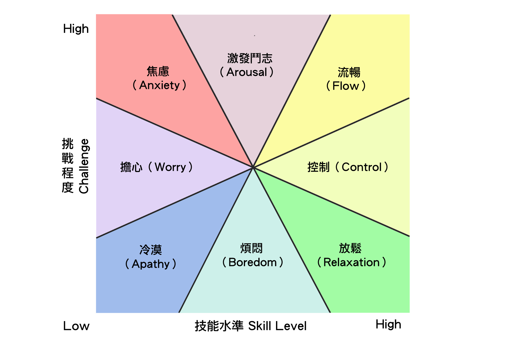

# learning how to learn
[如何進化自學能力？後端工程師 Mosky 的人體實驗
一個小時的工作，能不能五分鐘完成？
](https://medium.com/starrocket/https-medium-com-starrocket-interview-with-mosky-e7c18b54545)

# The Learning Flow
可惜pdf被擋住了，或許要等待之後他在介紹他的learning flow

# 心流象限圖
* 可以時時刻刻檢查一下自己現在在這張圖的哪裡
</img>