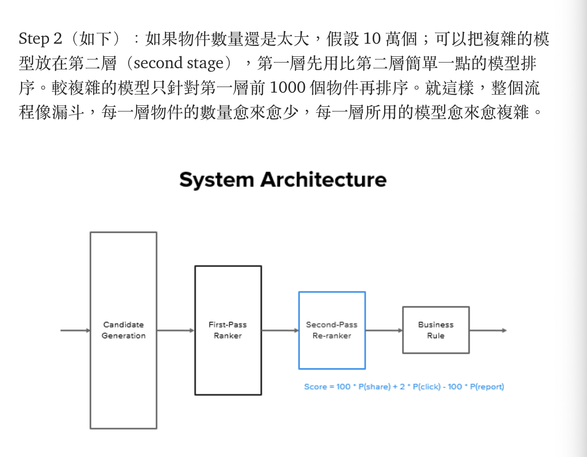

# Ref

[機器學習在推薦系統上之應用](https://medium.com/twdsmeetup/%E6%A9%9F%E5%99%A8%E5%AD%B8%E7%BF%92%E5%9C%A8%E6%8E%A8%E8%96%A6%E7%B3%BB%E7%B5%B1%E4%B8%8A%E4%B9%8B%E6%87%89%E7%94%A8-80ed845ecbfe)

Author : 講者：Brad Li| 機器學習軟體工程師 Software Engineer — Machine Learning @ Facebook

Brad Li，目前在 Facebook 擔任機器學習工程師；主要負責 Facebook 中影片 （Facebook Watch） 推薦系統的模型演算法。先前在 Linkedin 負責用戶搜尋排序演算法；更之前在 Medallia 負責自然語言處理（NLP） 模型訓練。

# Search and feed

推薦系統分兩類

1. Search engine : 使用者搜尋結果排序(Google, LinedIn)，算法必須連結三個元素
   1. User
   2. Query
   3. Item
2. Feed engine : 與使用者欲相關的物件排在越上面(例如臉書的塗鴉牆)，僅需連結兩個元素
   1. User
   2. Item

如何排序

使用者行為回饋

1. Positive feeback : e.g. 送出交友邀請，送訊息，分享文章
2. Negtive feedback : e.g. 沒有任何行為，舉報

Training a ranking model

3. X : 使用行為, Y : 物件 --> 使用者對某個個人檔案送出邀請 / 訊息
4. Metrics - 著重在，使用者黏著度(user engagement)，相關指標 DAU, MAU, 點擊數, 分享數
5. 有時候不容易直接訓練模型優化黏著度，可以找代理指標，該代理指標和最終想要的結果高度相關
6. Pointwise : 搜尋出來的每一個物件是獨立物件，類似 supervised-learning
7. Pairwise - 搜尋出來的物件，依照使用者回應分成正面和負面，正面的樣本高分，負面的樣本低分
8. Listwise - 正面/越相關的樣本排越上面越好

# Features

## User

1. 人口統計學類別 : 年齡、性別、國籍、語言、使用者分層、使用者目的
2. 使用環境類別 : 裝置、週間週末、一天中什麼時段、節慶假日、使用者是付費會員還是訪客
3. 使用者過去行為 : 點擊率、搜尋歷史

## Item

1. 物件品質 - 點擊率、廣告/垃圾郵件分數
2. 分類 - 主題、作者
3. 時事 - 最近發生的時事、話題、文章是否剛出爐(recency)
4. embedding : 文字、圖像

## User-Item 

1. User-item相似度
2. Embedding 相似度

## Model

1. CF - 很大的User-item rating matrix
2. Content-based
   1. rule-based
   2. GBDT
   3. NN

# System Design

In-general : 粗到細，準的放在後面，廣的filtering 放前面，Business Rule 放最後

</img>

</img>

</img>

# 例行工作舉例

1. PM, DS 討論、設定目標
2. 根據目標制定行動計畫
   1. 根據所需的付出和預期的影響，排定優先順序
   2. 訂出 20 項，最後可能做3項
   3. 會議，與合作夥伴達成共識
3. 了解資料
   1. Label data在哪裡，怎麼拿
   2. 每個欄位的意義
   3. 該資料的意義是否符合我們使用的標準
4. 建立 data pipeline
   1. 給模型用的訓練資料pipeline
5. 建立模型
   1. 審視論文、部落格、公司內部其他成功案例，同時考量複雜度
6. 等結果的時候
   1. 和其他夥伴開會
   2. 面試
   3. 其他
7. 檢查模型結果
   1. 看結果而定，可能要重新拿資料或調整
8. 線上測試
   1. 看結果而定，可能要重新拿資料或調整
9. 部署模型

# How to become a ML engineer

1. 仔細瞭解工作職稱，目前做的事情太多分兩種 
   1. Hybird - 同時要訓練模型、上線模型，線下測試 & 線上測試都要做 - FB, LinkedIN
   2. Decouple - 線下訓練 & 上線後的工作是不同人做 - Amazon

面試

1. 寫Code
2. 系統設計
3. 行為問題
4. 過去工作經驗

## The ML Design

1. 北極星指標 - 模型到底成功還失敗
2. Label
3. Feature
4. Data
5. Model
6. Offline Eval
7. Online Eval

### 北極星指標

到底要怎麼衡量這個模型上線之後成不成功；如果不容易直接衡量，要找代理指標（proxy indicator）。例如我們要設計一個推薦用戶他/她可能認識的朋友的系統，代理指標可以是送出的邀請數量、邀請被接受的數量。

### 標籤（Label
要找出可以模擬北極星指標（True north metric）或者代理指標的標籤。例如北極星指標（True north metric）是被接受的邀請數量。
以二分法來貼標籤：
1. 正面標籤：被接受的邀請。
2. 負面標籤：沒有被接受的邀請。

### 模型

1. 常見的有協同過濾或是以內容為基礎的推薦。
2. 訓練模型排序的方法：單點、成對、排序。
3. 要用哪個模型？
線下的衡量指標（要用什麼樣的衡量指標來衡量這個模型成不成功？）
1. AUC：指在 ROC 曲線（Receiver Operator Characteristic Curve，接收者操作特性曲線）之下的面積（Area Under Curve）。面積大於 0.5 表示模型效果優於隨機猜測，面積愈大代表模型愈有效。
2. AUC（PR）：在 PR 曲線（Precision-Recall Curve，精確召回曲線）之下的面積。精確召回曲線以召回率（Recall）為X軸，精確率（Precision）為Y軸。一般來說，精確率與召回率越高，代表模型的效益越高，也就是PR曲線，越往右上方靠近越好。
3. 排序依據：
a. NDCG（Normalized Discounted Cumulative Gain）：給予不同相關程度的物件不同分數。
b. MRR（Mean Reciprocal Rank）：第一個正確答案排序平均。把第一個正確答案出現的排序，取倒數；即評量第一個正確答案多早出現，越早越高分。
c. Recall@P90：精確率為 90% 的情況下，召回率（模型能夠判斷出相關物件的比率）

### 模型上線之後

1. 如果延遲太久？解決方法包括
a. Model compression
b. Feature selection
2. 如果不像在線下一樣好？解決方法包括
a. 看看線上和線下所使用的 feature logging/computation 是否一致。
b. Data distribution shift：線下訓練模型用的數據，跟上線之後遇到的數據，分佈是不一樣的，所以模型結果不同。例如因為時間不同，所以遇到不同分佈的數據。
3. A/B test 相關問題
a. Size
b. A/A test
4. Metric discrepancy