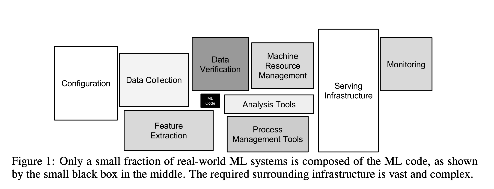
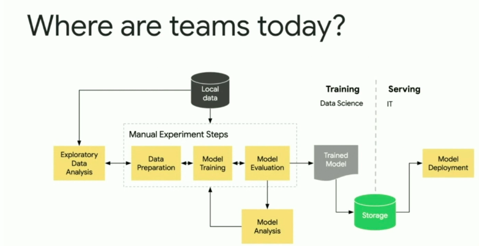
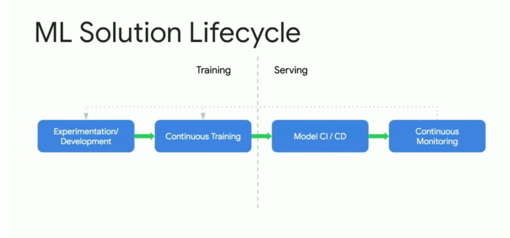
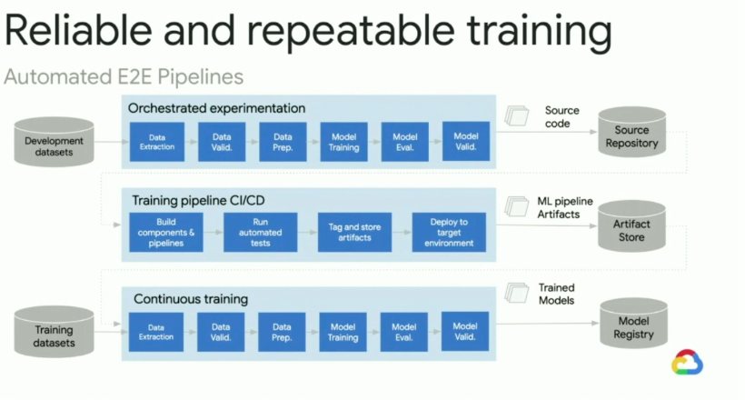
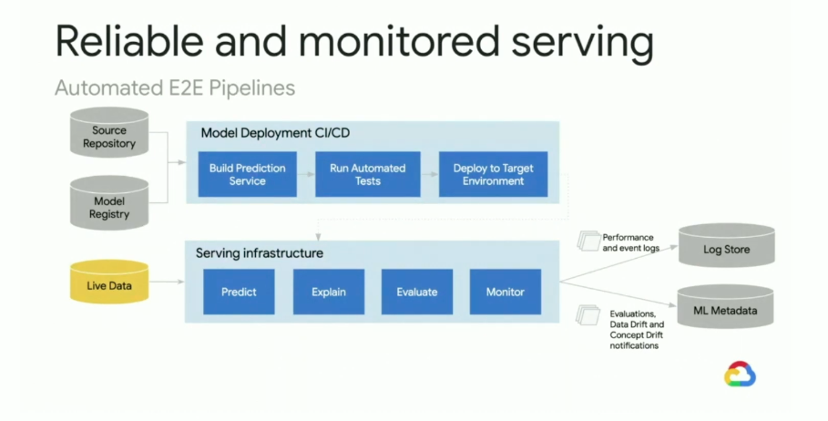
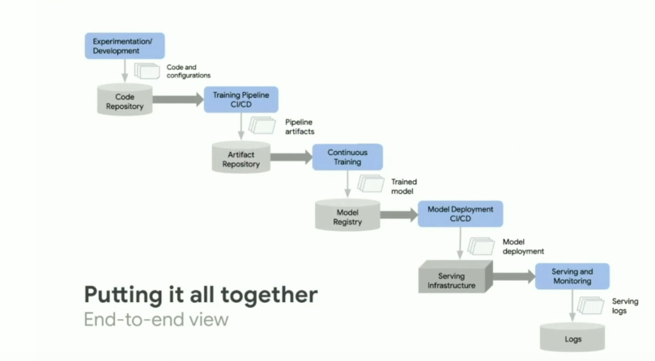
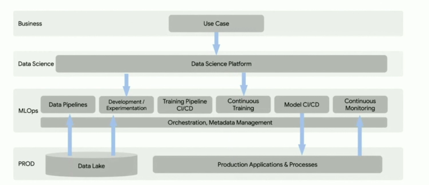
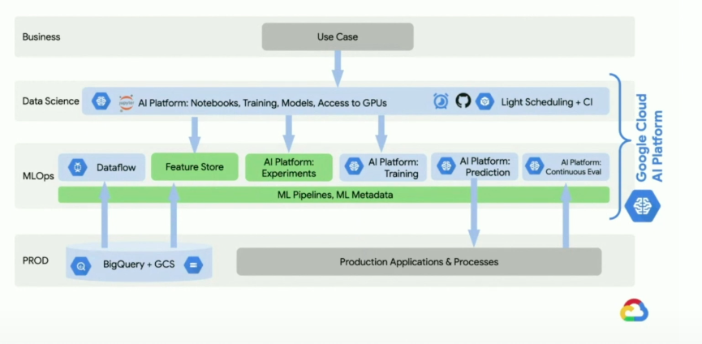

# Ref

[An introduction to MLOps on Google Cloud](https://www.youtube.com/watch?v=6gdrwFMaEZ0)

# Content

## Tech Debt

[Hidden Technical Debt in Machine Learning Systems 2015, google 450+ citations](https://web.kaust.edu.sa/Faculty/MarcoCanini/classes/CS290E/F19/papers/tech-debt.pdf)

## Challenges

1. Time Consuming (EDA, feature, hyperparamter tuning)
2. Manual
3. Inflexible (Cannot adapte to another problem)
4. Not reusable

## ML Solution Lifecycle

1. (Training) Experiments are critical to discovery and make sure data team deliver the best solution
3. (Serving) Model should be properly tested, evaluted and should be even versionable.
4. (Serving) monitoring - discovering better training data, making sure our model works well, debug when our model went wrong silently.
5. monitor as a feedback system.

Source Repo - source code

Artifact Store - ml pipeline, artifacts

Model Resgistry - trained model

trained model should be linked the pipeline, articfacts and source code.

# MLOps on GCP

green part : open source tools

# Our needs

(Integrated in git hash) : model-versioning, data-versioning, src versioning(including pipeline code)