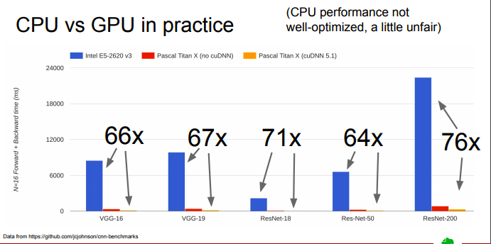
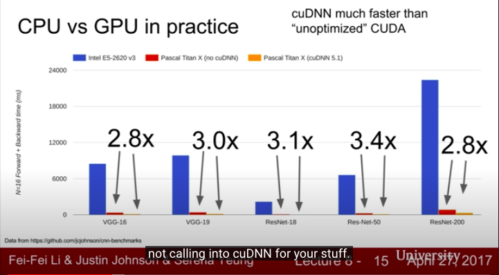

# Model GPU Resource Estimation

</img>

* commonly, 60x - 70x
* benchmark like that basically unfair, he might not tuning good performance on CPU, this is just a out-of-box benchmark like, tensorflow cpu vs tensorflow gpu, torch cpu vs torch gpu

</img>

* cudnn boost about 2x ~ 3x, make sure you're using cudnn!

# Simple Estimation

1. Model Parameters
2. Optimizer Parameters
3. Input/Output per layer

## Model Paramters
Model Parameter size : suppose 1 millions with (float32 4 bytes) - 

1000000 x 4 / 1000000 = 4MB (1百萬參數量 with float32 = 4MB)

E.g. [BERT-Base, Chinese: Chinese Simplified and Traditional, 12-layer, 768-hidden, 12-heads, 110M parameters](https://github.com/google-research/bert)

model loading with float32 : 110 x 4MB = 440MB

you can check by 

1. `model.summary()` in `keras`
2. `model.parameters()` in `pytorch`

## Optimizer Parameters

The parameters introduced in back propergation, like `dw`(the gradient).

For different optimizer, there are different fraction.

Adam - 4x parameters of model
SGD - 2x

## Input/Output per layer

### Input data

1. Input size

Input size : image resolution with float32(4bytes) / uint8(1bytes)

e.g. : 418x418(uint8) for yolo image input

418x418x4/1000 = 698KB(float32 input)

418x418/1000 = 174KB(uint8 unput)

2. batch size

## Model Paramters (when optimizing)

the gradient and original parameters

# Summary 

GPU memory = 模型參數量 x n + batch_size x 每層輸出參數量加總 x 2 + 一個batch的輸入資料大小(通常可以被忽略)

In general, n=2 for SGD, n=4 for Adam

# When OOM

1. Lower batch_size - effect the parameters of layer output(linearly)
2. smaller data type(float 32 -> float16 or int8)
3. simpler model(2 layer LSTM -> 1 layer LSTM)
4. sequence length for text data(effect the parameters)
5. release unnecessary tensor variable.
6. Inplace in activation function

# Ref
[Does freezing keras layer reduce memory needed for training? - yes](https://stackoverflow.com/questions/59037818/does-freezing-keras-layers-reduce-memory-needed-for-training)

[GPU 显存不足怎么办？](https://zhuanlan.zhihu.com/p/65002487)

[BERT-Base, Chinese: Chinese Simplified and Traditional, 12-layer, 768-hidden, 12-heads, 110M parameters](https://github.com/google-research/bert)