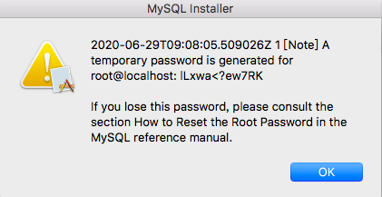

# MySQL
* [wiki](https://zh.wikipedia.org/wiki/MySQL)
  * C/C++ 開放原始碼之關連式資料庫
  * 多種語言的API介接 - C、C++、C#、VB.NET、Delphi、Eiffel、Java、Perl、PHP、Python、Ruby和Tcl等。
  * 免費
  * 風靡一時的LAMP(Linux - 作業系統, Apache 網頁伺服器, MySQL 資料庫 PHP 伺服器端指令解釋器)

# Installation

* [Official on mac os tutorial](https://dev.mysql.com/doc/mysql-osx-excerpt/5.7/en/osx-installation-pkg.html)
* [Offical download point mac os require mac os 10.14 5.7.30](https://dev.mysql.com/downloads/mysql/5.7.html)
* [Installing and running MySQL on macOS with errors resolved](https://medium.com/@jainakansha/installing-and-running-mysql-on-macos-with-errors-resolved-70ef53e3b5b9)
* [使用 Homebrew 在 MacOS Mojave 安裝 Mysql worked 0630](https://myapollo.com.tw/zh-tw/polly-install-mysql-using-homebrew/)

</img>

* start mysql service, check here [Restart, Start, Stop MySQL from the Command Line macOS, OSX, Linux](https://coolestguidesontheplanet.com/start-stop-mysql-from-the-command-line-terminal-osx-linux/)

`ls /Library/LaunchDaemons/com.oracle.oss.mysql.mysqld.plist
/Library/LaunchDaemons/com.oracle.oss.mysql.mysqld.plist*`

OR GUI Interface

系統偏好設定 - MySQL

</img>

your path with mysql : `ls /usr/local/mysql/bin/mysql`
add /usr/local/mysql/bin/ to path 

`mysql -V`

get : mysql  Ver 14.14 Distrib 5.7.30, for macos10.14 (x86_64) using  EditLine wrapper

`mysql.server`

Usage: mysql.server  {start|stop|restart|reload|force-reload|status}  [ MySQL server options ]

# brew install

`brew install mysql`

`brew services list`

`brew services start mysql@5.7`

`brew services stop mysql@5.7`

`brew services restart mysql@5.7`

* [Fix my LaunchAgents](https://apple.stackexchange.com/questions/224439/fix-my-launchagents)
# Unistallation

[No Offical tutorial, 700+ stars hints](https://gist.github.com/vitorbritto/0555879fe4414d18569d)

[3rd party, from GUI](https://nektony.com/how-to/uninstall-mysql-on-mac)

# Python Client

[Pure Python MySQL Client pymysql github](https://github.com/PyMySQL/PyMySQL)

[anaconda page](https://anaconda.org/anaconda/pymysql)

[explore mysql via command line, pymysql, and sqlalchemy](https://github.com/YLTsai0609/database_eplore/blob/master/mysql_exp/using_pymysql.py)