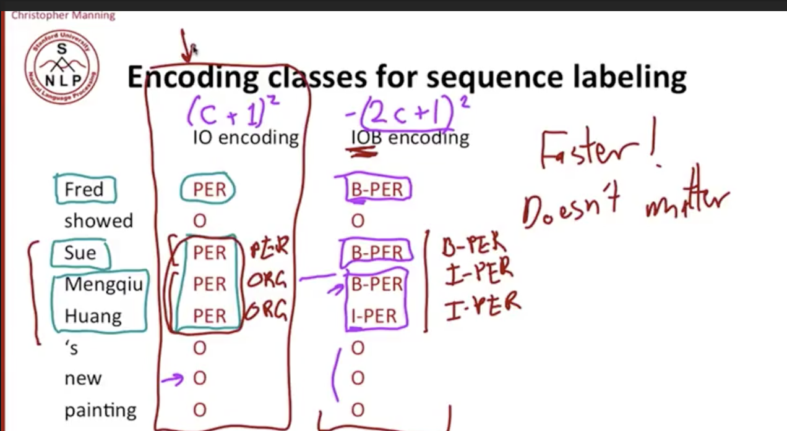

# Concept

[soruce : NLP || Christopher Manning || Stanford L43 ~ L46](https://www.youtube.com/watch?v=Tj3Dkiw-iZg&list=PLLssT5z_DsK8HbD2sPcUIDfQ7zmBarMYv&index=42)

# L43 Information Extraction and Named Entity Recognition

Information Extraction (I.E) : 
* Find and understand limit relavant part of texts.
* Gather information from many pieces of text.
* Produces a structured representation of relevant infomation

The Goal of I.E.
1. Organize infomation so that it is useful to people
2. Put information in sematically precise form that allows further inference to be made by computer algorithm.

Apple Mail knows there is a "date", so it recommend you to create a New calendar event.

It's easy, just use regular expression and name lists.

Google knows it's a location when you searching it.

## Named Entity Recognition (NER)

find them and classifiy what it is!(person/date/location/orgaization)

if you have a good NER system, you 'll do a good job in question answering.(it always asking who did what at when )

# L44 Evaluation of Named Entity Recognition

ORG : ogrinaztion
O : Out of ner
PER : person

left : per token(word), right : ner type(entity)

you may think it is a token(word) classification task, but we are interest in the entity, **So the standard evaluation is per entity not per token.**

## The boundary error

we cannot use classfication metrics for ner task. it will get wired situation

so our y label shoud contain the boundary.

ground truth : ORG(1-4)
prediction : ORG(2-4)

due to the "first" is not being predicted, it counts flase negtive, and the "back of chicago" is not fully correct, it counts false positive!

so select nothing would have been better.

otherwise you need to pick other metrics give partital credit.

So in common ner task. we use F1 score to measure the performance. (due to MUC scorer might be complex and not straight-forward.)

# L45 Sequence Models for Named Entity Recogintion

## The ML sequence model approach to NER

If your entity is too hard to capture(easy thing like date, time, fix named list). then you can do a ML approach.

labelling

### IO encoding : Inside / Outside

There is some problem in IO encoding labelling method.

Sue is 1 person name, Mengqiu is another person name.

But the labelling will tell machine : a person called Sue Mengqiu Huang.

So we have another labeling method.

### IOB encoding

I : inner
O : other
B : beginning

It's will be great that we label in this way. 
And it comes a bit of costs.

If we have $C$ entity class.

We'll have labels $C+1$ for IO encoding. and $2C+1$ for IOB encoding.

In this case, $C=1$(person). $1$ for "other".

for IO encoding. the prediction will run faster, but less accurate.

This course will use IO encoding. due to the different people are adjacent will be very rare to happen. the IO encoding run faster.

And an itresting thing is : In practice, if we use IOB encoing, the system still get it wrong because the adjacent is too rare to happen. So you can find the IOB encoing dataset still encode B-PER, I-PER, I-PER for Sue Mengqiu Huang(even it's 2 people)

## Features

POS-Tagging - 詞性標注

word shape is kind of reguar expression. it's a powerful feature.

## other resource

[NLP中的 POS Tagging 和Chunking](https://www.twblogs.net/a/5cb40e0ebd9eee480f07af98)

pos tagging : 詞性標註 
chunking : 短動詞，短名詞等，可以藉由pos tagging接續做

# Case Study I (AML NER 玉山挑戰賽)

[webpage](https://tbrain.trendmicro.com.tw/Competitions/Details/11)

[post - 1](https://medium.com/@rossleecooloh/%E7%8E%89%E5%B1%B1%E4%BA%BA%E5%B7%A5%E6%99%BA%E6%85%A7%E5%85%AC%E9%96%8B%E6%8C%91%E6%88%B0%E8%B3%BD2020%E5%A4%8F%E5%AD%A3%E8%B3%BD-nlp%E6%87%89%E7%94%A8%E6%8C%91%E6%88%B0%E8%B3%BD%E4%BD%9C%E6%B3%95%E5%88%86%E4%BA%AB%E7%AD%86%E8%A8%98-5d48e47fe38d)

[code](https://github.com/CHI-MING-LEE/2020_Esun-Tbrain_NLP_Competition)

task : 

1. identify AML news.(document classficiation)
2. get AML list in the news.(NER)

language : chinese

dataset : news url, is_news_contain_aml, new_aml_name

used model :

identify AML news (AML classifier) : 

1. jieba + countVectorizer / tfidf + Multinomial Naive Bayes
2. BERT chinese embedding + BiLSTM_CRF
3. BERT chinese embedding + BiLSTM_CRF + Rule-based name list 

BERT chinese + BiLSTM_CRF : F1-Score 0.728
Keyword List : 0.746

combined appraoch : F1-Score 0.92

AML NER Model : 

1. BERT chinese at setence level
2. BIO encoding(BIO, BIOSE, IOB, BILOU ...)
3. post-processing(Tabu-list)

highlights : 
1. chinese document data cleaning
2. hybird rule-based and ml-based approach.
# Hello world!

https://github.com/YLTsai0609/bert_ner

## Labelling

# Case Study II PoI extraction in article title

