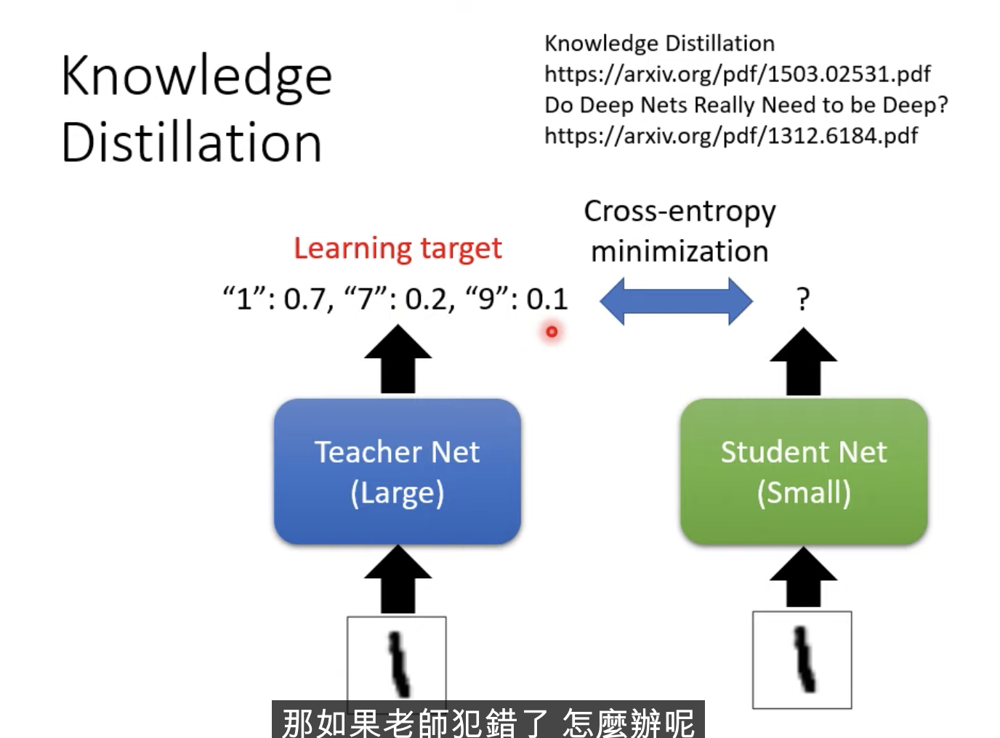

[Ref](https://www.youtube.com/watch?v=xrlbLPaq_Og&t=985s)

# Knowledge Distillation

</img>

Original Network : Teacher Network

We want : Stdudent Network

Learning the trachers answer.

Minimize the cross entropy between student predcition and teacher's answer.

QA : 

1. When tracher goes wrong? 
   1. Learn it anyway.
2. Why not we just train a small network?
   1. learning toward teacher leads better result.
   2. tracher network provide addtional information(output a distribution (soft label))
   3. student network even can learn the unseen category by soft label prediction.

We even can learn a student complex ensemble network.

</img>

Temperature for softmax $y_i = \frac{e^{y_{i}/T}}{\sum_{j} e^{y_{j}/T}}$

</img>

when $T \rightarrow \infin$, student network learn nothing.

# Parameter Quantization

1. less bits
   
64 bits --> 32 bits --> 16 bits --> 8 bits --> binary !?

2. weight clustering --> only need 2 bits
   1. you can clustering when training or post-training.

3. represent frequent clutser by less bits, represent rare by more bits - Huffman encoding

</img>

4. Binary weight

</img>

Binary weights possible get good result...

</img>

# Architecture Design(Depthwise Separable Convolution)

Review Standard CNN, filter is a cube instead of retangle.

</img>

Depthwise - convolution by channel 

</img>

pointwise convulition - to capture cross channel correlation.

</img>

Parameters fraction : 

</img>

$O$ is big in general, like $O = 256$, however, if you are using kernel size $k=3, k=5$, you will get a $\frac{1}{9}$ or $\frac{1}{25}$ small network.

## Why it work? Low rank approximation

consider a dense layer.

</img>

we basically apply matrix factorization in NN.

tadeoff, $W$ will br limited.

$rank(W) \leq k$

</img>

</img>

</img>

They're very famous!

MobileNet, ShuffleNetm GhostNet

# Dynamic Computation

The network adjust the computation it need.

e.g. : 

1. different devices.
2. high/low battery.

Q : Why don't we prepare a set od models? (storage consuming.)

## Dynamic Depth

</img>

</img>

MSDNet

</img>

## Dynamic Width

</img>

## Computation based on Sample Difficultyu.

</img>
