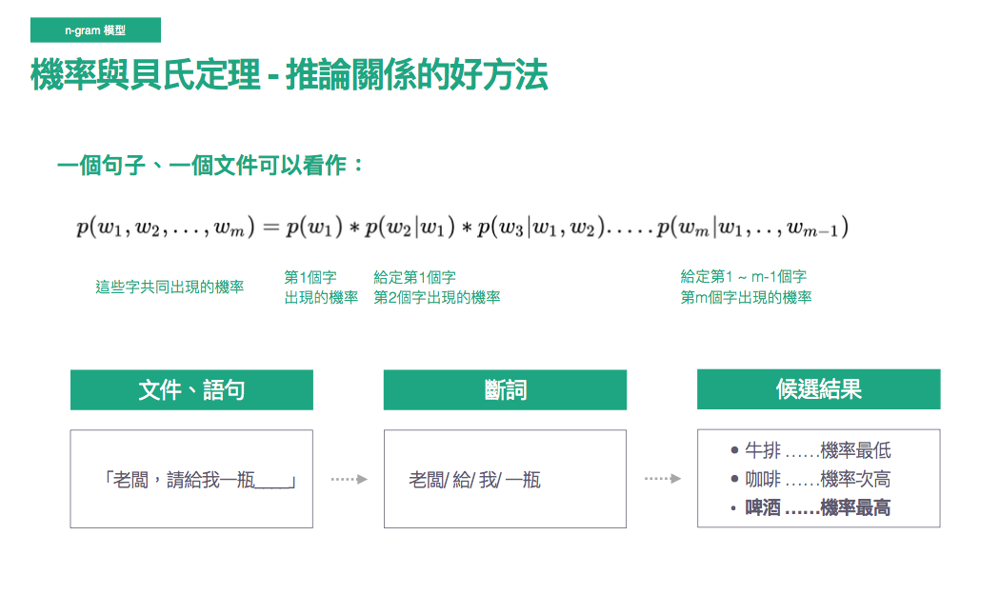
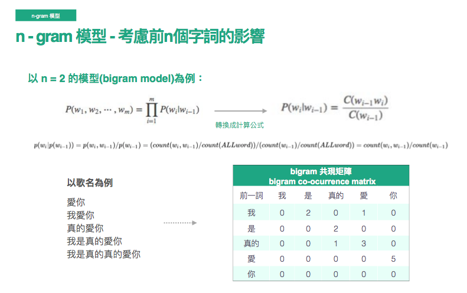
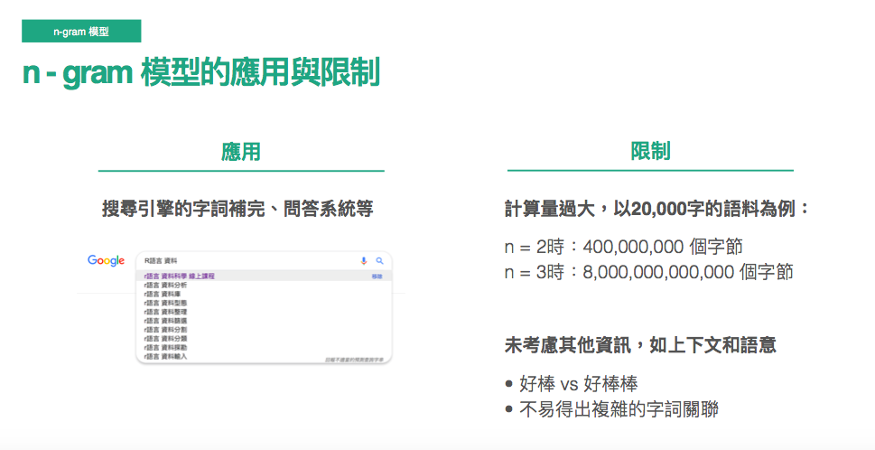

# 貝氏定理 for ngram
</img>

# 馬可夫鍊假設 - 前n個詞提供重要訊息
* 避免計算量暴增
* 比較以前的字，例如我們抓20個字，在這之前或許真的影響就不大了
## n = 2, bingram model

</img>
* 以共現矩陣來表示，就可以把該機率公式很簡單的算出來
* 如果以一個簡單的文字補全系統來說，當你輸入"真的"，就會讓你選"愛"，輸入"愛"，就會出現"你"

## ngram模型的應用與限制
* 應用 : 搜尋引擎的字詞補全，問答系統
* 限制 : 
  * 計算量過大 : 20000字時，n=2, n=3 超級大的字節
  * 好棒vs好棒棒 上下文與複雜語意無法做好的推論
</img>