# Resource

[[TA 補充課] Optimization for Deep Learning (1/2) (由助教簡仲明同學講授)](https://www.youtube.com/watch?v=4pUmZ8hXlHM&list=PLJV_el3uVTsM8QoIIe9JrSDjB0e1UkbEC&index=3)

[pdf](http://speech.ee.ntu.edu.tw/~tlkagk/courses/ML2020/Optimization.pdf)

[ML Lecture 9-1: Tips for Training DNN](https://www.youtube.com/watch?v=xki61j7z-30&list=PLJV_el3uVTsPy9oCRY30oBPNLCo89yu49&index=16&t=659s)

# ML 9-1

# 問題診斷

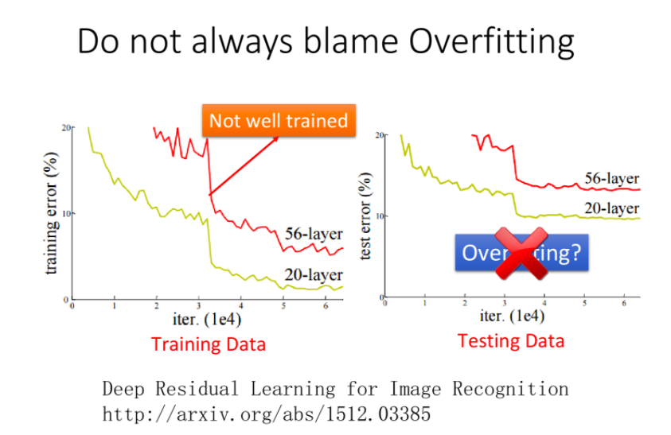</img>

從15開始

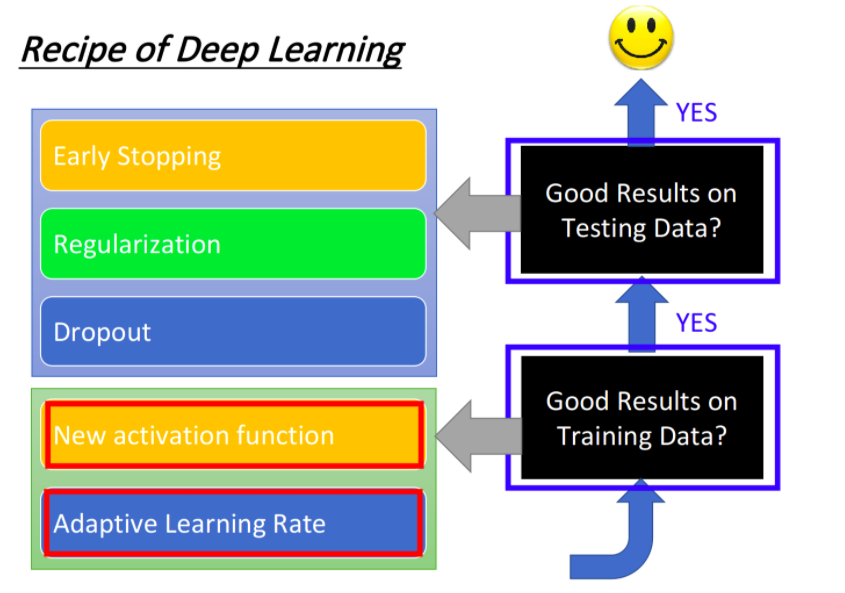</img>

# Gradient Vanishing Problem

* 這個結果之下通常連training set的準確度都很差 - 這不是overfitting，也不是under fitting，必須重新檢視VC dimension，56層模型的複雜度確實是比20層還要複雜才是

  
目前的解法是從模型架構著手，activation func, batch normalization, 其他normalization等

# TA補充課

## Method

* 閱讀方法這篇在第一階段 - 快速掃過並且幫助解決Adam怎麼做trouble shooting?

## Background

* 有數學證明，但是這堂課不會詳細證明他們，會以比較直覺的方式介紹
* 但這些數學名詞可以去證明某些optimizer在什麼情況下可以收斂，什麼情況下不會收斂
* 與起叫做New Optimization不如叫做New Optimizer for Deep Learning
* 就算你有一些情況上的保證，現實訓練中也很難用到，因為情況太複雜

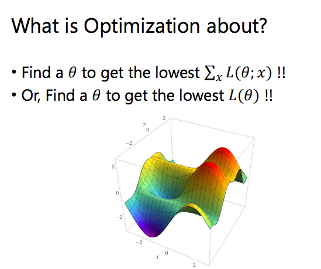</img>

* $m_{t+1}$會有一些scaling，不會完全等價於累積動量

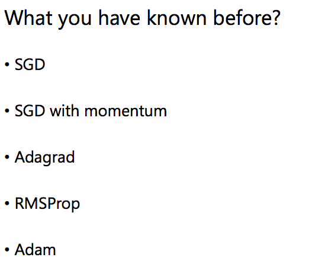</img>
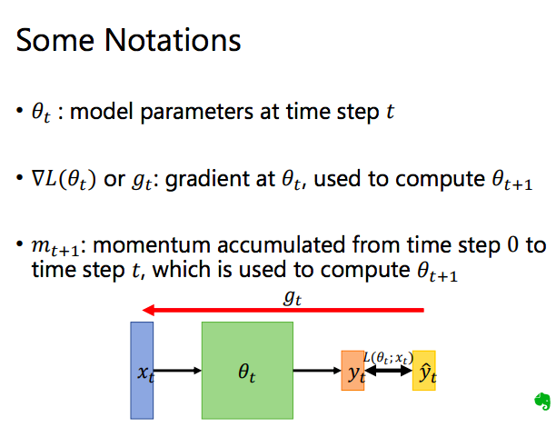</img>

* 在$\theta$ 為軸的loss surface找到最低點

## Recap SGD

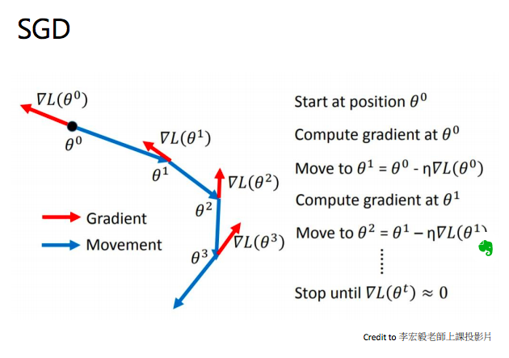</img>

## SGD with Momentum (SGDM)

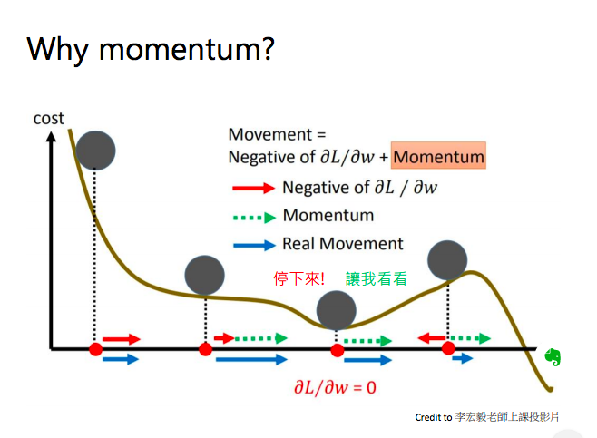</img>

* 過往的所有移動會累加到下一步形成類似物理慣性的效果 - 藍色框框的內容很重要

$v^{1} = \lambda v^{0} - \eta\nabla L(\theta^{0})$

* 這主要可以解決Gradient Vanishing，以及幫忙跳出Local minimum
  + Gradient Vanishing - gradient變成0了，沒關係我們還有以往累加的Gradient幫忙進行learning rate的更新

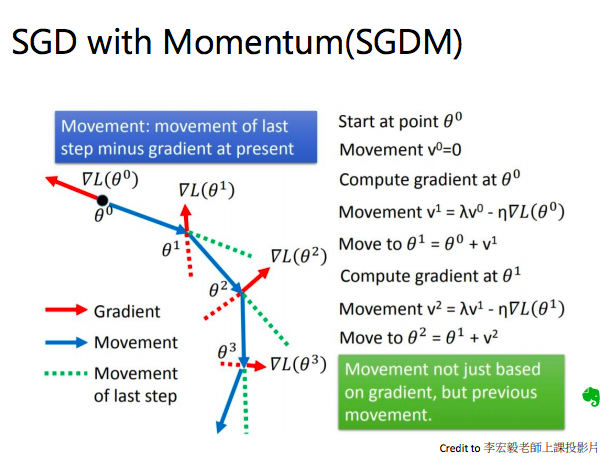</img>
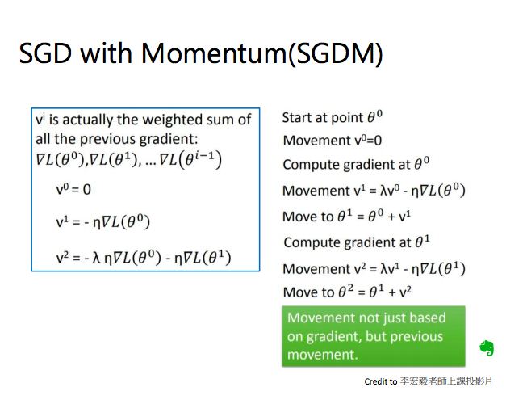</img>

* 累加的動量大小決定了跳不跳的出local minmum，但要手調參數

## Adagrad(Adaptive gradient descent)

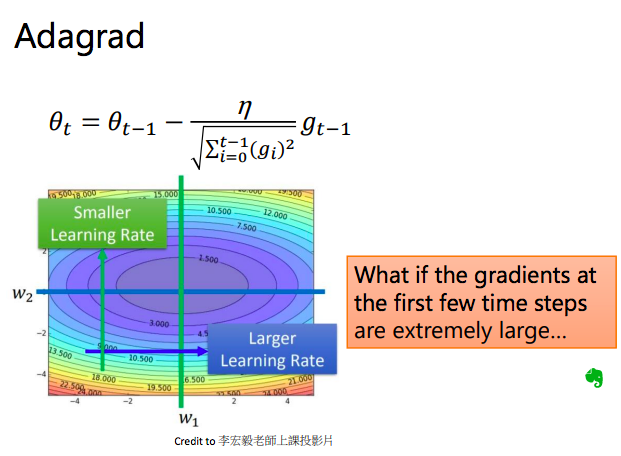</img>

* 如果你一開始的gradients很大，很有可能直接走到一個很難跳出去的local minimum - 針對這種情況我們希望gradient可以稍大，但是不要大太多，因此有了分母的normalization讓gradient小一點

## RMSProp

* 和Adagrad不一樣的地方在於分母的計算
* Adagrad的分母值會一直無止盡的累加(而且恆正) - 也就是說如果你的gradient一開始就超大，那麼learning rate一下子就會直接變得很小，然後就有可能train不動了
* 所以RMSProp的做法是讓分母的factor可以隨著時間改變，做法是使用權重alpha來和前一步的gradient值做weighted sum

* 但還是很容易卡在gradient為0的地方，因此我們有了adam

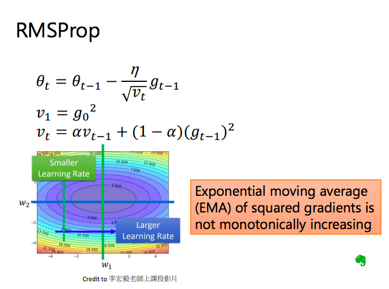</img>

## Adam

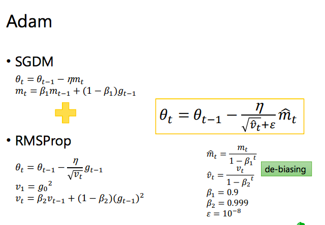</img>

## So far

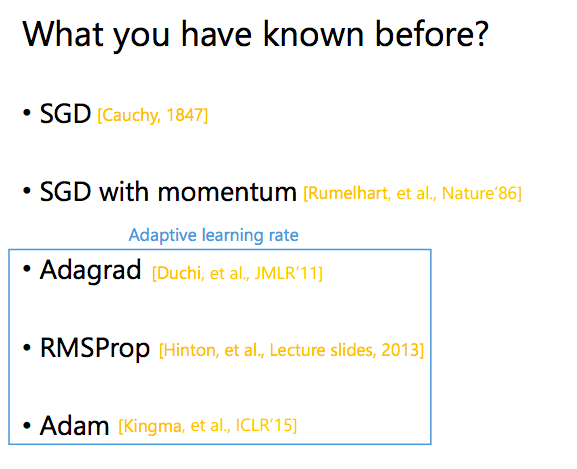</img>

* Adaptive learning rate的方法都是在10年之後出現的
* 阿中間都發生了什麼事? DL寒冬?

</img>

* 這些是用Adam train的

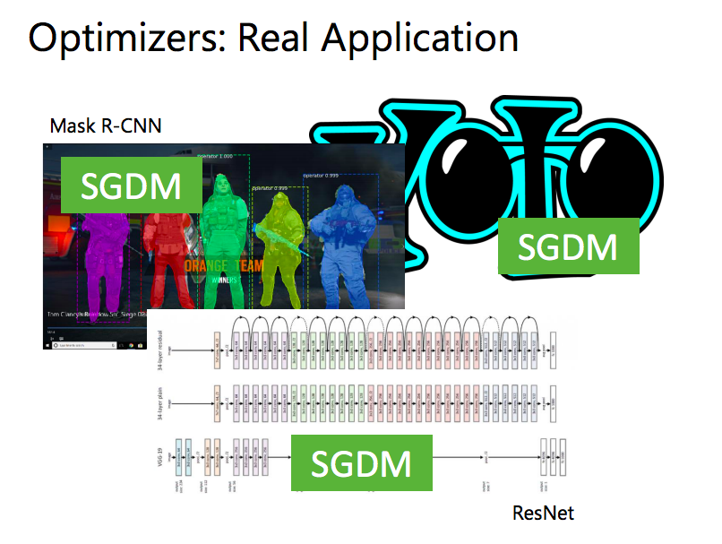</img>

* 這些是用SGDM train的

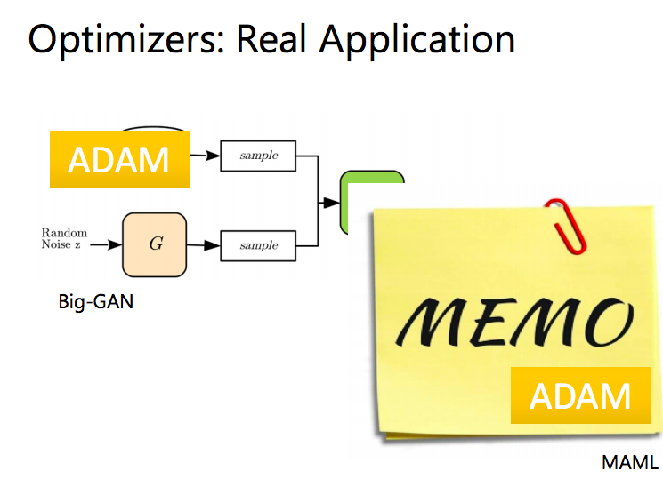</img>

* GAN, MEMO(for transfer learning) - 是用Adam train的
* **為什麼GAN, MEMO不是用SGDM訓練出來的!?**
* **難道SGDM和Adam有各自適合解決的問題嗎?**
* 2014到2020都沒有新的Optimizer嗎？ 還是都太爛不能用呢?
* 經過助教survey一圈，還真的沒有optimizer可以超過Adam和SGDM ...

</img>

* 以下是助教個人分析的原因，以下分別是一個貓狗分類資料集的trn以及val accuracy vs epochs

## Case study on cat/dog classfication

</img>
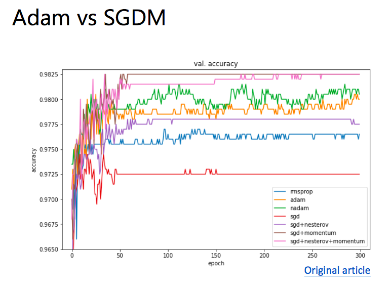</img>

* SGD和Adam個別搶到上界和下界，其他的都只是在之間，沒人會想要用他們

* Adam在traing上很快就衝到頂，但是在val上反而SGD比較穩定，Adam有一些明顯的上下起伏

## Case study on ResNet34(New method paper)

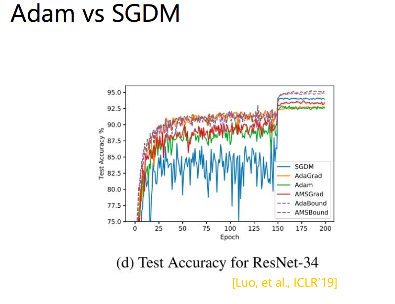</img>

* SGDM一開始表現很不穩定，但後期比Adam收斂在更好的值，標準差也更小(更穩定)

## Case study on LSTM

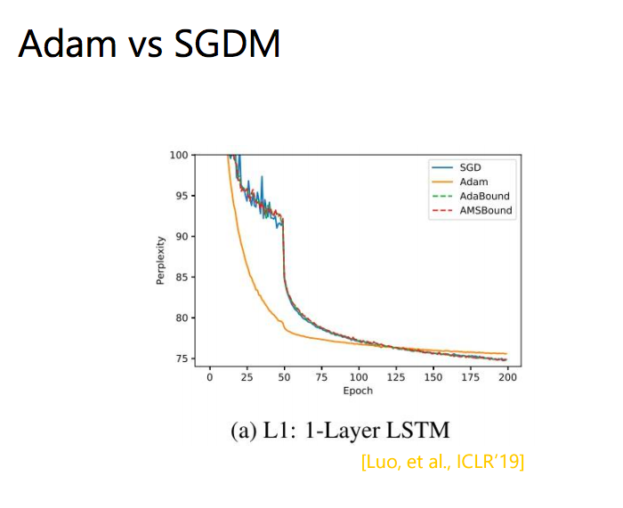</img>

* 在LSTM上訓練，Adam也是一開始下降很快，後來SGD有更穩定且較好的結果

## Hypothesis

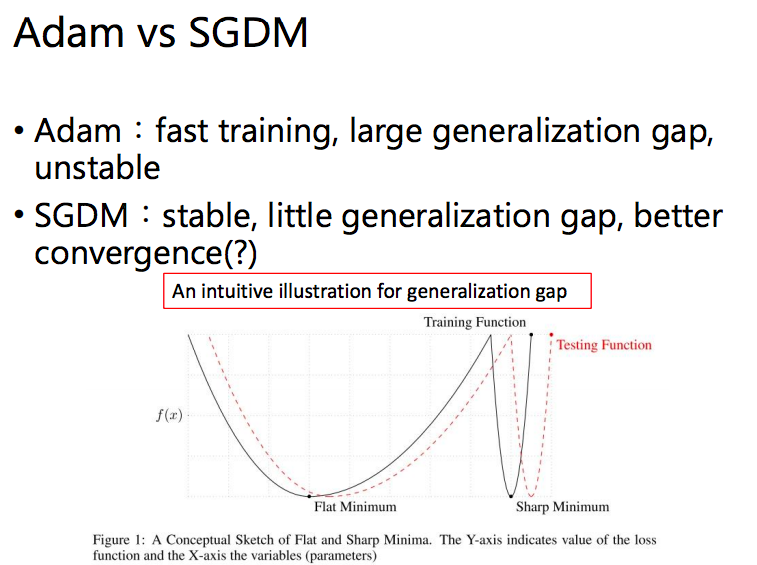</img>

* paper? 黑線跟紅線是什麼? 
* 主要想表達收斂在不同的local minimum，adam容易收斂在sharp local minimum，SGDM容易收斂在flat local minimum
* begin with adam, end with sgdm!? - SWATS

## SWATS

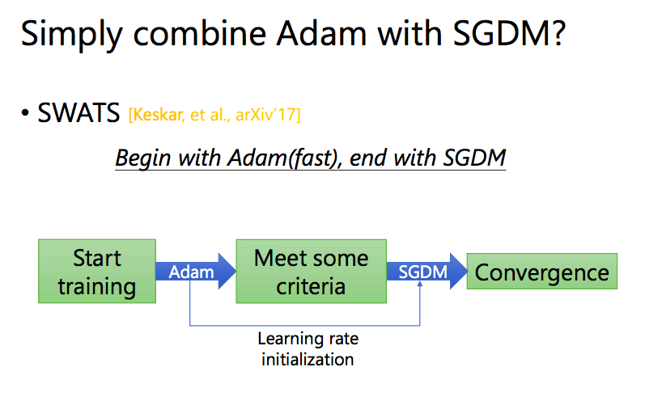</img>

* 兩個問題 
  + 什麼時候切換
  + 怎麼把adaptive learning rate作為SGD的initilization learning rate? moments要不要持續帶?

* 作者的做法其實還是蠻土炮的，沒啥證明，但是有用，算是一個務實的實驗報告

## Adam trouble shooting

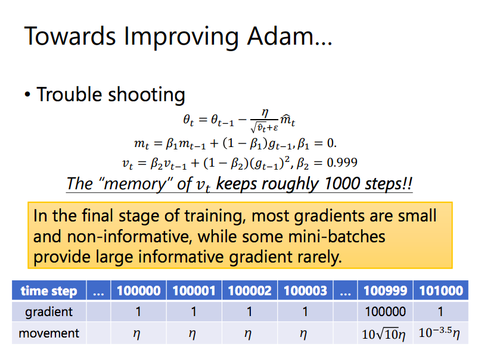</img>

* adam的$m$和SGDM的$m$其實是同樣的內容

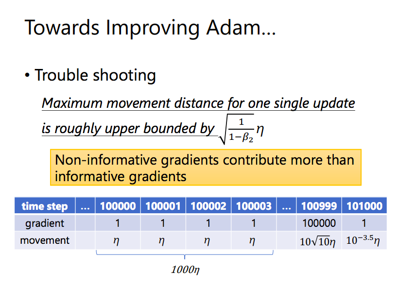</img>

* 由於累加的關係，那些不重要的gradient累加起來把真正有資訊量的gradient的權重搶過了
* 而且前面那些gradient不知道怎麼走，所以就亂走，造成較大的Variance

* 總結來說，會被小的gradient牽著鼻子走

### AMSGrad

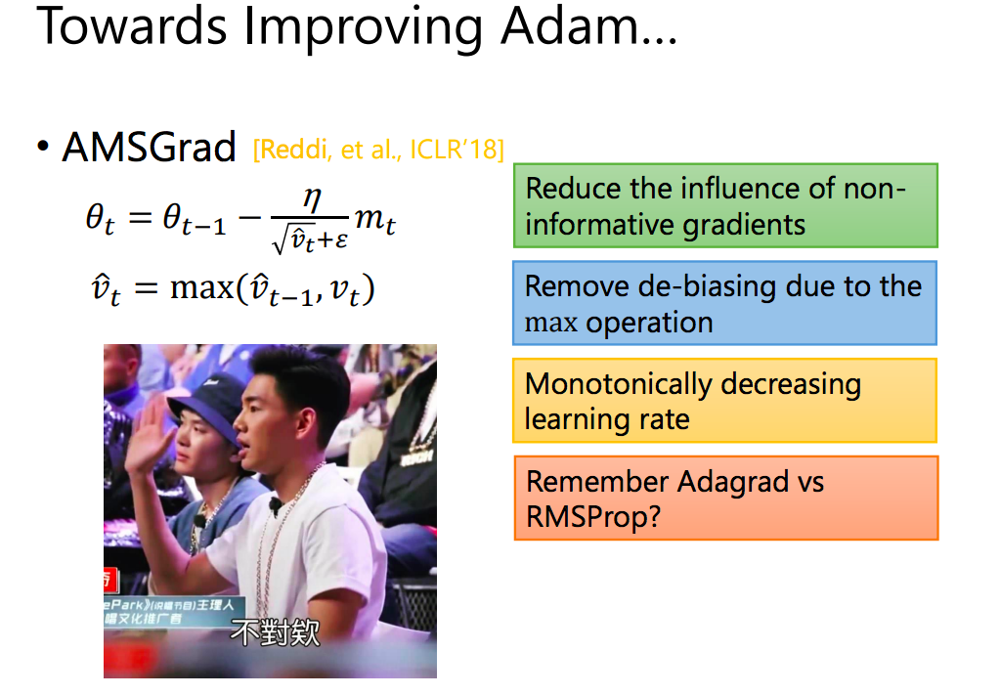</img>

* 那我們用一個max函數來抓住有資訊量的gradient
* 但還有一些問題，這個gradient是單調的，會一直增大
* 這篇論文只解決一個問題，不夠好(不像transformer一次解決好多個XD)

### AdaBound

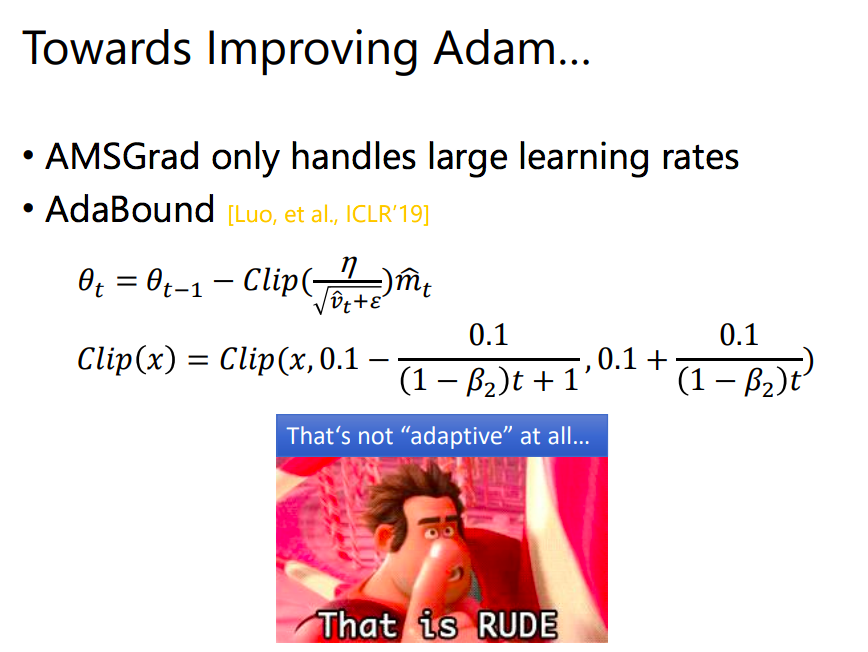</img>

* 要抓住有資訊量的gradient
* 不要讓gradient單調
* 像經驗公式
* 太hard-code

TBC, 46:30

## paper

[ADAPTIVE GRADIENT METHODS WITH DYNAMIC
BOUND OF LEARNING RATE 2019 引用190+](https://arxiv.org/pdf/1902.09843.pdf)

[ON LARGE-BATCH TRAINING FOR DEEP LEARNING:
GENERALIZATION GAP AND SHARP MINIMA 2017 引用1000+](https://openreview.net/pdf?id=H1oyRlYgg)

[DECOUPLED WEIGHT DECAY REGULARIZATION 2017 引用400+](https://arxiv.org/pdf/1711.05101.pdf)

## blog

[為什麼Adam常常打不過SGD？癥結點與改善方案](https://medium.com/%E8%BB%9F%E9%AB%94%E4%B9%8B%E5%BF%83/deep-learning-%E7%82%BA%E4%BB%80%E9%BA%BCadam%E5%B8%B8%E5%B8%B8%E6%89%93%E4%B8%8D%E9%81%8Esgd-%E7%99%A5%E7%B5%90%E9%BB%9E%E8%88%87%E6%94%B9%E5%96%84%E6%96%B9%E6%A1%88-fd514176f805)
