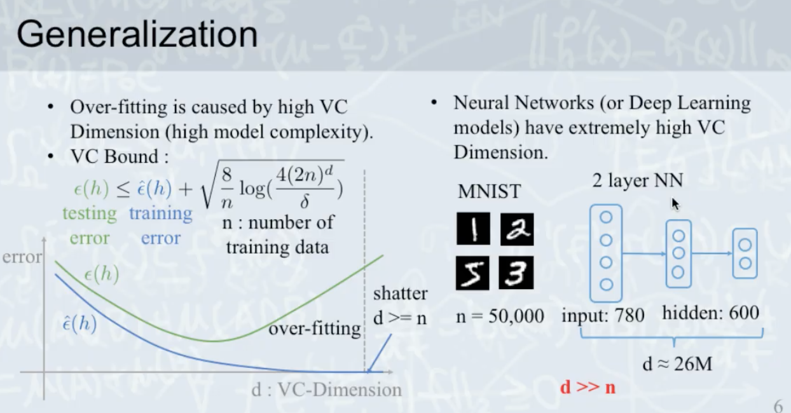
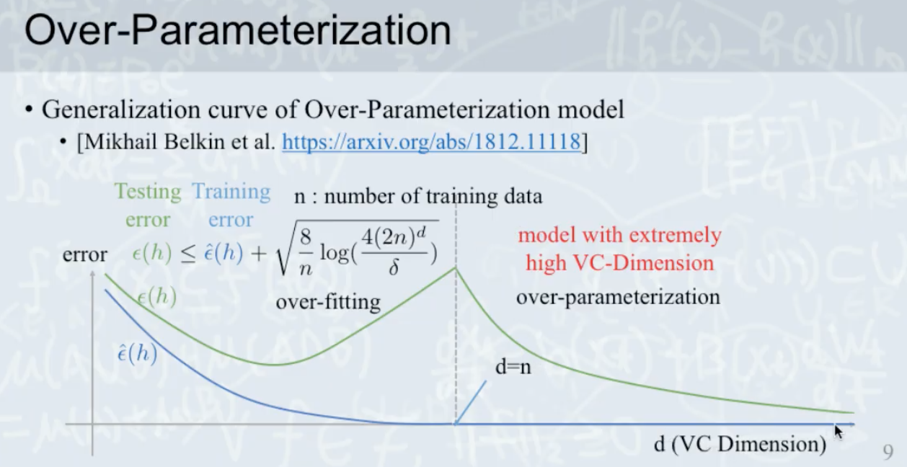
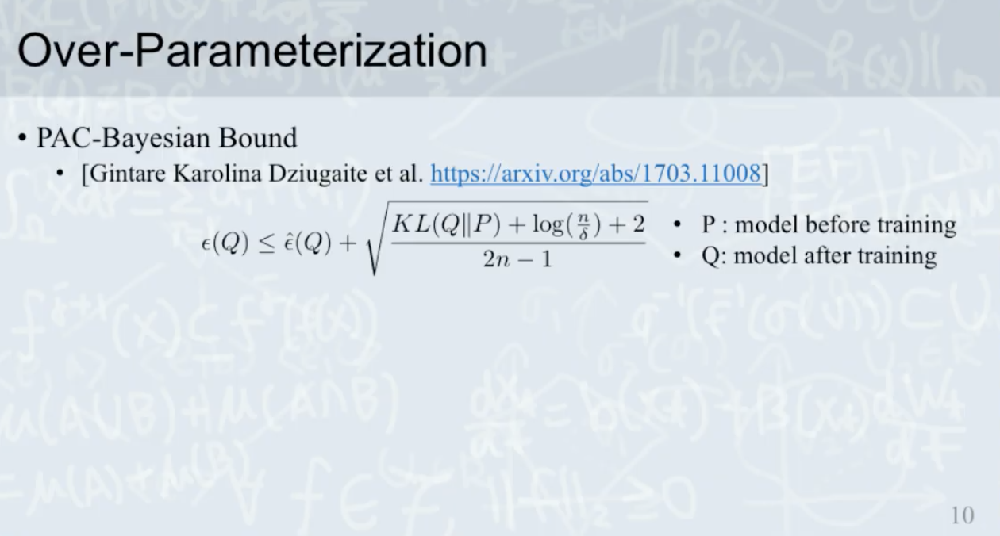
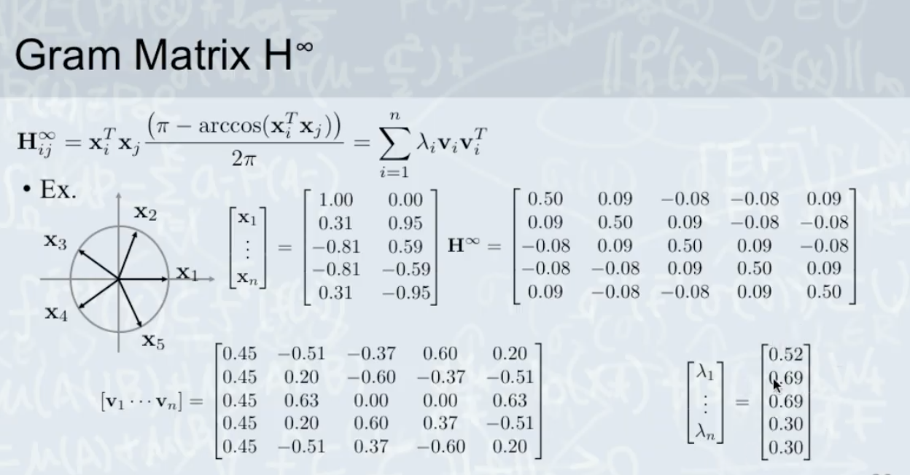
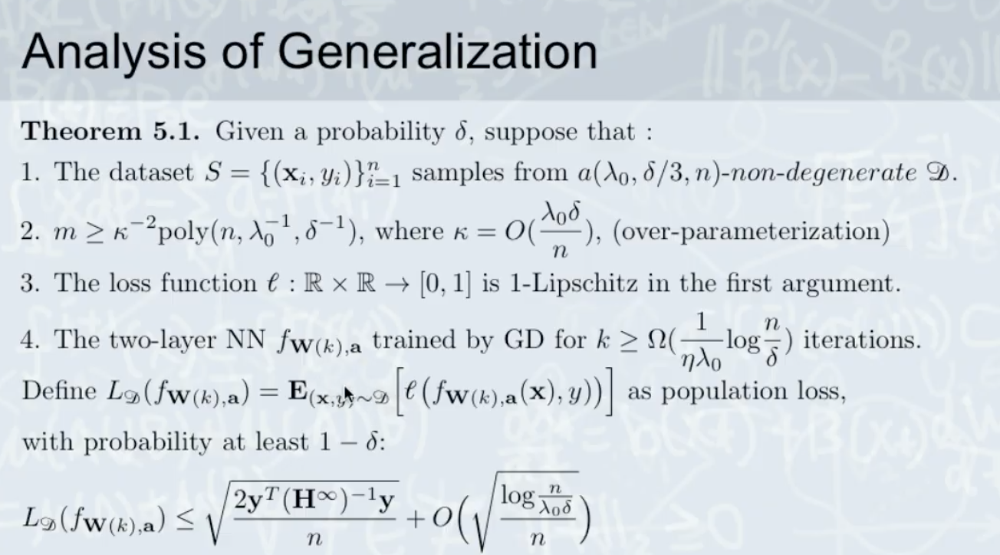
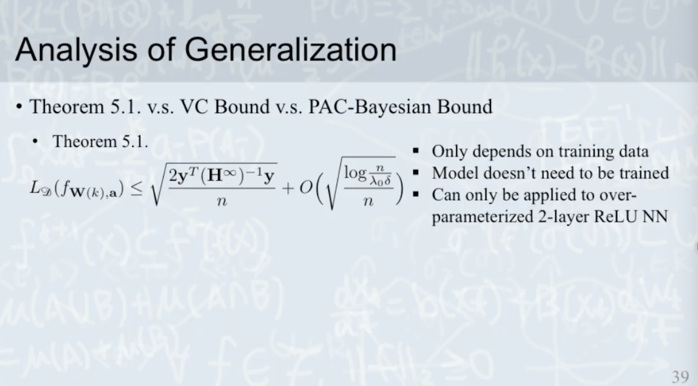

# Over-Parameterization

</img>

# Learning Theory

</img>

1. Training data and testing data samples from the same distribution(i.i.d)
2. How to use a algorithm make $E_{in}$ is small enough?(Optimization)
3. How to make sure $E_{in}$ samll makes $E_{out}$ is small, too? -> the statisical guarantee(Generalization)

# Optimization

1. If our loss surface is CONVEX. GD algorithm could coverage to the global minimum.
2. But the loss surface of deep learning usually is **NON-CONVEX**

</img>

# Generalization

Old theorem 

Over-fitting is caused by high VC Dimension(high model complexity)

The VC theorem stats : 

the upper bound of testing error is :

</img>

1. $n$ plays data diversity, n should be larger than d so that VC bound is small.
2. $d$ >> $n$, then we have a shatter(high VC bound)

## NN

</img>

$d$ >> $n$ 

shatter and overfitting? 

but that's not the fact.

# Over-Parameterization

paper : Rethinking Optimization and Generalization.

We have experiments:

</img>

How about the generalization?

</img>

Looks good, but why?

## the data

We foucs on **data**

| data     | error | note  |
|----------|-------|-------|
| original | small |  |
| random   | large |  |
| noise level    | large | for reference |

## Noise level?

</img>

Conclusion : 

Noise hurts deep nn model(actually, hurts all ml model...)

## Generalization curve of Over-Parameterization model 

</img>

## PAC-Bayesian Bound

</img>

The equation look likes vc bound(pac bound)

Conclusion : If the parameter change a lot, you might overfit the data. 

Otherwise, you're doing well.

Experiments?

</img>

1. parameter x 2 -> vc bound x 2 -> $E_{out}$ the same
2. add noise(random label) -> vc bound the same -> $E_{out}$ explore! (PAC bound x 13)
3. PAC bound matches the result =)

# Fine-Grained Analysis of Optimization and Generalization for Overparameterized Two-Layer Neural Networks

## Symbols

1. data

</img>

wnormalized data both $x$ and $y$

2. model

</img>

$m$ :  hidden nodes

$w$ : wrights from normal distribution

$f$ : model hypothesis also written as $u_{i}$

3. Loss

</img>

Optimization : 

</img>

do some math trick

the derevite of relu we get a $I$ identity function

</img>

What we get?

the gradient is meaningful. we introduce Gram Matrix.

# Gram Matrix

$H(k)$

$k$ is the $k^{th}$ step of training iteration.

If we throw two data into model at iteration $k$. we have gram matrix.

</img>

## Example?

</img>

## Gram matrix infinity

* The infinity means width of layer is infinity.

</img>

After some math trick(maybe integrtation or something). we know the value.

Gram Matrix could be eigen decomposition(bring us many phtsical meaning)

</img>

### Example

</img>
</img>
</img>
</img>

Since we can decompose the gram matrix. 

We can find representive virtual data to represent all data(depends on eigen values)

Gram Matrix is the Neural Tangent Kernel two-layer ReLU NN

# Neural Tangent Kernel : Convergence and Generalization in Nerual Networks

This kernel could solve the VC bounds and pac bound puzzle!

## Analysis of Convergence Rate

</img>

if you use large $m$(large layer width)

as k grows, you will reach global minimum.

</img>

It shows that even though you have a non-convex loss surface. When you Over-Parameterization, you will get global minimum.

## How fast? (Analysis of Convergence Rate)

They use functional space to analysis it.

Function could be treat as vectors.

And functions could be orthogonal to each other.

</img>

</img>

The math tricks do their work, XD.

</img>

Conclusion :

1. If the gram matrix could be decompose with large eigen value. model converge more faster.(more easy to learn the data)
2. The convergence can be slower when the eigen vector are more uniform-like

All about the data, right : P

## Examples

1. true label

</img>

2. noisy label

some body label the data is wrong.

</img>

</img>

Red line is true label(mistake on the ppt)

worse case ?

How to training your model more faster!?

Conclusion : 

1. Clean data helps convergence!!!!
2. Instead of tuning optimization method, clean your data helps!

## Analysis of Generalization

</img>

</img>

We have dataset, then we can caculate gram matrix. Then we can know about the convergence rate and is there any representive vitural data

</img>

What is the bound?

</img>

Left hand is test error - in sample error

</img>

What we got?

1. Still, we need more data $n$
2. The deep learning need a lot data due to model complexity - wrong! over-Parameterization!
3. The gram matrix shows that same label and similar x helps the convergence and better result.
4. Notice that $y^{T}(H^{\infinity})^{-1}y$ can shows clean, seperatable data makes the generalization better.

Experiments shows the same guarantee!

</img>

This theorem is good so far!

# Summary

Theorem 5.1 : focus on data

VC bound : focus on number of data and model complexity

PAC-Bayesian Bound : focus on model and data but so cheating(only you trained the model....)
</img>
</img>

# Misc

1. Implementation is very important! 

2. Deep Learning so far is a magic. No theoretical guarantee!

3. The deep learning theorem(optimization and generalization) is still growing.

4. You should believe your reuslt of the experiemnt.

5. How to read math-related paper?

   1. write down the symbol. make sure what it is.
   2. take example which the formular you don't understand.

6. Is some data agumentation technique useless? - yes. you need to make your data fits your testing data distribution.

7. Are there some tricks to make data labeling good and use less manpower? - yes there are some research.

# Papers

1. Rethinking Optimization and Generalization

2. Generalization curve of Over-Parameterization model

3. PAC-Bayesian Bound

4. Fine-Grained Analysis of Optimization and Generalization for Overparameterized Two-Layer Neural Networks

5. Neural Tangent Kernel : Convergence and Generalization in Nerual Networks
