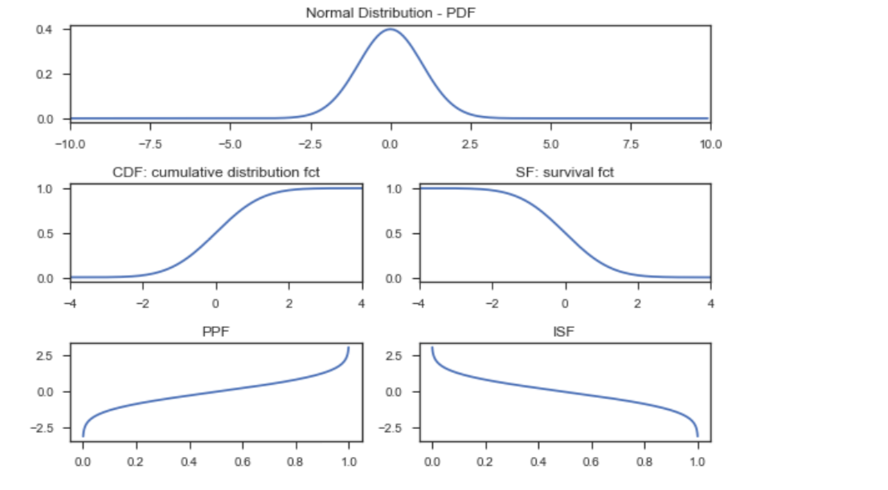

# The pdf things mash up
* 一個機率密度函數(probability density function)有許多可解釋的面向，我們下列一一展示出來

</img>

# PDF
* 機率密度函數(probability density function)，注意，為了得到變涼在一定區間內出現的機率，你必須將PDF整合要該範圍內，
* 例如 : 男人的身高在160-165cm之間的機率是多少?

# CDF
* 累積分佈函數(Cumulative Distribution Function) : 獲得小於給定值的機率
* 例如 : 一個男人不到165cm的機率是多少?

# SF
* 存活函數(survival function)，也稱殘存函數(survivor function)，或是可靠性函數(reliability function) 
* 互補累積分佈函數(complementary cumulative distribution function, CCDF)，也是這種函數的一個名稱
* SF = 1 - CDF : 得到大於給定植的機率
* 例如 : 一個男人身高大魚165cm的機率是多少?
* 很常使用在壹些**基於時間的系統失敗或是死亡機率**，同時也可以描述客戶流失

# PPF
* 百分點函數，CDF的反函數，PPF用來回答，為了得到一定的機率，CDF相對應的輸入是多少?
* 例如 : 假設我現在在找一個身高比其他95%的男人更矮的男人，這個個體的身高應該是多少?

# ISF
* 他的名字說明了一切。
* 例子 : 假如我在找一個比其他95%男人高的男人，這個個體的身高是多少?

