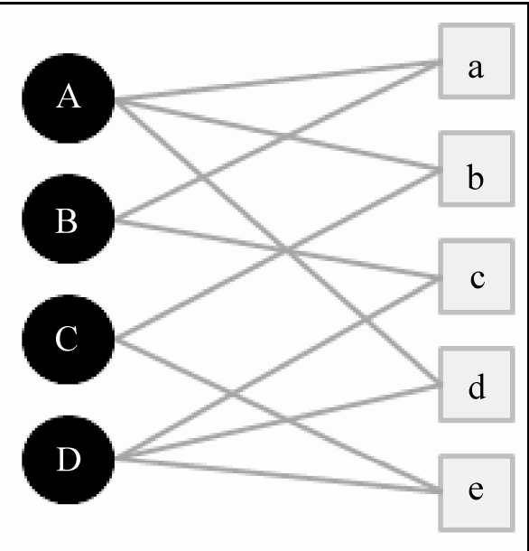

# Random Walk for Recommendation

### 二分圖表示法(Bipartite Graph)

**以下內容擷取自推薦系統實踐，加上筆者自己些微註解**

record $(u, i)$表示使用者$u$對物品$i$產生過行為，這樣的資料可以用一個二分圖表示

$G(V, E)$ : 使用者-物品二分圖

$V = V_{U} \bigcup V_{I}$ - 使用者頂點集合$V_{U}$和物品頂點$V_{I}$組成

$e_{v_{u}, v_{i}} = 1$ - 有產生互動行為

</img>

普遍來說，在這種表示法的情況下，需要去量測兩個頂點之間的相關性，但大致上跑不出以下這幾種思路

1. 頂點之間路徑數

2. 頂點之間的路徑長度

3. 頂點之間經過的頂點數目

而相關性高的一對頂點一般都具有以下特徵

1. 兩個頂點之間有很多路徑相連
2. 連接兩個頂點之間的路徑長度都比較短
3. 連接兩個頂點之間的路徑不會經過out-degree較大的頂點

### 舉例

</img>

A-c vs A-e

1. 有幾條路連通?

    - A-c : 2條 (A-a-B-c, A-d-D-c)
    - A-e : 1條 (A-b-C-e)

     - 對A來說，c比e關係更強

2. 聯通的路徑長度是多少?

   
   - A-c : 長度為3(A-a-B-c, A-d-D-c)  
   - A-e : 長度為3(A-b-C-e)

3. 聯通路徑的經過頂點out-degree? - 這個做法可以抑制商品以及什麼都喜歡的User

    

   - A-c : (A(3) - a(2) - B(2) - c(2)
   - A-c : (A(3) - d(2) - D(2) - c(2)
   - A-e : (A(3) - b(2) - C(2) - e(1)

基於以上的思考邏輯，研究人員設計了很多種計算圖中頂點相關性的方法，以下是一個基於隨機遊走(Random walk based)的算法PersonalRank

## PersonalRank

假設要給使用者$u$進行個人化推薦，可以從使用者$u$對應的節點$v_{u}$開始進行隨機行走，由走到任何一個節點時，必須按照機率$\alpha$決定繼續走或是停止該次行走，並從$v_{u}$從新開始行走，如果決定繼續行走，那就隨機選擇一個有連接的邊，進入到下一個頂點，如此經過很多次隨機行走之後，每個物品節點被訪問到的機率就會收斂到一個數值，最終物品節點的訪問機率就是推薦排序

Psudo code

personalrank(user_i : Union[int, str]) -> item_distribution : List[int]

1. Start with user $u$ at vertex $v_{u}$
2. rec_item = {}
3. if random.random() > alpha:   

   random pick an edge and go to next vertex
   
   rec_item[item_idx] += 1

4. else:

   restart at $v_{u}$ 

5. repeat 2 and 3, K times
6. return rec_item

以數學式來表達的話，則會長以下這樣

$PR(v) = \begin{cases}
\alpha \sum_{v' \in ~ in ~(v)}  \frac{PR(v')}{|out(v')|} ~~ (v \neq v_{u}) \\
(1-\alpha) + \alpha \sum_{v' \in ~ in ~ (v)}  \frac{PR(v')}{|out(v')|} ~~ (v = v_{u})\\
\end{cases}$.

$PR(v)$ - 頂點$v$的訪問機率

$|out(v)|$ - 頂點$v$的out degree

### 方程式解析

若訪問點為使用者$A$，根據圖2

每一個itertaion

對於非$v_{A}$節點
$$
PR(v_{a}) = \alpha(\frac{PR(v_A)}{|out(v_A)|} + \frac{PR(v_B)}{|out(v_B)|})
$$
$PR(v_a)=1$, the other $PR(v')=0$

僅$v_A, v_B$會進入到節點a，$V_A, V_B$的out degree，來取得分配到的機率，$V_A, V_B$個別有$\frac{1}{3}, \frac{1}{2}$的機率走到$v_a$

對於$v_{A}$節點
$$
PR(v_{A}) = 1 - \alpha + \alpha(\frac{PR(v_a)}{|out(v_a)|} + \frac{PR(v_b)}{|out(v_b)|} + \frac{PR(v_d)}{|out(v_d)|})
$$

有$1- \alpha$的機會重新在$V_A$節點，也有可能從，abd節點走來

以上行為重複$k$個iteration，直到收斂，即可收回item probability list

課本中有實作程式碼，將每一次iteration取得各個item的機率分佈以堆疊長條圖紀錄，以圖2的例子來說：

</img>

在Movielens上的結果則是

</img>

### 優缺點

Pros:

1. 好的理論解釋
2. 容易實踐

Cons:

1. 每次都要在整個圖上迭代，直到機率分佈收斂，時間複雜度高

解決方案

1. 減少迭代次數 - 容易控制準確度和推論時間，且容易實驗準確度影響
2. 從矩陣的角度出發重新設計算法，圖能夠用矩陣表示

### Personal Rank(Matrix Form)

各個節點之間若基於隨機行走的假設，會以out degree的反比進行轉移，可以令$M$為使用者物品二分圖的轉移機率矩陣

$$
M(v, v') = \frac{1}{out(v)}
$$

$where~~ v \in in(v')$

$$
v = \{v_A, v_B, v_C, v_D, v_a, v_b, v_c, v_d, v_e\}
$$
矩陣$M$不是一個對稱矩陣，比如圖2的轉移矩陣$M$應為
$$
M_{v \times v} = \begin{pmatrix} 0& 0 & 0 & 0 & \frac{1}{3} & \frac{1}{3} & 0 & \frac{1}{3} & 0
\\ 0 & 0 & 0 & 0 & \frac{1}{2} & 0 &  \frac{1}{2} & 0  & 0
\\ 0 & 0 & 0 & 0 & 0 &  \frac{1}{2} & 0  & 0 & \frac{1}{2}
\\ 0 & 0 & 0 & 0 & 0 &  0 & \frac{1}{2}  & \frac{1}{2} & 0

\\ \frac{1}{2} & \frac{1}{2} & 0 & 0 & 0 &  0 & 0  & 0 & 0
\\ \frac{1}{2} & 0 & \frac{1}{2} & 0 & 0 &  0 & 0  & 0 & 0
\\ 0 & \frac{1}{2} & 0 & \frac{1}{2} & 0 &  0 & 0  & 0 & 0
\\ \frac{1}{2} & 0 & 0 & \frac{1}{2} & 0 &  0 & 0  & 0 & 0
\\ 0 & 0 & 1 & 0 & 0 &  0 & 0  & 0 & 0

\end{pmatrix}\quad
$$

針對以上矩陣有幾點特性說明如下

1. 轉移矩陣$M$通常不是對稱矩陣，但仍然可能存在特例
2. 轉移矩陣$M$滿足了每一列和為1的性質(每個頂點的out機率和為1)，而行沒有這個特性
3. 轉移矩陣可以搭配Marcov chain相關理論進行推演
4. 實際場景下，使用者互動的物品很少，轉移矩陣高度稀疏
5. 與矩陣分解的關聯性，MF/SVD會直接對User-Item互動矩陣做分解，取出某個User row做推薦，此轉移矩陣的形式和MF/SVD的Input非常像，能夠交互使用，也有一些論文做了這些嘗試

對於使用者$v_u$可設定一初始向量$r^{0}$，以$v_A$舉例

$$
r^{0}_{v \times 1} =  \begin{pmatrix} 1
\\ 0 
\\ 0 
\\ 0 
\\ 0 
\\ 0 
\\ 0 
\\ 0 
\\ 0
\end{pmatrix}\quad
$$

那麼對於使用者$v_{u}$進行1次隨機行走的狀態分佈$r^{1}$

$$
r^{1}_{v \times 1} = (1- \alpha)r^{0}_{v \times 1} + \alpha M_{v \times v}r^{0}_{v \times 1}
$$

數學推到這邊我們可以在思考幾個點(可用的數學工具)

1. 這樣的遞迴式在Marcov chain的理論中滿足特定條件下可以收斂
2. 穩定態可以快速算$r^{k}$
3. 每一個iteration也可以透過數學方式來算$r^{k}$，例如透過反矩陣

常見的公式長相長這樣
$$
r = (1-\alpha) r_{0} + \alpha M^{T}r
$$

Convention和我使用的不一樣，但是是同一件事情的

能夠透過數學推理出

$$
r = (1- \alpha)(1- \alpha M^{T})^{-1}r^{0}
$$

$T$或許是total iteration? 可以查書，基本上有些數學技巧可以快速對稀疏矩陣求反矩陣，就不是這篇介紹的討論範圍了

# 小結

1. 推薦系統能夠透過隨機行走 + 使用者-物品二分圖來進行推薦
2. 2002年發展出了一個經典算法PersonalRank，有其優點和缺點
3. PersonalRank有容易理解且容易基於數學、電腦科學進行魔改，擴展的特性(Twitter, Pintrest, Facebook都曾魔改過這個算法)
4. Marcov chain理論在基於圖的隨機行走具有用武之地

# 參考資料

[推薦系統實踐 - 項亮 2010](https://cdn-1253764997.cos.ap-chongqing.myqcloud.com//download/%E6%8E%A8%E8%8D%90%E7%B3%BB%E7%BB%9F%E5%AE%9E%E8%B7%B5.pdf)

[个性化召回算法实践(三)——PersonalRank算法](https://www.cnblogs.com/hellojamest/p/11763033.html)

[3-2 personal rank 算法的数学公式推导](https://blog.csdn.net/weixin_41640583/article/details/87394541)

[个性化推荐召回算法——Personal Rank](https://zhuanlan.zhihu.com/p/211371449)

[FAST ALGORITHMS FOR SPARSE MATRIX INVERSE
COMPUTATIONS](https://citeseerx.ist.psu.edu/viewdoc/download?doi=10.1.1.225.639&rep=rep1&type=pdf)

[Matrix wiki](https://zh.wikipedia.org/zh-tw/%E7%9F%A9%E9%98%B5)

[Topic-Sensitive PageRank 2002](https://dl.acm.org/doi/pdf/10.1145/511446.511513?casa_token=ViUvwxmTEYAAAAAA:PVRuHkbjE99tyK6Wc-bZDyh8L0L-jTmQTb543_HUKXGrn20vN_lcwJQAfy_VSjf_w3wSLuBdVIe5Nmk)

[Hybrid Recommendation Algorithm Based on Latent Factor
Model and PersonalRank 2018](https://jit.ndhu.edu.tw/article/viewFile/1710/1718)
