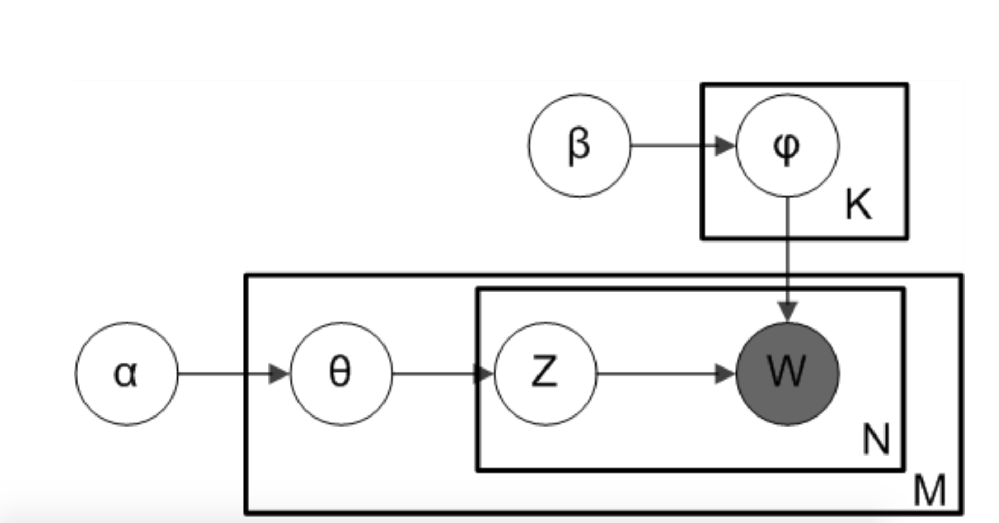

# Ref

[Plate notation](https://en.wikipedia.org/wiki/Plate_notation)

[深入探討 Latent Dirichlet Allocation (LDA) 與在推薦系統上的應用](https://blog.rosetta.ai/%E6%B7%B1%E5%85%A5%E6%8E%A2%E8%A8%8E-latent-dirichlet-allocation-lda-%E8%88%87%E5%9C%A8%E6%8E%A8%E8%96%A6%E7%B3%BB%E7%B5%B1%E4%B8%8A%E7%9A%84%E6%87%89%E7%94%A8-2441d57ecc8a)

[Stop using Plate Notation](https://www.zinkov.com/posts/2013-07-28-stop-using-plates/)

# Plate Notation

板符號(Plate Notation) 是一種在被是推論中以圖形表達對隨機變數重複採樣的過程，每個板塊都可以看作是一個回圈

</img>

1. 上板 : 有$K$個主題，其字詞為Dir dist，由參數$\beta$控制
2. 下板 : 有$M$個文檔，每個文檔有$N$個字詞，灰色的圈圈$w$代表觀察到的單詞，白色圈圈代表不同的潛在變數
   1. z --> 字詞$w$對應的主題，$\thata$主題在文黨中的分佈，由超參數$\alpha$控制

Genetative Process : 

$alpha$ : categorical weights between topic - document, $n$ dimentational array 

1. for $i=1...M$ 從 Dir$(\theta)$抽取樣本 --> sahpe : $|alpha|, M$ topics, documents
2. for $k=1...K$

TODO