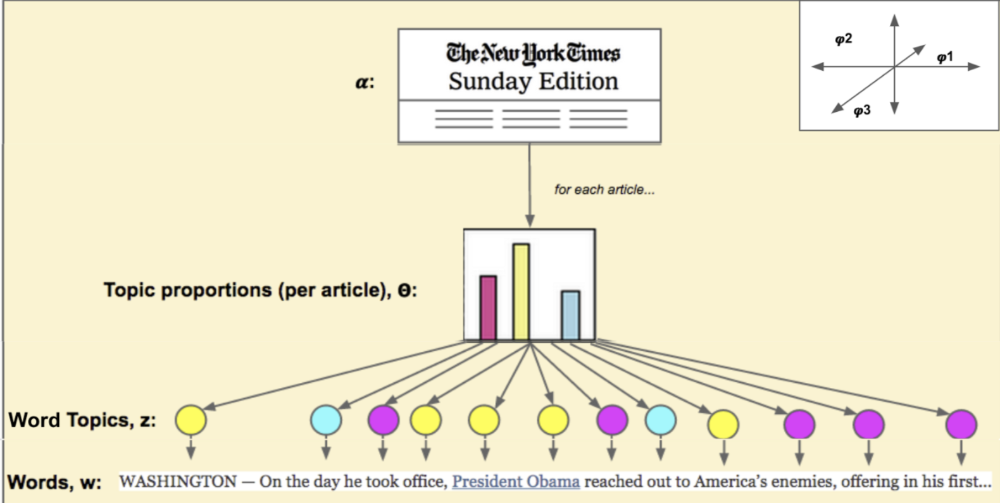
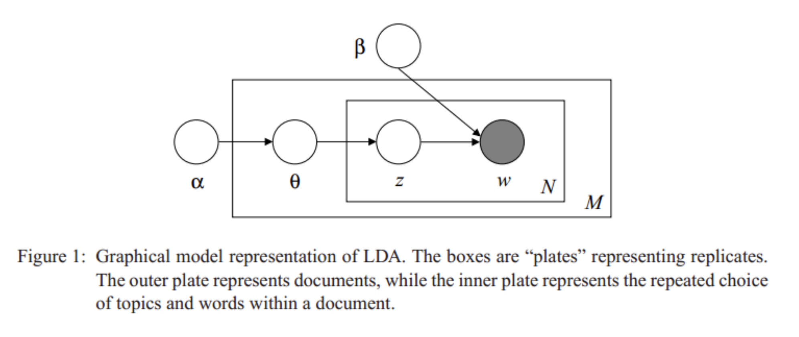
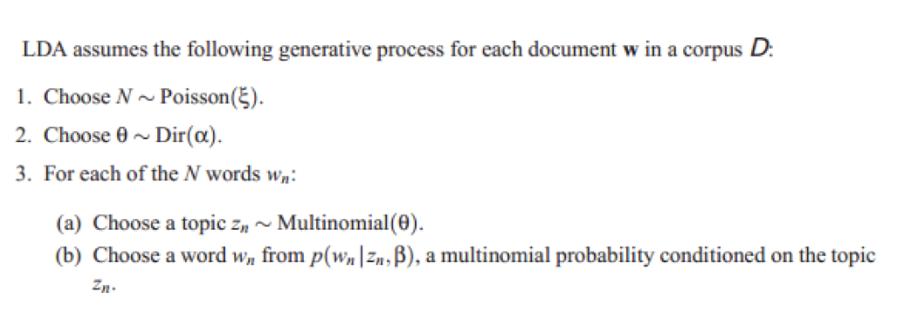
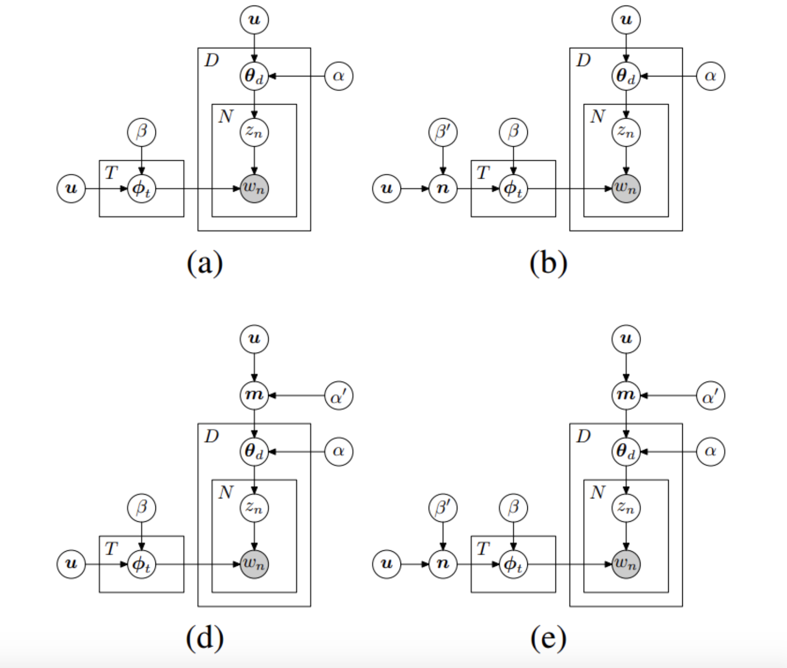

# Ref

[Plate notation](https://en.wikipedia.org/wiki/Plate_notation)

[深入探討 Latent Dirichlet Allocation (LDA) 與在推薦系統上的應用](https://blog.rosetta.ai/%E6%B7%B1%E5%85%A5%E6%8E%A2%E8%A8%8E-latent-dirichlet-allocation-lda-%E8%88%87%E5%9C%A8%E6%8E%A8%E8%96%A6%E7%B3%BB%E7%B5%B1%E4%B8%8A%E7%9A%84%E6%87%89%E7%94%A8-2441d57ecc8a)

[Stop using Plate Notation](https://www.zinkov.com/posts/2013-07-28-stop-using-plates/)

# Plate Notation

板符號(Plate Notation) 是一種在被是推論中以圖形表達對隨機變數重複採樣的過程，每個板塊都可以看作是一個回圈

</img>

1. 上板 : 有$K$個主題，其字詞為Dir dist，由參數$\beta$控制
2. 下板 : 有$M$個文檔，每個文檔有$N$個字詞，灰色的圈圈$w$代表觀察到的單詞，白色圈圈代表不同的潛在變數
   1. z --> 字詞$w$對應的主題，$\theta$ 主題在文檔中的分佈，由超參數$\alpha$控制


Genetative Process : 

$\alpha$ : categorical weights between topic - document

$n$ : dimentational array 


1. for $i=1...M$ 從 Dir$(\theta)$ 抽取樣本 --> sahpe : $|alpha|, M$ topics, documents
   * 可能是 numpy generation / tfp generation
2. for $k=1...K$ 從 Dir$(\phi_k)$ 抽取樣本 --> shape $|K|, |terms|$
3. for $i=1, .. M$, $j=1, .. N_{i}$ 抽取單詞對應的主題
4. 拿$z_{ij}$ w_{ij} 比較 --> maximum likelihood
   1. by optimizer

以紐約時報為例

1. 對於每一個新聞文章($i=1, .. M$)，整份語料庫的主題抽樣，
2. 對每個主題上的單詞進行抽樣($k=1, ... K$)
3. 對每篇文章中的每個詞抽樣對應的主題($i=1, ... M$, $j=1, ... N_{i}$)


</img>

# Stop Using Plate Notation (Blog Post)

</img>
</img>

```
Yet, we never get such a story/pseudocode in many papers that use complex graphical models. The story has to be put together from scattered jigsaw puzzle pieces laid throughout the paper.

Describing the model as a story is the better way. Here is a more complicated model trained on twitter data showing how language and word usage varys across the country.
```

Use Plate Notation for your story. 

And MAKE IT EASY TO READ.

</img>

They are same algorithm about LDA. But it's very hard to read!