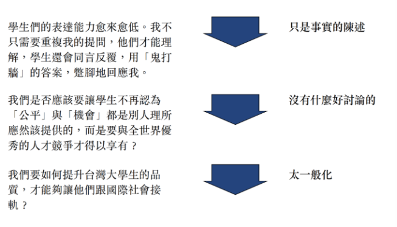
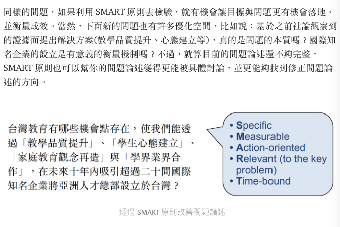

# Resource 
[資料科學中的商業分析 1：定義問題，不做沒有用的專案](https://medium.com/@taweihuang1/%E8%B3%87%E6%96%99%E7%A7%91%E5%AD%B8%E4%B8%AD%E7%9A%84%E5%95%86%E6%A5%AD%E5%88%86%E6%9E%90-1-%E5%AE%9A%E7%BE%A9%E5%95%8F%E9%A1%8C-%E4%B8%8D%E5%81%9A%E6%B2%92%E6%9C%89%E7%94%A8%E7%9A%84%E5%B0%88%E6%A1%88-85244acf1cb6)

# 所謂商業分析
* Case : 業務端需求 - 我們想要建立一個AI基礎的客戶管理系統
1. 定義問題，並找出問題背後的原因?
  * DO 退後一步 - 目前在客戶管理遇到最大的挑戰是什麼?, 這個挑戰可能的原因有哪些? 如何驗證這些可能原因是否正確?
  * Don't 從**解決方案**出發去構思專案 - 直接提出有系統實作的方法，業務端也許當下會覺得高興，但是做了有很高的機會發生 : 誠品不符合業務端期待，後續得花大量時間去修改維護

2. 根據情境與原因，提出適當的解決方法
  * 找出確定的原因之後，構思解決方案，並建立衡量解決方案有效性的方法 - 發現了產品最大的問題是 **使用者得花費大量時間瀏覽，才能找到喜歡的商品** - 對應方案 : 
    * 優化版面設計
    * 建立搜尋機制
    * 建立推薦系統
    * 並判斷哪一種解法對公司是最合適的

# 定義問題
達成目標的路上，有哪些**真正的**阻礙?
DON'T - 沒有清楚的目標、沒有找出真正的阻礙
```
舉個「沒有清楚的目標」的例子（情境內容為了保密都有抽換過，但真有類似的事件），曾經有人請我幫忙做一個「不同時期加入平台的用戶，平均 CAC (customer acquisition cost) 是多少」的 Dashboard。聽起來是個挺合理的需求，但因為公司還沒有很好的財務系統記錄任何成本相關資訊，所以現在要做到自動化更新需要花滿多時間而且不長久，所以我就多問了一句：「那你們有算好目標的 CAC 嗎？如果 CAC 持續惡化，你們會採取甚麼行動？」這時得到的答案是：「Hummm，我們也不知道目標 CAC 該訂在哪，所以想看一看目前表現是多少抓一下？我們也還在想要怎麼優化 CAC。」
其實仔細想一想，我們決定考試成績的目標單純只要看過去考幾分就可以決定嗎？不是應該要看看班平均怎麼樣（行業平均 CAC）、想錄取學校的要求（投資人的要求 / break-even 的CAC）等才會決定嗎？另外，如果不知道怎麼提升成績 (降低 CAC)，那每天研讀成績單其實也沒麼意義的。因此，真正的目標應該是要「決定目標 CAC、並找出可以優化 CAC 的方法」。
「沒有找出真正的阻礙」也是一個很常見的錯誤。比如說，過去有客戶提出需求：想透過分析歷史交易資料，針對「大額消費族群」提出一些行銷組合，來提升他們的消費金額。這時我真的滿頭問號：大額消費族群，還需要提升消費金額嗎？顯然這是一個不太正確的假說。後來仔細研究發現，大額消費族群真正的問題是：他們的留存率非常低，因此真正的問題是「找出影響大額消費族群留存率的原因與設計對應的行銷機制」以及「如何有效喚醒已經 inactive 的大額消費者」。
```
DO : 
1. 從想要達成的目標出發，而不是從解決方案出發
2. 不要再問題論述中參雜未經驗證的假說

# 問題有效性評估 SMART原則
* 收斂需求的過程中，有發現通常會有幾個關鍵問題需要有很明確的答案
  1. 我們想要達成的目標是什麼
  2. 目前的情境/挑戰是什麼? 不解決這些挑戰會有什麼影響?
  3. 跟這個專案相關的決策人士有誰? 他們在意的面向是什麼?
  4. 如何定義 **問題被解決了**?

* SMART(撥開迷霧的燈塔原則)
  1. Specific(足夠明確)
  2. Measureable(成敗可以被衡量)
  3. Action-oriented(有下一步可以落地執行)
  4. Relevant(與願景/商業目標有直接關聯) 
  5. Time-bound(有一定的時間性)

* 舉例
</img>
</img>

# UseCase - Kaggle房價預測專案
* solution本體 - 可以預測某一地區/單間房屋的房價
  * S - 
  * M - 
  * A - 
  * R - 
  * T - 
# UseCase - 蝦皮賣家的選品問題
